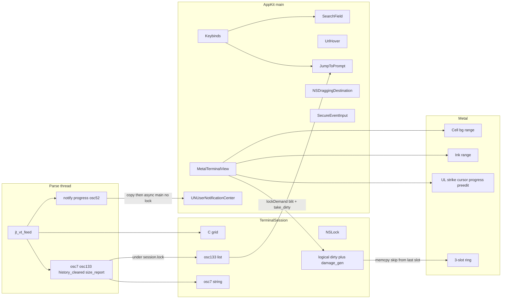
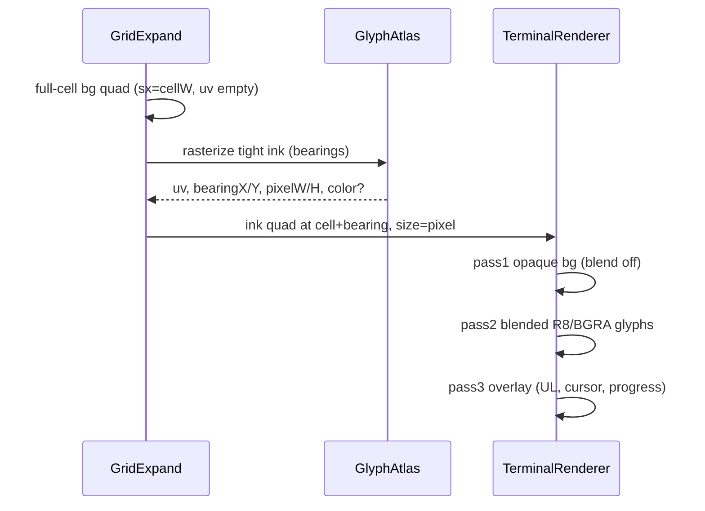
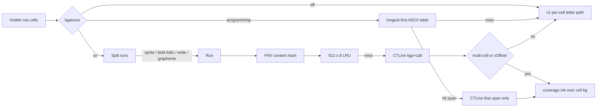
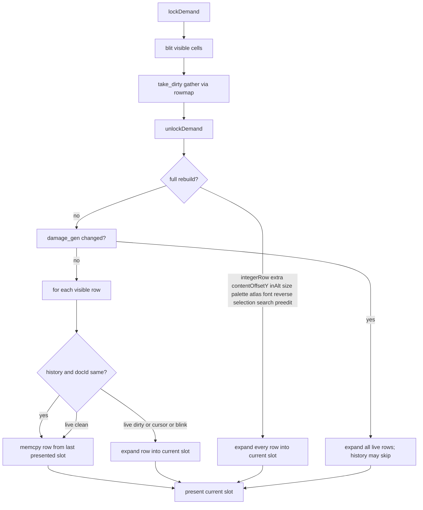

# jetty — follow-on (post-v1 daily-driver)

| Field | Value |
| --- | --- |
| Document | Design (follow-on) |
| Author | TBD |
| Date | 2026-08-22 |
| Status | Draft |
| Project dir | `/Users/jmiller/dev/jetty` |
| Bundle ID | `dev.jetty.app` |
| Baseline | v1 DESIGN `/Users/jmiller/dev/jetty/DESIGN.md`; HEAD `573cf05` on `master` |
| Audience | Senior engineers who already know v1 (16-byte `Cell`, C VT, linux16term Metal) |

This is design only. It does not implement the emulator. v1 PR plan 1–17 is **done**. This document is the next plan.

Ghostty (`/Users/jmiller/dev/ghostty`) is the **parity baseline** for xterm semantics and for “what a daily macOS terminal does.” It is not a library. Do not wrap `libghostty`, Zig, or `ghostty.h`.

---

## Overview

v1 is a truthful `TERM=xterm-256color` macOS terminal: 16-byte inline `Cell`, C parse/grid, AppKit + `MTKView` instanced cells, IME, mouse, OSC 0/2/4/7/8/10/11/12/52/133, DEC 2026, ExtraBold SGR 1, sprites before the font. It is correct enough to daily-drive neovim and tmux. It is not yet pleasant enough to switch to from Ghostty: ligatures are off and cannot paint, italic/Nerd ink clips to the cell, GPU expand rebuilds every visible row every frame, OSC 133 marks have no UI, URLs require OSC 8, Smulx curly/dotted/dashed store bits but paint as a single bar, and several DESIGN.md config keys were never wired.

This follow-on is **daily-driver parity** on macOS. It lands the named v1 leftovers (ligatures, dirty-row GPU skip, ink-bearing quads, compact instances, jump-to-prompt, Unicode width bump, notarization, DEC 2027, fuller Smulx) plus the Ghostty-switcher features that matter for neovim/tmux/shell: auto URL, scrollback search, keybind file, shell-integration inject / OSC 7 cwd, rectangular selection, drag-drop paths, OSC 9/777 notifications, OSC 9;4 progress, `font-family` / `palette-N` / `adjust-cell-*`, background opacity, and macOS secure input.

It does **not** become Ghostty. Tabs, splits, Kitty graphics/keyboard, Sixel, inspector, command palette, quick terminal, settings GUI, and other OS ports stay out.

---

## Background & Motivation

### Current v1 surface (do not re-propose)

Shipped and locked. Treat these as present:

IME (`NSTextInputClient`), mouse 9/1000/1002/1003/1006/1007, 2004/1004, OSC 0/2/4/10/11/12/52/8/7/133, DEC 2026 hold present 1 s, CSI 14/18 t, DECSCUSR overlay, selection + copy wrap-join including history, Shift+Enter LF, NEON UTF-8 3-byte + fused wide print, BGRA emoji atlas, ExtraBold SGR 1, sprites (box/block/braille/geometric/powerline/branch) draw **before** the font when `SpriteFace.covers` (`573cf05`).

Performance canaries (do not regress; release, 105×35). Source: `AGENTS.md`. Do not invent extra benches:

| bench | expect |
| --- | ---: |
| vtebench `scrolling` | ~27 ms |
| `scrolling_*_region` | ~18 ms |
| `scrolling_fullscreen` | ~16 ms |
| in-process `y\n` 1 MiB | ~16 ms |
| `ScreenTests` 200k alt `y\n` | ~5 ms |
| 10k full-width lines | ~1 ms |
| `dense_cells` / `medium_cells` | ~7 / ~5 ms |

A 2× jump on those is a regression — fix before commit. `jt_scr.pool_cells == 0` must still skip per-cell retain/release on ASCII `y\n` scroll/print. No partial-row BCE sneak-in.

### v1 leftovers (named, not built)

From DESIGN.md PR plan and closed questions:

| Leftover | v1 state |
| --- | --- |
| Ligatures | Off. Per-cell rasterize. Atlas key is a scalar/`UInt64` mix, not a shaped-run key. `liga`/`calt` CT feature bits were never applied (off in practice because nothing shapes across cells). |
| Dirty-row GPU skip | `jt_buf.dirty[rows]` is stored and set on mutate. `MetalTerminalView.draw` never reads it. Expand rebuilds every visible row. Dirty is **never cleared**. |
| Ink-bearing quads | Cell-boxed R8. `CellInstance` origin/size can already represent a tight quad; atlas does not store bearings. Italic/Nerd clip. |
| Compact instances | 20-float / 80-byte `CellInstance` (`Sources/Jetty/Render/CellInstance.swift`). |
| Jump-to-prompt | OSC 133 parse/store in `TerminalSession.osc133` keyed by `lines_scrolled + y`, cap 4096. No UI, no key. Alt-screen marks still append using primary `lines_scrolled`. |
| Width-table Unicode bump | `scripts/gen-width-table.py` fetches UCD `latest`. **v1 committed `jt_width.inc` only.** `scripts/unicode/` is an untracked local cache. No version pin in the LUT header. |
| Cell blink (`ATTR_BLINK`) | SGR 5/6 store the bit. v1 DESIGN toggles glyph visibility every 500 ms. `GridExpand` never reads it. Cursor blink is implemented. |
| xcodeproj / notarization | SPM-only. `scripts/build-app.sh` runs `swift build -c release` and prints the binary path. No `.app`, no `Info.plist`, no sign, no notary. |
| DEC 2027 | Ignored. DECRPM `CSI ? 2027 $ p` → state **4** permanently reset (`jt_vt.c` `dec_mode_state`). |
| Smulx curly/dotted/dashed | SGR `4:3`/`4:4`/`4:5` pack `UL_CURLY`/`UL_DOTTED`/`UL_DASHED` (`jt_sgr.c`, `jt_cell.h`). Overlay paints **one** bar for any non-zero UL except double (`MetalTerminalView.writeUnderlineOverlays`). |

Also incomplete versus v1 DESIGN.md itself (not a new idea — a hole):

| Hole | DESIGN.md | Code |
| --- | --- | --- |
| `font-family` | Config key, Core Text family, fallback to bundled Mono | `AppConfig` has no field; `CellMetrics.measure` always uses `EmbeddedFonts` |
| `palette-0`…`palette-15` | Config overlay on compiled 0–15 | Not parsed. Compiled 0–15 is Eighties Black (`jt_grid.c` `jt_palette_reset`), cube 16–255 is xterm |
| Strike / overline paint | Overlay pass | Bits set in SGR 9/53; overlay never reads `ATTR_STRIKETHROUGH` / `ATTR_OVERLINE` |

### Pain for a Ghostty switcher on macOS

1. **Paint looks boxed.** Italic clips. `=>` in JetBrains Mono does not ligate. neovim `curly` underline is a flat bar.
2. **Idle GPU cost.** 5K ~32k cells × 80 B × 60 Hz ≈ 150 MB/s instance upload even when one status line changed. C `dirty[]` exists for this.
3. **Prompt marks are dead data.** Fish/zsh/Ghostty shell-integration already send OSC 133; jetty stores them and never jumps.
4. **URLs without OSC 8.** `cat` a log, Cmd-click does nothing unless the TUI emitted OSC 8.
5. **No search.** 50k-row scrollback cannot be grepped from the host.
6. **Config is thinner than DESIGN promised.** Cannot pick a font or ANSI palette without a rebuild.
7. **No ship path.** There is no notarized `.app`.

### Ghostty as prior art (not a template to clone)

Ghostty is a multi-OS product with tabs, splits, Kitty graphics, an ImGui inspector, a command palette, a quick terminal, and a large `keybind` language (`src/input/Binding.zig` `Action`). jetty is a lightweight macOS xterm. Parity means: the **daily TUI and shell** path feels complete. It does not mean cloning `Config.zig`.

---

## Goals & Non-Goals

### Goals

- Keep v1 locks (cell, parser, TERM, sandbox, sprites-before-font, ExtraBold, no Ghostty wrap) unless a section **explicitly** relaxes one.
- Finish named v1 follow-ons listed above.
- Close DESIGN.md config holes (`font-family`, `palette-N`) and overlay holes (Smulx shapes, strike, overline).
- Daily-driver Ghostty-switcher features: auto URL, search, keybinds, shell integration / OSC 7 cwd, rectangular selection, drag-drop, notifications, progress, transparency, cell metric adjust, secure input.
- Produce a signable `.app` and a notarization path. xcodeproj only if that path needs it.
- Stay inside the linux16term `MTKView` instanced-quad GPU. No IOSurface copy-forward, no Highway.

### Non-Goals (explicit)

| Capability | Why |
| --- | --- |
| libghostty / Zig / `ghostty.h` | v1 lock |
| Grow linux16term / wrap maxterm | v1 lock |
| Densify `Cell` / Ghostty style table | v1 lock |
| Kitty graphics, Kitty keyboard, `TERM=xterm-kitty` | Would lie about `TERM` |
| Sixel, iTerm2 inline images, tmux control mode | Graphics/control protocols; not daily xterm |
| Linux / GTK / Windows | Product is macOS |
| Tabs, splits, `VtManager`, WebKit | Lightweight surface |
| Settings GUI | Config file only |
| 8-bit C1 CSI | UTF-8 DFA owns `≥ 0x80` |
| IOSurface / span blit / Highway | GPU lock |
| Scrollback compressor / byte cap | Still 50k **rows** |
| Command palette | Searchable action chrome. Menus + `keybind` cover it. Product UI: no helper chrome. |
| Quick terminal (Quake / drop-down) | Extra window product; restoration; global hotkey. Not needed to daily-drive neovim. |
| Inspector (ImGui) | Ghostty debug tool. Not a daily feature. |
| Custom shaders, background images, Kitty OSC 21 | Paint toys |
| Auto-update, AppleScript, icon theming | Distribution extras |
| `modifyOtherKeys` / full Ghostty `Action` union | Keep host keybinds small |
| Partial-row BCE | AGENTS.md lock |

### Recommended grouping

**This document is one grouping: daily-driver follow-on.** Everything in [Proposed Design](#proposed-design) is in-scope. Everything in the parity matrix marked **out of scope** is not. Do not start a second “Ghostty clone” track.

---

## Key Decisions

1. **One grouping, not a Ghostty port.** Daily macOS xterm + neovim/tmux/shell. Out: tabs/splits/graphics/inspector/palette/quick-terminal/other OS. Rationale: v1 product surface is linux16term chrome. Growing it into Ghostty’s `apprt` is a different app.

2. **v1 cell/parser/TERM/sandbox/sprites/ExtraBold stay locked.** Follow-ons paint, config, GPU upload, and host UI. DEC 2027 is the only VT-semantics relaxation, and it is a **mode** default-off. Rationale: canaries and honesty.

3. **Ligatures are `off` / `programming` / `on`. Default `programming`.** `false`/`true` still parse as `off`/`on`. `off`: no run hash, no row `CTLine` (atlas may still `CTLine` one cached character). `programming`: longest-first hardcoded ASCII spans only (`=>`, `!=`, …); shape those spans; every other cell stays the v1 letter path. `on`: shape each run (liga+calt); 1:1 / `xOffset≈0` cells still **paint** with the v1 cell-boxed letter path so `a` does not change. `font-feature` applies only where the shaper runs (`on` runs, and `programming` spans). Rationale: canary path; daily-driver `=>` without retuning letters.

4. **Letters stay cell-boxed.** Do not switch default text to tight bbox / `CTFontDrawGlyphs` / blend-on ink. That is the Ghostty letter look. Italic and Nerd **clip**. Ligature spans that overflow use a **coverage** ink pass over per-cell bg (blend-on, `sx=0` on non-liga cells). Do not invent `N×cellW` tiles. Do not land a second instance range while `ligatures = off`. Rationale: keep jetty’s letter raster; `=>` cannot bake two cells of bg into one mix tile.

5. **Sprites stay cell-boxed and still win `SpriteFace.covers` before the font (`573cf05`).** Box/block/braille/powerline must meet cell edges. A ligature run **breaks** on a sprite cell. Rationale: line-drawing alignment; HEAD behavior.

6. **Dirty-row GPU skip copies skipped slices from the last *presented* ring slot.** Keep the 3-slot shared ring. Track `presentedSlot` on successful `commit`. Skip is **CPU memcpy** from `instanceBuffers[presentedSlot]`, not the last prepared slot and not “leave bytes alone.” `take_dirty` gathers `dirty[rowmap[y]]`. `damage_gen` increments **inside** `rowmap` writers (`rotate_up` / `rotate_down` / `sb_push_falling`), not at the top of `index` (mid-screen IND is `cy++`). Full rebuild on: host `integerRow` change, `extra != 0` or `contentOffsetY != 0`, `inAlt` flip, cols/rows/cell px, palette, atlas generation, reverse, font, **selection, search highlight, preedit**. Idle skip is neovim-status-line, not `y\n`.

7. **Compact 32-byte instances after skip (20).** Pack: **`int16_t ox, oy`**, `uint16_t` size, **u16 atlas pixel coords** (not UNORM 0..65535, not f16), RGBA8, pad to 32. Shader: `UV = float2(float(u0)/uni.atlasW, float(v0)/uni.atlasH)`. `FrameUniforms` is 8 floats / 32 bytes. Negative `ox` is for ligature ink in PR 22, not for retuning letters. Do not compact first.

8. **OSC 133 UI uses the existing mark list on the primary screen only.** Ignore OSC 133 while `in_alt`. Jump skips marks outside `[lines_scrolled - sb_len, lines_scrolled + rows)`. ED 3 and RIS clear the list. Do not clamp expired marks to 0. Default keys: `Cmd+Shift+Up/Down` (Ghostty macOS `super+shift+arrow`, not Terminal.app Cmd+Up). Rationale: alt keys would pollute primary; wrap/ED 3 would jump to the oldest row.

9. **Shell integration injects OSC 7/133 only.** Detect bash/zsh/fish/nu. Do not inject Ghostty `ssh-terminfo`, `sudo` wrapper, or `TERM=xterm-ghostty`. `TERM` stays `xterm-256color`. Rationale: stock terminfo; no private overlay.

10. **Auto URL is hover-time scan, not a print-path matcher.** Do not put regex on `jt_scr_print_run`. Cmd-hover scans the visible row (and maybe ±1 for wrap-join). OSC 8 still wins when `extra` has a URI. Rationale: canary lock; Ghostty `link-url` is a renderer concern.

11. **Host keybinds are a small action table, not Ghostty `Binding.Action`.** No chains, no `global:`, no `all:`, no tab/split actions. Unknown `keybind` lines ignored. NSMenu remains the default map. Rationale: config-file product; do not grow an action VM.

12. **DEC 2027 is a real mode, default off.** DECRPM becomes 1/2, not 4. ASCII store path unchanged when the byte is 0x20–0x7E. Cluster width (VS16, ZWJ) only on the UTF-8 scalar path. Rationale: neovim/tmux probe DECRQM; most TUIs still assume wcwidth-like per-codepoint.

13. **`font-family` / `palette-N` / `adjust-cell-*` land as DESIGN.md specified.** Compiled Eighties Black 0–15 stays the reset baseline. C stores a 16-entry overlay; `jt_scr_palette_reset` applies it after the compiled cube. Rationale: OSC 104 / RIS run in C and cannot see Swift `AppConfig` otherwise.

14. **Notify/progress hop like OSC 52; OSC 7/133/`size_report` stay lock-held.** `notify` / `progress` / `osc52_*` / `set_title` copy bytes, hop to main, **must not** take `session.lock` (`83a94a7`). `osc7` / `osc133` / `history_cleared` / `palette_changed` / `size_report` run on the parse thread under the lock already held. Hopping CSI 14/18 t to main then locking reintroduces the hang. `history_cleared` fires from **ED 3 only**, not RIS.

15. **Ship via SPM + `scripts/build-app.sh`, then notarytool.** Add `macos/Jetty.xcodeproj` only if notarization or an asset catalog actually needs Xcode. Rationale: v1 SPM-only was right; ghosvt’s xcodeproj exists to force-load `libghostty-vt.a`.

16. **Product chrome stays silent.** No subtitles, helper text, or descriptive copy. Search is an `NSTextField` with no label. Progress is a thin bar. Secure input uses the system indicator, not a banner.

---

## Closed Questions (this document)

| Decision | Resolution |
| --- | --- |
| Grouping | Daily-driver follow-on only |
| Ligatures | **`off` / `programming` / `on`**. Default **`programming`**. `false`/`true` → `off`/`on`. `programming` is the daily `=>` mode. `font-feature` only where the shaper runs. Letters stay cell-boxed. |
| DEC 2027 default | **Off**; DECRPM 2 when reset, 1 when set |
| Command palette / quick terminal / inspector | Out of scope |
| Keybind language | Small host table; no Ghostty chains/global/all |
| URL schemes (auto) | `http`/`https` (host required), `mailto` (path non-empty). Same allowlist as `LinkURL`. `file:` still deny. |
| Search | Case-insensitive substring. No regex. `Cmd+F` = Ghostty macOS search. |
| Rectangular selection | Option-drag. Copy does not wrap-join; each row is `cols[x0…x1]` plus `\n`. |
| Transparency | `background-opacity` (default 1). Native fullscreen forces 1 (Ghostty). |
| Secure input | Auto when slave is canonical and echo-off. Menu toggle. No in-grid badge. |
| Config reload | `Cmd+Shift+,` re-reads `~/.config/jetty/config` for keys that can apply live (font, palette, opacity, keybinds, notifications). Geometry keys apply to **new** windows. |
| Unicode pin | Generate against an explicit UCD version directory, not `latest`. Today: 17.0.0. |
| xcodeproj | Optional; not a gate for notarization |

Do not reopen v1 Closed Questions (cell, TERM, ExtraBold, sandbox, sprites-before-font, 16-byte, no Ghostty wrap).

---

## Proposed Design

### Architecture (what changes)



Ownership is still v1: parse mutates C under `NSLock`; `writePtyBlocking` does not take that lock.

Host callback classes:

| Callback | Thread | Lock | Rule |
| --- | --- | --- | --- |
| `osc7`, `osc133`, `history_cleared`, `palette_changed`, `size_report` | parse | already held | mutate session / reply PTY; return |
| `notify`, `progress`, `osc52_*`, `set_title` | parse | **must not** take lock | copy bytes, hop to main, return |

`notify`/`progress` glue copies title/body into Swift `String`/`[UInt8]` **before** return; C OSC buffer is reused.

### Paint completeness — Smulx + strike + overline

**Files:** `Sources/Jetty/Render/MetalTerminalView.swift` (`underlineOverlayCount`, `writeUnderlineOverlays`), optional tiny R8 strip in `GlyphAtlas` for curly.

v1 overlay is `OverlayInstance { origin, size, rgba }` blended quads. Keep that. Do not change `Cell`.

| Attr | Paint |
| --- | --- |
| `UL_SINGLE` | one bar, thickness `max(1, cellH * 0.06)`, y = baseline-ish near cell bottom (current) |
| `UL_DOUBLE` | two bars (current) |
| `UL_CURLY` | repeating 2-quad zigzag **or** a 1-px-tall sine strip sampled per cell (DESIGN.md already allowed either). Prefer a shared R8 strip in the atlas, one overlay quad per cell, UV scrolled by `x % period`. |
| `UL_DOTTED` | on/off dashes `dot = max(1, t*2)`, gap = `dot` |
| `UL_DASHED` | on `3*dot`, off `2*dot` |
| `ATTR_STRIKETHROUGH` | bar at ~0.55 of cell height from top |
| `ATTR_OVERLINE` | bar at top + 1 px |

Underline color still comes from Snapshot rare `ul_color` else fg (Setulc). Strike/overline use fg (xterm; SGR 58 is underline-only).

Count function today: `n += ul == UL_DOUBLE ? 2 : 1`. Change to:

- curly: 1 overlay quad if atlas-strip, else 4 zig quads
- dotted/dashed: `min(ceil(cellW / (on+off)), floor(cellW))` quads — **ceil first, then cap at cellW** (one quad per device pixel). Not a magic `~8`.
- plus 1 each for strike / overline

**Cell blink (v1 hole):** `ATTR_BLINK` paints in `GridExpand` with the 500 ms clock already used for the cursor: off phase sets `fg = bg` (same as `ATTR_HIDDEN`). On phase unchanged. Skip (PR 20) rebuilds a row when the blink phase changes and the row has `ATTR_BLINK`.

Goldens: SGR `4:3m` / `4:4m` / `4:5m` / `9m` / `53m` / `5m` produce overlay or blink; `24m` / `29m` / `55m` / `25m` clear them. Double still two bars.

**Does not touch** parse, cell, or canary paths. Preedit underline moves to `OverlayInstance` in PR 20 (not this PR’s overlay count).

### Config that DESIGN.md already specified

**Files:** `Sources/Jetty/Config/Config.swift`, `CellMetrics.swift`, `EmbeddedFonts.swift`, `jt_grid.c` palette reset hook, `JettyApp/main.swift`.

`AppConfig.load()` today parses `font-size`, `scrollback-lines`, `copy-on-select`, `osc52-write`, `osc52-read`. Add:

```
# ~/.config/jetty/config
font-family = JetBrainsMono Nerd Font Mono
font-size = 20
ligatures = programming
font-feature =                 # optional; e.g. calt  or  -calt
adjust-cell-width = 0
adjust-cell-height = 0
background-opacity = 1
palette-0 = #111111
# …
palette-15 = #f2f0ec
link-url = true
desktop-notifications = true
macos-auto-secure-input = true
scrollback-lines = 50000
copy-on-select = true
osc52-write = allow
osc52-read = ask
keybind = cmd+shift+up=jump_to_prompt:-1
```

Rules:

- Unknown keys still ignored.
- `font-family` is a Core Text family name. Omitted or equal to `EmbeddedFonts.familyName` → bundled TTFs (Regular / ExtraBold / Italic / ExtraBoldItalic). Else `CTFontCreateWithName`; missing family → bundled Mono + `fputs` once.
- SGR 1 is still ExtraBold **of that family** if a heavy/black/extrabold face exists, else Bold, else regular (no synthetic outline in this follow-on).
- `palette-N` overlays compiled Eighties Black. C owns the overlay: `jt_scr_set_palette_overlay(s, rgb16, mask)` stores 16 RGB values + a 16-bit mask. `jt_scr_palette_reset` writes compiled 0–15 then applies masked overlay entries, then the xterm cube 16–255. OSC 104 / RIS call that reset. Swift load/reload calls the setter then reset. Do not re-apply from Swift on every `palette_changed` — C already did. Compiled Eighties Black is not reopened.
- `adjust-cell-width` / `adjust-cell-height`: integer pixels added to `CellMetrics.cellWidthPx` / `cellHeightPx` after the existing `round(max ASCII advance)+1` / `round(ascent+descent+leading)` measure. Clamp so cell ≥ 1×1. Negative allowed. Recompute `TIOCSWINSZ` on change.
- `ligatures` is `off` / `programming` / `on` (default `programming`). Aliases: `false`/`0`/`no` → `off`; `true`/`1`/`yes` → `on`. Unknown values ignored (stay `programming`). `off` ignores `font-feature` and must not hash runs. `programming` matches a hardcoded longest-first ASCII table and shapes **only those spans**. `on` shapes each run (liga+calt) then still paints 1:1 cells with the v1 letter path. `font-feature` (`+tag` / `-tag` / `tag=0`) applies only on shaped spans/runs. Invalid tags ignored. `-calt` with `on` disables `calt` on the shaper (user wins).
- Reload: menu **Reload Config** (`Cmd+Shift+,`). Live: font, size, ligatures, palette overlay, opacity, keybinds, notifications, link-url, secure-input. New-window only: `scrollback-lines`, launch cols/rows.

Do not add Ghostty’s `font-family-bold` stack or synthetic italic in this follow-on unless the family has no italic (then italic request uses regular; italic ink may clip).

### Ink-bearing quads

**Withdrawn for letters.** v1 cell-boxed `CTLineDraw` / `max(alpha, r)` / blend-off `mix` stays the letter path. Italic/Nerd clip. Tight bbox + `CTFontDrawGlyphs` + blend-on for *every* glyph is the Ghostty look; do not land it.

Ligature overflow (PR 22) is the only ink that leaves the cell: coverage over per-cell bg, not a retuned letter atlas. Sprites stay cell-boxed (`573cf05`).

The two-range layout below is **only when `ligatures` is not `off`**. `off` keeps one `drawPrimitives` as v1/PR 20.

v1 glyph pass: blending **off**, UVs are the **full cell**, fragment mixes `bg` and `fg` by R8 coverage. Italic ink that would sit in the next cell is clipped at rasterize. **Keep that for letters.**

Follow-on split, still linux16term `MTKView`:



**Atlas `Entry`** (ghosvt `GlyphAtlas.Entry`):

```swift
struct Entry {
    var uv: UV
    var bearingX: Float
    var bearingY: Float
    var pixelW: Float
    var pixelH: Float
    var color: Bool
}
```

Rasterize with `CTFontDrawGlyphs` into a tight bitmap (`boundingRectForGlyphs` + 1 px pad), not into a `cellW×cellH` box. `bearingX` = left side of ink minus cell origin (may be negative). `bearingY` = top of ink minus cell top (top-left Metal).

**Expand:**

1. Always emit a **bg instance** for every visible cell (including `WIDE_TAIL`/`WIDE_HEAD`: bg only). `hasGlyph=0`. Size = cell (or 2×cell for `WIDE_FULL` bg).
2. If sprite (`SpriteFace.covers`): keep **cell-boxed** R8, origin = cell origin, size = cell. Blend off is fine for sprites because they fill the cell; they can ride pass 1 or a non-blended sprite bucket. **Do not** tight-crop box drawing.
3. Else if ink: origin = cell + bearing, size = pixelW×pixelH. `WIDE_FULL` may overflow into the tail cell — that is the point. Skip glyph on tail/head.
4. Color emoji: still BGRA atlas, cover-fit **or** tight; prefer tight with bearing so flag emoji is not squashed, but do not exceed 2 cell widths.

**Instance layout (PR 20 one range; second range only for ligature frames):** one MTLBuffer, two row-strided ranges when `ligatures` is not `off` and the frame has liga ink:

```
bg[y * cols + x]     // pass 1, blend off — full-cell bg; sprites also here (cell-boxed R8)
ink[y * cols + x]    // pass 2, blend on  — tight glyph, or degenerate (sx=0) if sprite/empty/tail/head
bgCount = paintRows * cols
inkBase = bgCount
```

On liga frames, two instances per cell so skip memcpy stays `cols * stride` per range per row. Degenerate ink: `sx = 0, sy = 0`, UV empty — `drawPrimitives` still uses `bgCount` but the vertex shader emits zero-area triangles (or skip in shader when `sx == 0`).

**Two `drawPrimitives` (liga frames, PR 22):**

```
enc.setRenderPipelineState(bgPipeline)      // blend off, current cell_fragment
enc.setVertexBuffer(slot, offset: 0, index: 0)
enc.drawPrimitives(.triangle, vertexStart: 0, vertexCount: 6, instanceCount: bgCount)

enc.setRenderPipelineState(inkPipeline)     // blend on; fg.rgb * coverage, no bg mix
enc.setVertexBuffer(slot, offset: bgCount * CellInstance.stride, index: 0)
enc.drawPrimitives(.triangle, vertexStart: 0, vertexCount: 6, instanceCount: bgCount)
```

Pass 3 overlay unchanged (cursor, UL, strike, overline, progress, **preedit underline**).

Skip on liga frames: memcpy **both** ranges for a skipped row from the last presented slot (`bg` slice and `ink` slice at the same `y * cols`).

Do **not** merge letter cells into tight unblended quads. Compact (PR 23) packs the letter range; liga ink uses the same stride.

Goldens: box `U+2502` still meets the cell top and bottom (sprite path). Italic `f` and Nerd icons **may clip** (letter lock). `=>` with `programming`/`on` is PR 22.

### Ligatures

**Does not retune letters.** **Files:** new `Sources/Jetty/Render/ShaperCache.swift` (port ghosvt `ShaperCache` patterns, not Ghostty Zig), `GridExpand.swift`, `GlyphAtlas` keys, `Config.swift` (`AppConfig.Ligatures`).

v1 rasterizes one glyph per cell. JetBrains `calt` ligatures are typically: spacer glyph on cell 0, liga glyph on cell 1. Core Text positions both at `xOffset≈0`; overflow is the liga glyph’s left side bearing. Detect by **cmap mismatch** (shaped glyph ≠ `CTFontGetGlyphsForCharacters`), not by `xOffset`. Coverage ink is an **N-cell R8** tile over per-cell bg (blend-on, no baked bg). Letters stay 1-cell mix tiles. A 2-cell mix tile would bake bg and break when the two cells differ (selection).



**`off`:** do not enter the shaper. No run hash. Per-cell letter path as v1. Atlas `rasterize` may still `CTLine` one cached character.

**`programming`:** scan visible cells for a hardcoded longest-first table (narrow ASCII only). Shape **that span only**. Everything else is the v1 letter path. No row hash. The table is JetBrains Mono’s official `calt` list (`ProgrammingLigatures.raw`; [wiki](https://github.com/JetBrains/JetBrainsMono/wiki/List-of-supported-symbols)). If the font does not ligate the span, paint the cells as today.

**`on`:** split runs, hash, `CTLine` liga+calt. **Paint** 1:1 / `xOffset≈0` with the v1 letter path (`a` does not change). Only merged cells or non-zero `xOffset` use coverage ink. Single-cell `calt` swaps stay the old letter (the letter lock).

**Run break** (`on` only) — sprites / wide / bold / italic / grapheme **only**. Do **not** break on OSC 8 / reverse / selection. `programming` also must not match across those breaks.

**Shaper font:** constructed only when mode is not `off`. Enable `calt`+`liga`, then apply `font-feature` on shaped spans/runs.

**Atlas key for shaped liga glyphs:** `(CGGlyph, fontID, bold, italic, cellW, cellH, fontPx)`. v1 scalar key stays for letters.

**Ink pass:** only if mode is not `off` **and** this frame has at least one liga span. Per-cell bg as v1 (blend off). Liga coverage blend-on over that bg. Non-liga ink `sx=0`. Config change → full rebuild. `off` → one `drawPrimitives` as PR 20.

**Canary:** `off` → `GridExpand` does not `CTLine` a run and does not hash rows. `programming` → `CTLine` only on a table hit (`=>` is one ink glyph; `hello` is two-path letters). `on` with `=>` ligates; `off` prints two characters.

**Do not** put shaping on the parse thread or in `Cell`.

### Dirty-row GPU skip

**Files:** `jt_grid.c` / `jt_vt.h` (`jt_scr_take_dirty`, `damage_gen`), `Screen.swift`, `MetalTerminalView.swift`, `GridExpand.swift`, `TerminalRenderer.swift`.

v1: mutate sets `dirty[phys_y]` via `rowmap`. Draw never reads it. Dirty is never cleared. `dirty[]` length is `grid_rows` (visible + sb-steal extras), indexed physically.

**Chosen skip method (KD 6):** keep the 3-slot shared ring. `prepareInstances` rotates `instanceSlot` to the next buffer (write target). `TerminalRenderer` stores `presentedSlot` only after a successful `present`+`commit`. For a skipped paint row, **memcpy** that row’s instance bytes from `instanceBuffers[presentedSlot]` into the current slot, then expand dirty rows into the current slot. If `presentedSlot` is nil (first frames) or the presented buffer’s cap/stride differs from the current slot, expand all — do not memcpy across a grow. DEC 2026 `skipSyncPresent` returns before prepare; `presentedSlot` stays the last successful present. Do not memcpy from the last *prepared* slot (a failed drawable or a 2026 skip after prepare would be wrong). The GPU reads the current slot at commit.

```c
/* Gather logical dirty, then clear the physical plane.
 * dst[y] = active->dirty[active->rowmap[y]] for y in [0, n)
 * n is live logical rows (s->rows). Extra physical slots used as
 * sb backing are not a GPU dirty plane — they are zeroed too.
 * Then memset(active->dirty, 0, grid_rows).
 * *damage_gen = s->damage_gen (see below).
 */
void jt_scr_take_dirty(jt_scr *s, uint8_t *dst, int32_t n, uint32_t *damage_gen);
```

Call **only** under `lockDemand`, after the cell blit.

`damage_gen` (uint32 on `jt_scr`) increments **inside rowmap writers only**: `rotate_up`, `rotate_down`, `sb_push_falling`, and the `scroll_up` path that `memmove`s `rowmap` without calling `rotate_up`. Do **not** increment at the top of `index` / `RI`. Mid-screen IND/LF is `cy++` and must not full-expand live rows. `y\n` that actually indexes (`cy == scroll_bottom`) goes through `sb_push_falling` / rotate and does bump gen. A status-line write that does not rotate `rowmap` increments no gen and sets one logical dirty bit. Resize already full-rebuilds (cols/rows).



**Buffer layout from PR 20, stable through 23:**

- One buffer per ring slot, row-strided.
- PR 20: one range `inst[y * cols + x]`, one `drawPrimitives`, `instanceCount = paintRows * cols`.
- PR 22 liga frames only: second range at `inkBase = bgCount`. Skip memcpy copies **both** `cols * stride` slices for that `y`. `ligatures = off` stays one range.
- `paintRows = rows` when skip is active. Fractional overscroll (`extra != 0` or `contentOffsetY != 0`) is a **full rebuild** (v1 of skip). Pin skip to integer rows; do not keep a peek-row fast path in this follow-on.
- Preedit **underline** moves to `OverlayInstance` (overlay is rebuilt every frame). Preedit **glyph** stamps still force a full rebuild while marked text is non-empty (listed above).

**Per-row rebuild** (when not in a full rebuild): logical `dirty[y]`, cursor on the row, blink phase changed and (`ATTR_BLINK` on the row or cursor on the row).

**Full rebuild** — say this once, here, matching KD 6:

- host `scrollPhysics.integerRow` changed
- `extra != 0` or `contentOffsetY != 0`
- `inAlt` flipped
- cols / rows / cell px changed
- OSC 4/10/11/12/104, DECSCNM, `background-opacity`
- atlas `packGeneration` bump, font/zoom
- **selection** (stream or rect) present or changed — **all rows**, not per-intersect. Acceptable v1 of skip.
- **search highlight** active
- **preedit** (`markedText.length > 0`)

URL hover is overlay-only and does **not** invalidate instances.

**Live vs history:** do not treat physical dirty bits as viewport-slot dirty. Live skip requires `damage_gen` unchanged **and** logical `dirty[y]==0`. `sb_push_falling` both increments `lines_scrolled` and bumps gen, so a wrap of live rows invalidates the live GPU slots. History: sb rows are immutable after `sb_push` (resize is a full rebuild). Skip a history paint row if `rowDocId[y] == docRow`.

**Present:** current ring slot. Idle neovim: `scheduleRedraw` only on PTY, blink, or input. The win is sparse PTY (one status line) and cursor/cell blink, **not** `y\n` / `cat`.

Goldens: after a full paint, a second draw with no mutate memcpy-skips every live row except the cursor row. Print on logical y=10 with no index sets only `dst[10]`. `index` at the region bottom bumps `damage_gen` (via rotate / `sb_push_falling`); next frame expands all live rows. Mid-screen LF does not bump gen. `take_dirty` is a gather of `rows` bytes plus `memset` of `grid_rows` — not per-cell on the ASCII path.

Do not use dirty skip as an excuse for partial BCE.

### Compact 32-byte instances

**Follow of PR 20** (letters stay full-cell origin/size). **Files:** `CellInstance.swift`, `TerminalRenderer.swift` shader, `GridExpand.swift`.

Current stride 80. DESIGN.md: compact allowed if drop-in. **`int16_t` origin** — ligature coverage ink (PR 22) can have **negative** `ox`. `uint16_t` would wrap. Letters keep non-negative cell origins.

Swift `@frozen` and Metal device struct, 32 bytes, 16-byte aligned:

```c
// offsets
//  0  int16_t  ox, oy          // device px, may be negative
//  4  uint16_t sx, sy          // device px size; 0x0 = degenerate
//  8  uint16_t u0, v0, u1, v1  // atlas pixel coords (not UNORM, not f16)
// 16  uint32_t fg              // RGBA8
// 20  uint32_t bg              // RGBA8
// 24  uint8_t  atlas           // 0=R8 1=BGRA
// 25  uint8_t  flags           // bit0 hasGlyph
// 26  uint16_t _pad0
// 28  uint32_t _pad1           // pad to 32
```

```metal
struct CellInstance {
    short ox, oy;           // 0
    ushort sx, sy;          // 4
    ushort u0, v0, u1, v1;  // 8  atlas pixel coords
    uint fg, bg;            // 16
    uchar atlas, flags;     // 24
    ushort _pad0;           // 26
    uint _pad1;             // 28
};
static_assert(sizeof(CellInstance) == 32, "instance stride");

struct FrameUniforms {
    float2 viewport;        // 0
    float contentOffsetY;   // 8
    float _pad0;            // 12
    float atlasW;           // 16
    float atlasH;           // 20
    float _pad1;            // 24
    float _pad2;            // 28
};
static_assert(sizeof(FrameUniforms) == 32, "uniform stride");
```

Vertex: `float2 px = float2(float(c.ox), float(c.oy)) + corner * float2(float(c.sx), float(c.sy));`  
`float2 uv = float2(mix(float(c.u0), float(c.u1), corner.x) / uni.atlasW, mix(float(c.v0), float(c.v1), corner.y) / uni.atlasH);`  
Atlas max edge is 16384 (`GlyphAtlas.maxAtlasEdge`); u16 pixel coords fit. Do **not** encode `u / 65535`.

Tests: `MemoryLayout<CellInstance>.stride == 32` and `MemoryLayout<FrameUniforms>.stride == 32`. Swift `@frozen` field offsets match the Metal struct (`MemoryLayout.offset(of: \.u0) == 8`, `\.fg == 16`, `\.atlas == 24`). Metal `[[buffer(0)]]` device array stride is 32. v1 uniforms are 16 bytes (4 floats); PR 23 grows them to 8 floats / 32 bytes.

Letter range always. Liga ink range only on liga frames; degenerate `sx=0`.

5K 32k × 32 B ≈ 1 MiB/frame vs 2.5 MiB at 80 B. Liga frames add a second range. `int16` range ±32767 covers 5K (~5120) plus negative liga bearings.

If a driver rejects the packed shorts, land 48 B (`int16` origin/size + float uv + RGBA8, padded) — still a win. Do not invent a second instance type per pass.

`OverlayInstance` stays 32-byte floats. Not a gate.

### OSC 133 jump-to-prompt

**Files:** `TerminalSession.swift` (list already), `MetalTerminalView.swift`, `Config.swift` keybinds, `main.swift` menu.

v1 stores `[(line: UInt64, action: UInt8, opts: [UInt8])]` from `parser.onOsc133` **under `session.lock`**. Line = `screen.linesScrolled + cursorY` at parse. Actions from Ghostty `osc/parsers/semantic_prompt.zig`: `L`/`A`/`N`/`P`/`B`/`I`/`C`/`D`. Jump uses prompt starts `{A,P,L}`. `C`/`D` stay stored; copy-last-output is out of this PR.

**Alt:** if `in_alt`, **do not append**. `scroll_up` only increments `lines_scrolled` on primary with `top == 0`. Alt OSC 133 today would key primary ids and misfire after `rmcup`.

**Clear:** `jt_vt_host.history_cleared` fires from the **ED 3** path in `jt_vt.c` after `jt_scr_ed(s, 3)` (`jt_scr_clear_history`). Parse thread, lock already held → `osc133.removeAll()`. Do **not** fire it from RIS: v1 `jt_scr_ris` is ED 2 only and keeps scrollback; clearing marks would drop valid jump targets. Do not put the callback inside `jt_scr_clear_history` (no `jt_vt_host` there). Jump’s in-window skip still covers sb wrap.

```mermaid
sequenceDiagram
  participant PTY
  participant Parse
  participant Marks
  participant View
  PTY->>Parse: OSC 133 ; A ST
  alt in_alt
    Parse-->>Parse: ignore
  else primary
    Parse->>Marks: append(lines_scrolled+cy, A) under lock
  end
  View->>Marks: jump -1
  Marks-->>View: previous line in live window
  View->>View: ScrollPhysics pin
```

**Jump ±1:** among `{A,P,L}`, walk previous/next relative to viewport top id `lines_scrolled - sb_len + integerRow`. **Skip** marks with `line < lines_scrolled - sb_len` or `line >= lines_scrolled + rows`. Do **not** clamp expired marks to 0 (that jumps to the oldest history row). If no in-window mark, no-op. Jump on alt: no-op (no history).

Default keys: `Cmd+Shift+Up/Down` = Ghostty macOS `super+shift+arrow` (not Terminal.app Cmd+Up). Edit menu **Previous Prompt** / **Next Prompt**.

Cap 4096, drop oldest: already implemented. No click-to-jump.

### Shell integration / OSC 7 cwd

OSC 7 is a lock-held store (`TerminalSession.osc7`) on the parse thread. Follow-on spawn must pass cwd + extra env into the child **before** `login -flp`. `TERM` stays `xterm-256color` (`set_term_identity`).

**Spawn API** (replace the 5-arg `jt_pty_spawn` or add `_ex` and wrap it):

```c
int jt_pty_spawn_ex(
    uint16_t cols, uint16_t rows,
    uint32_t cell_width_px, uint32_t cell_height_px,
    const char *cwd,              /* NULL = inherit parent cwd */
    const char *const *extra_env, /* NULL-terminated "KEY=VAL"; NULL = none */
    pid_t *child_out);
```

Child, before `exec_login_shell`:

1. if `cwd`, `chdir(cwd)` (fail → `dprintf` + `_exit(127)`).
2. for each `extra_env[i]`, `putenv` / `setenv` (overwrite).
3. `exec_login_shell()` as today (`login -flp` / `-qflp`, `-p` preserves env).

Do not keep the slave fd (`forkpty(..., NULL, ...)` unchanged).

**Inherit cwd:** on the main thread, under `session.lock`, copy `osc7` to a local `String`, unlock, parse `file://` as a local existing directory, pass that path as `cwd`. Race-free vs parse-thread stores.

**Detect** (basename of `$SHELL`, same as Ghostty): `zsh`, `fish`, `nu`, `bash`. On Darwin, **skip auto-inject for `/bin/bash`** (Apple 3.2 disables `ENV`). `shell-integration = none` skips. Manual OSC 133 still works.

**Inject files** (SPM resources `Sources/Jetty/Resources/Shell/…`), trimmed to OSC 7 + OSC 133 only:

| Shell | Resource | Env `login -p` must see |
| --- | --- | --- |
| bash (not `/bin/bash`) | `Shell/bash/jetty.bash` | `ENV` = that path. Set `JETTY_BASH_ENV` **only** when a previous `ENV` existed; the snippet sources `${JETTY_BASH_ENV}` if set. |
| zsh | `Shell/zsh/` (wrapper `.zshenv` / `.zshrc`) | `ZDOTDIR` = that dir. Set `JETTY_ZSH_ZDOTDIR` **only** when a previous `ZDOTDIR` existed. Snippet: `source ${JETTY_ZSH_ZDOTDIR:-$HOME}/.zshrc` (and `.zshenv` the same way). |
| fish | `Shell/` as an XDG data dir containing `fish/vendor_conf.d/jetty.fish` | prepend that dir to `XDG_DATA_DIRS` (default `/usr/local/share:/usr/share`); `JETTY_SHELL_XDG_DIR` = that dir so the snippet can pop it |
| nu | `Shell/` with `nushell/vendor/autoload/jetty.nu` | same `XDG_DATA_DIRS` prepend. Do **not** rewrite argv (`login -flp` already `exec -l $SHELL`). Document that nu autoload may need a one-line `use` in the user’s config if vendor autoload is off |

Do not wrap `sudo`. Do not install terminfo. Do not set `TERM`. Do not `chdir` the host process. Darwin `login -flp` already passes `-l` to the login shell (skips the login helper’s home `chdir`); child `chdir` before `exec_login_shell` is the inherit-cwd path. Keep skip of Darwin `/bin/bash`.

### Auto-detected URL

**Files:** new `Sources/Jetty/Input/AutoURL.swift`, `MetalTerminalView.mouseMoved`, `LinkURL.swift`.

Ghostty `src/config/url.zig` uses Oniguruma with a large regex. jetty must not take that dependency. Use `NSDataDetector(types: .link)` on the **current row’s UTF-8** (wrap-join previous/next if `wrap[y]`), on Cmd-hover / Cmd-click only.

Policy: same as `LinkURL.openable` — `http`/`https` host required, `mailto` path non-empty, **deny `file:`**, deny C0/C1/bidi. Detector may return `file:` — drop it.

Paint: while Cmd held and hover hits a match, overlay a single underline on that span and `NSCursor.pointingHand`. Overlay-only — does **not** invalidate GPU instance skip. OSC 8 URI on the cell wins if present (`link-osc8` always on; no config to disable in this follow-on).

`link-url = false` disables detector; OSC 8 still works.

**Not on the print path.** No per-cell regex. Canary-safe.

### Scrollback search

**Files:** `MetalTerminalView`, `Screen.copy`/`blitDocumentRow`, `main.swift` Edit menu.

`Cmd+F` is Ghostty macOS search (`super+f`). Jump-to-prompt stays `Cmd+Shift+Up/Down` (Ghostty `super+shift+arrow`). Does not collide with View → Full Screen (`Cmd+Ctrl+F`).

**Titlebar accessory:** window is `.titled + .fullSizeContentView`, `titlebarAppearsTransparent`. Find is an `NSTitlebarAccessoryViewController` with a single `NSTextField` (no placeholder if the control allows; no label). Adding the accessory changes `safeAreaInsets`; existing `lastSafeTop` / `relayout` path already watches that — **call `relayout` when showing/hiding Find**. First responder moves from `MetalTerminalView` to the field. **Escape** ends search, removes the accessory, `makeFirstResponder` the surface. STE100 menu title **Find**.

- Case-insensitive substring of the field’s UTF-8.
- Scan document rows from the viewport, wrapping once.
- Highlight: selection-style invert on match spans. While search is active, GPU skip does a **full rebuild** (KD 6).
- `Cmd+G` / `Cmd+Shift+G` next/prev.
- Empty query: no matches, field stays.

50k × 105 scalars ≈ 5e6 codepoints. Target: < 16 ms per Next on Apple Silicon; if over, scan in chunks and hop. Do **not** hold `session.lock` across the whole 50k if draw is waiting — copy row text under lock per row.

No regex. No Ghostty `search-foreground` theme keys; use selection invert.

### Rectangular selection

v1 selection is stream order (`CellSelection.columns` fills mid-rows 0…cols-1). Follow-on: **Option-drag** (Ghostty `SelectionGesture.rectangle`) sets a flag `selRect`.

Copy: for each row `y0…y1`, take columns `min(x0,x1)…max(x0,x1)`, **do not** wrap-join, emit `\n` after each row including the last-but-one. Skip tails/heads as today.

Paint: invert only that rectangle (change `CellSelection.columns` to clamp lo/hi on every row when rect). Selection (stream or rect) is a **full GPU rebuild** while present (KD 6).

Shift-extend keeps the mode of the original gesture. Triple-click still line; double-click still word (if v1 has word — v1 is cell-drag; **do not** add word-select in this PR unless already present). v1 is cell-drag + shift-extend + select all. Leave word-select out.

### Drag-drop paths

Ghostty `SurfaceView_AppKit.swift` `NSDraggingDestination`: `.string` and `.fileURL`, `insertText` of the opinionated string.

jetty: register for `.fileURL` and `.string` on `MetalTerminalView`. On drop:

- File URLs → POSIX paths, shell-quoted (`'` with `'\''`), joined by spaces, then `writePtyBlocking` (bracketed paste if 2004).
- Plain string → same as paste.

Do not open dropped files in a new window (Ghostty `macos-dock-drop-behavior` is tab-oriented). One window, one PTY.

### OSC 9 / 777 notifications and OSC 9;4 progress

**Files:** `jt_osc.c`, `jt_vt_host`, `Parser.swift`, `TerminalSession`, AppKit notifications.

Ghostty `src/terminal/osc/parsers/osc9.zig`: OSC 9 with `9;4;…` is ConEmu progress; otherwise iTerm2 notification body. OSC 777 `notify;title;body`.

jetty:

| Sequence | Behavior |
| --- | --- |
| `OSC 9 ; <body>` (not `9;4`) | notify title `jetty`, body sanitized |
| `OSC 777 ; notify ; <title> ; <body>` | notify |
| `OSC 9 ; 4 ; <st> ; <pct>` | progress |
| other ConEmu 9;1 sleep / 9;2 msgbox | **ignore** |

Sanitize: strip C0/C1/bidi, cap 256 UTF-8 bytes title, 1024 body. Copy into Swift, hop to main. `UNUserNotificationCenter` request authorization once. Config `desktop-notifications = false` drops. Do not take `session.lock`. PR 30 links `UserNotifications.framework` in `Package.swift`. Auth UX without a bundle id is poor; PR 36 plist carries `CFBundleIdentifier=dev.jetty.app` and `NSUserNotificationsUsageDescription` / user-notification usage string.

Progress state (ConEmu): 0 remove, 1 set percent, 2 error, 3 indeterminate, 4 paused. Percent 0–100. Paint a **2 px** bar at the top of the grid (overlay quads), color from default fg (error: palette 1). No text. Native fullscreen: still show in-grid so we do not add chrome.

Host callback must be fire-and-forget.

### Keybind config

**Files:** `Sources/Jetty/Input/Keybinds.swift`, `Config.swift`, `MetalTerminalView.keyDown`.

Ghostty `keybind = trigger=action` with flags `global:`, `all:`, chains, and ~80 actions. jetty table:

```
keybind = cmd+shift+up=jump_to_prompt:-1
keybind = cmd+shift+down=jump_to_prompt:1
keybind = cmd+f=start_search
keybind = cmd+g=find_next
keybind = cmd+shift+g=find_prev
keybind = cmd+shift+comma=reload_config
```

Triggers: `cmd`, `shift`, `ctrl`, `opt` + key (`up`,`down`,`left`,`right`,`page_up`,`page_down`,`home`,`end`,`enter`,`tab`,`space`, `a`–`z`, `0`–`9`, `comma`, `period`, `minus`, `equal`, `slash`).

Actions (host only; never forwarded to PTY):

`copy`, `paste`, `select_all`, `new_window`, `close_window`, `increase_font_size`, `decrease_font_size`, `reset_font_size`, `scroll_to_top`, `scroll_to_bottom`, `scroll_page_up`, `scroll_page_down`, `jump_to_prompt:N`, `start_search`, `find_next`, `find_prev`, `end_search`, `reload_config`, `toggle_secure_input`.

`keybind = clear` drops **user** bindings; NSMenu defaults remain (Copy/Paste/New/… still work via First Responder). A user bind of the same chord **overrides** the view’s `handleZoomKeys` / `handleScrollbackKeys` / jump.

No `global:` (would require an event tap). No `csi:` / `text:` PTY sends in this follow-on (use the shell). Unknown action: ignore line.

### Transparency

`background-opacity` ∈ [0, 1], default 1.

- `NSWindow.isOpaque = opacity >= 1`
- `clearColor` alpha = opacity
- Cell bg in pass 1: default-bg cells use `ba = opacity`; **explicit** cell bg stays `ba = 1` (Ghostty `background-opacity-cells` default false). Do not add that extra key unless it is one line.
- Native fullscreen: force 1 (Ghostty: gray show-through).
- Titlebar transparent already (`titlebarAppearsTransparent`).

Need `layer?.isOpaque = false` on the `MTKView`. Test: opacity 0.85, default bg shows desktop; `CSI 44 m` cells stay solid.

### Password / secure input

Ghostty `Exec.zig`: slave `canonical && !echo` ⇒ password. `EnableSecureEventInput` / `DisableSecureEventInput`. Config `macos-auto-secure-input`.

Follow-on: poll `tcgetattr` on the **master**’s peer via `TIOCGETA` on the slave fd we do not have — Ghostty uses the pty child tty. jetty spawn is `forkpty`; the master can `tcgetattr` on the slave if we keep the slave fd, or parse thread can `ioctl` the master (`TIOCGETA` on master returns slave flags on Darwin). Verify on Darwin before coding; if master does not reflect echo, skip auto and keep the menu toggle only.

Menu: **Secure Keyboard Entry** (macOS convention). No in-grid lock badge (product chrome). System secure-input indicator is enough.

Do not enable over a heuristic that false-positives on `read -s` in a long-running TUI if we cannot get flags cheaply — menu-only is acceptable. Auto is best-effort.

### DEC 2027

**Files:** `jt_vt.c` (drop perm_reset), `jt_grid.c` UTF-8 `print_scalar` / `attach_mark`, new `Sources/CVt/jt_grapheme_break.c` + generated `jt_gb_props.inc` / `jt_gb_precompute.inc`, tests. **Do not mix with PR 35.**

v1: combining / ZWJ / VS16 after a base go to the grapheme store; **width is the base** `jt_codepoint_width`. `attach_mark` keeps the old `WIDE_*` flag. DECRPM 2027 = 4. `JT_GP_MAX` is 16 (`jt_pool.c`).

Follow-on: `CSI ? 2027 h/l`. Default off. DECRPM 1/2. ASCII `print_run` / NEON store **untouched**.

**Port Ghostty `src/unicode/grapheme.zig` into C**, not a paraphrase:

1. **Props LUT** (`jt_gb_props.inc`): per codepoint U+0000..U+10FFFF, packed fields matching Ghostty `props.zig`: grapheme-break class (UAX #29 *without* Control — Ghostty `GraphemeBreakNoControl`), `emoji_vs_base`, `width_zero_in_grapheme`. Generator `scripts/gen-grapheme-tables.py` pins `https://www.unicode.org/Public/17.0.0/ucd` and commits the `.inc` (same pattern as v1 `jt_width.inc`). PR 35 later commits the UCD *inputs*; 34 does not depend on that cache.
2. **Precompute table** (`jt_gb_precompute.inc`): Ghostty `Precompute` is a u13-key 8 KiB table `(BreakState, gb1, gb2) → {result, next_state}`. Generate it. `jt_grapheme_break(cp1, cp2, uint8_t *state)` indexes that table. **Do not** call it on C0/LF/CR — those never reach `print_scalar` as graphics (parser `execute_c0`).
3. **Width effect** (`jt_grapheme_width_effect(prev, cp)`): copy Ghostty `graphemeWidthEffect`:
   - `cp == U+FE0F` (VS16) or `U+FE0E` (VS15): if `!emoji_vs_base(prev)` → `JT_GB_IGNORE` (do not store); else VS16 → `JT_GB_WIDE`, VS15 → `JT_GB_NARROW`.
   - else if `!width_zero_in_grapheme(cp)` → `JT_GB_WIDE`.
   - else `JT_GB_NO_CHANGE`.

**No sticky `jt_scr` GB field.** After CUP / index / EL the next combining mark must look at the **attach-target cell** (same `x` as v1 `attach_mark`), not a cursor-side cache that survived CUP. Replay break state from that cell’s cluster in the grapheme store (`cps[0]…cps[n-1]`, n ≤ `JT_GP_MAX` 16). Scalar bases replay as a one-codepoint cluster.

**Streaming print** (`jt_scr_print_scalar` when `s->mode_2027`, scalar not ASCII-run). Copy Ghostty `graphemeWidth`: save `state_before`, call `graphemeBreak` (mutates state), restore on IGNORE:

```
x = attach_mark column (pending_wrap ? cols-1 : cx-1)
replay prev, state from cell[x] cluster (or scalar)
state_before = state
if (jt_grapheme_break(prev, scalar, &state)) {
    /* new cluster: v1 width-0 attach if combining, else fall through to place */
} else {
    effect = jt_grapheme_width_effect(prev, scalar);
    if (effect == IGNORE) {
        state = state_before;   /* Ghostty: invalid VS16 must not leave GB=Extend */
        return;                 /* do not intern */
    }
    intern cluster; if n would exceed JT_GP_MAX (16) drop the mark (visible)
    if (effect == WIDE && cell is NARROW)
        upgrade_narrow_to_full(s, x, y);
    else if (effect == NARROW && cell is FULL)
        /* drop tail, set NARROW; cursor stays */
    return;
}
/* first codepoint of a cluster: v1 print_wide / place_graphic using jt_codepoint_width */
```

Golden: `CSI ? 2027 h`, `U+0031` (not `emoji_vs_base`) + VS16 + `a` → two clusters (digit, then `a`), not one glued cluster. Invalid VS16 does not intern and does not change width.

**`upgrade_narrow_to_full`** (VS16 after a narrow base; cursor is already past the base, at `cx`):

```
x = base column (attach_mark's x)
if (x == cols-1) {
    /* need two cells: spacer_head wrap like print_wide */
    if (!auto_wrap) { /* no room: leave NARROW, intern VS16 anyway */ return; }
    convert cell x to WIDE_HEAD? No — v1 print_wide at last col writes HEAD then FULL+TAIL on next line.
    Here the base is already on last col. Convert to WIDE_FULL occupying this cell + next-line col 0:
      write WIDE_HEAD at x (or keep FULL without tail on this line — Ghostty wraps).
    Match print_wide: if auto_wrap, pending_wrap then on next graphic... simpler:
      blank this cell to space+pen; print_wide(base) so HEAD/FULL/TAIL integrity holds;
      then attach VS16 onto the FULL cell. Cost: one extra intern. Accept for the rare last-col VS16.
}
if (insert_mode) jt_scr_ich(s, 1);          /* room for tail at cx */
if (cx >= cols) { wrap or clip like print_wide }
write WIDE_TAIL at x+1 (current cx if we just printed the base)
set cell x to WIDE_FULL (keep grapheme id)
if cursor was at x+1, advance to x+2 (or wrap)
mark both rows if wrap
```

IRM failure / no room at EOL without wrap: leave NARROW, keep the cluster id, do not write a dangling TAIL.

When **off**: v1 `attach_mark` (width flag unchanged).

Goldens: `CSI ? 2027 h`, `U+0031` + VS16 stays width 1 and does not intern; then `a` is a **second** cluster (not glued). `U+2764` + VS16 → width 2 + tail; ZWJ family one cluster width 2, `n ≤ 16`; `CSI ? 2027 $ p` → `;1$y` / `;2$y`. Off: v1 width-table goldens unchanged. ASCII `y\n` path not entered.

### Unicode width-table bump

**Files:** `scripts/gen-width-table.py`, `scripts/unicode/*`, `jt_width.inc`, `WidthTests.swift`.

v1 committed **`jt_width.inc` only**. `scripts/unicode/` is an untracked cache; the LUT header has no version pin. The script fetches `UCD/latest`. PR 35:

```
UCD=https://www.unicode.org/Public/17.0.0/ucd
```

Commit `scripts/unicode/{EastAsianWidth.txt,emoji-data.txt,DerivedCoreProperties.txt,UnicodeData.txt}` at 17.0.0 and pin that URL in the script. Process for 18.0.0:

1. Point `UCD` at `18.0.0`.
2. Re-fetch into `scripts/unicode/`.
3. Regen `jt_width.inc`.
4. Extend `WidthTests` for any known terminal-width change (emoji, new CJK).
5. Do **not** change 2027 logic in the same PR.

v1 272 KiB 2-bit LUT stays. No sparse table in this follow-on.

### Distribution: `.app`, notarization, optional xcodeproj

**Files:** `scripts/build-app.sh`, new `scripts/notarize.sh`, `Resources/Info.plist`, optional `macos/Jetty.xcodeproj`.

v1 `build-app.sh` only compiles. Follow-on assemble:

```
jetty.app/Contents/MacOS/jetty
jetty.app/Contents/Info.plist
jetty.app/Contents/Resources/  # fonts already in the SPM bundle; copy as needed
```

`Info.plist`: `CFBundleIdentifier=dev.jetty.app`, `CFBundleName=jetty`, `CFBundlePackageType=APPL`, `LSMinimumSystemVersion=14.0`, `NSHighResolutionCapable=true`, `NSPrincipalClass=NSApplication`, plus the user-notifications usage string required by PR 30 (`NSUserNotificationsUsageDescription` or the current AppKit key). **Sandbox off.** If an entitlements file is required for `--options runtime`: **none beyond `com.apple.security.app-sandbox=false`**. No `allow-jit`, no network client entitlement. `LSUIElement` no.

Sign: `codesign --force --sign "Developer ID Application: …" --options runtime --timestamp jetty.app`. Ad-hoc remains the default for local `build-app.sh`.

`scripts/notarize.sh`: `xcrun notarytool submit --wait` + `stapler staple`. Not a gate for development.

**xcodeproj:** only if we need an asset catalog, Sparkle, or Xcode Cloud. Prefer SPM. If added, it wraps the SwiftPM package (Xcode 16 “Add package product”) and does not fork sources. Do not force-load anything.

---

## Parity matrix (Ghostty → jetty)

Status: **now** = v1 HEAD `573cf05`. **follow-on** = this document. **out** = will not do.

### VT / cell / TERM

| Ghostty | jetty now | follow-on | notes |
| --- | --- | --- | --- |
| `TERM=xterm-ghostty` + private terminfo | `xterm-256color` stock | now | Do not change |
| Truecolor, 256, SGR mouse 1006, 2004, 1004, 2026 | now | now | |
| 16-byte inline cell vs 8-byte style table | 16-byte locked | now | out to densify |
| DEC 2027 grapheme width | ignore, DECRPM 4 | follow-on | default off |
| Kitty keyboard / `fullkbd` | no | **out** | would require `TERM` lie |
| 8-bit C1 CSI | no | **out** | |
| SGR 1 bold face | ExtraBold | now | |
| Smulx 4:0–4:5 | store; paint single/double | follow-on | curly/dotted/dashed |
| Setulc SGR 58 | rare store + paint | now | |
| OSC 8 | now | now | |
| OSC 7 | store | follow-on UX | inherit cwd + inject |
| OSC 133 | store, no UI | follow-on | jump-to-prompt |
| OSC 52 allow/ask | now | now | |
| OSC 9 / 777 notify | drain | follow-on | |
| OSC 9;4 progress | drain | follow-on | |
| OSC 21 Kitty colors | drain | **out** | |
| Kitty graphics | no | **out** | |
| Sixel | no | **out** | |
| iTerm2 images | no | **out** | |
| tmux control mode | no | **out** | |
| DA1 `?1;2c` / DA2 `>0;0;0c` | now | now | |
| CSI 14/18 t | now | now | other XTWINOPS out |
| DECRQM all v1 modes | now | + 2027 | |

### Font / GPU

| Ghostty | jetty now | follow-on | notes |
| --- | --- | --- | --- |
| `font-family` list + styles | bundled Mono only | follow-on | one family name |
| `font-feature` / ligatures | off, no shaper | follow-on | default `programming` |
| Ink-bearing / CoreText shape | cell-boxed | follow-on | ghosvt bearings |
| Sprites before font | now (`573cf05`) | now | lock |
| `adjust-cell-width/height` | no | follow-on | px delta |
| Other `adjust-*` (underline, icon, …) | no | **out** | one pair is enough |
| IOSurface copy-forward / Highway | no | **out** | |
| Dirty-row skip | bits stored, unused | follow-on | |
| Compact instances | 80 B | follow-on | 32 B |
| Custom shaders | no | **out** | |
| Background image | no | **out** | |
| `background-opacity` | 1 | follow-on | |
| `background-blur` | no | **out** | |

### Input / chrome

| Ghostty | jetty now | follow-on | notes |
| --- | --- | --- | --- |
| IME | now | now | |
| Mouse 9/1000/1002/1003/1006/1007 | now | now | |
| `link-url` auto | OSC 8 only | follow-on | `NSDataDetector` |
| Rectangular selection | stream only | follow-on | Option-drag |
| Scrollback search | no | follow-on | substring |
| `keybind` language | NSMenu + a few chords | follow-on | small table |
| Command palette | no | **out** | |
| Quick terminal | no | **out** | |
| Inspector | no | **out** | |
| Tabs / splits | no | **out** | |
| Settings GUI | no | **out** | |
| Drag-drop paths | no | follow-on | |
| Secure input | no | follow-on | |
| Shell integration inject | no | follow-on | OSC 7/133 only |
| `jump_to_prompt` | no UI | follow-on | |
| Notifications | no | follow-on | |
| Progress bar | no | follow-on | |
| Clipboard HTML/VT copy | plain UTF-8 | **out** | |
| `copy-on-select` | now | now | |
| Config file | now, few keys | follow-on | |

### Platform / ship

| Ghostty | jetty now | follow-on | notes |
| --- | --- | --- | --- |
| macOS | now | now | |
| Linux GTK / Windows | no | **out** | |
| xcodeproj | no | optional | not a gate |
| Notarization | no | follow-on | scripts |
| Auto-update | no | **out** | |
| AppleScript | no | **out** | |
| Sandbox | off | off | lock |

---

## API / Interface Changes

### C

```c
/* Gather dst[y] = dirty[rowmap[y]] for y in [0,n), n = live rows.
 * Zero dirty[0, grid_rows). *damage_gen = s->damage_gen. */
void jt_scr_take_dirty(jt_scr *s, uint8_t *dst, int32_t n, uint32_t *damage_gen);

void jt_scr_set_palette_overlay(jt_scr *s, const uint32_t rgb16[16], uint16_t mask);
/* jt_scr_palette_reset: compiled Eighties Black + cube, then overlay. */

int jt_pty_spawn_ex(uint16_t cols, uint16_t rows,
                    uint32_t cell_width_px, uint32_t cell_height_px,
                    const char *cwd, const char *const *extra_env,
                    pid_t *child_out);

void jt_scr_set_mode_2027(jt_scr *s, int on);
int  jt_scr_mode_2027(const jt_scr *s);

int  jt_grapheme_break(uint32_t cp1, uint32_t cp2, uint8_t *state);
int  jt_grapheme_width_effect(uint32_t prev, uint32_t cp); /* IGNORE/NO_CHANGE/WIDE/NARROW */
```

`jt_scr` grows `uint8_t mode_2027`, `uint32_t damage_gen`, `uint32_t pal_overlay[16]`, `uint16_t pal_overlay_mask`. Do not grow `Cell`. `pool_cells` accounting unchanged.

Host callbacks (additive):

```c
void (*notify)(void *ctx, const uint8_t *title, size_t nt,
               const uint8_t *body, size_t nb);   /* hop, no lock */
void (*progress)(void *ctx, uint8_t state, uint8_t percent); /* hop, no lock */
void (*history_cleared)(void *ctx);              /* lock held; ED 3 only, from jt_vt.c */
```

`osc7` / `osc133` / `size_report` already exist and stay lock-held (`replySizeReport` on the parse thread, `writePtyBlocking`, no second lock). OSC dispatcher branches `9` and `777`. Unknown ConEmu subcommands drain.

### Swift config

```swift
public struct AppConfig: Sendable {
    public var fontFamily: String = EmbeddedFonts.familyName
    public var fontSize: CGFloat = 20
    public var ligatures: Ligatures = .programming // off | programming | on
    public var adjustCellWidthPx: Int = 0
    public var adjustCellHeightPx: Int = 0
    public var backgroundOpacity: CGFloat = 1
    public var paletteOverlay: [UInt8: UInt32] = [:] // 0…15
    public var linkURL: Bool = true
    public var desktopNotifications: Bool = true
    public var autoSecureInput: Bool = true
    public var shellIntegration: ShellIntegration = .detect
    public var keybinds: [Keybind] = []
    // existing: scrollbackLines, copyOnSelect, osc52*, launchCols/Rows
}
```

### Renderer

- Ring stays 3 slots. Skip = memcpy from `instanceBuffers[presentedSlot]` (set only after successful present). Nil or cap/stride mismatch → expand all.
- Layout: `inst[y*cols+x]` one range (`off`). Second ink range only on liga frames (PR 22).
- Letter atlas stays cell-boxed. Liga glyphs use a coverage key, not a retuned letter `Entry`.
- `ShaperCache` when `ligatures` is not `off`. `programming` shapes table spans only.
- `CellInstance.stride`: 80 (20–22) then 32 (PR 23), `int16` origin, u16 **pixel** UVs. `FrameUniforms` 32 bytes after PR 23.
- Preedit underline: `OverlayInstance`.

### Host UI

- `MetalTerminalView`: search field, Option-rect select, URL hover, drag-drop, progress overlay, `take_dirty` skip.
- `AppDelegate`: Reload Config, Previous/Next Prompt, Secure Keyboard Entry, Find.

No new Swift parser. No `print_glyph` callback.

---

## Data Model Changes

No on-disk DB. Config file keys added; unknown keys ignored. No migration of `~/.config/ghostty/config`.

OSC 133 list: already in-memory. ED 3 clears via `history_cleared`. RIS does **not**. Alt-screen OSC 133 is ignored.

Grapheme store: 2027 may intern longer clusters (ZWJ families). Cap 4096 entries **per `jt_scr`** still. Overflow remains visible-drop. If 2027 users hit the cap, raise in a later PR — not a silent densify of `Cell`.

Dirty bits: consumed. After `take_dirty`, the physical `dirty[0, grid_rows)` plane is zero until the next mutate. `damage_gen` is sticky until the next rotate.

---

## Alternatives Considered

### 1. Wrap libghostty-vt for 2027 / ligatures / search

**Rejected.** v1 lock. Ghostty cell is 8-byte + style table. Search and ligatures are not in `libghostty-vt` as a drop-in AppKit view.

### 2. IOSurface copy-forward / in-place single buffer for dirty skip

**Rejected IOSurface.** v1 GPU lock: linux16term `MTKView` instances.

Skip method (review): (a) memcpy skipped rows from the previous ring slot; (b) one buffer, wait on the last command buffer, in-place writes; (c) ring write-only, no buffer-level skip. **Chosen (a).** (b) stalls the GPU on every sparse frame. (c) is v1 (no skip). Do not claim skip-in-place on a rotating ring.

### 3. Ligatures by `N×cellW` atlas tiles for every letter, or tight ink for every letter

**Rejected both.** `N×cellW` mix tiles bake bg. Tight `CTFontDrawGlyphs` for `a` is Ghostty’s letter look. Chosen: letters stay v1 cell-boxed; only `programming`/`on` liga spans get coverage ink.

### 4. Compact instances blocked on letter ink-bearing

**Rejected.** Letters stay full-cell quads. Compact (PR 23) follows skip (20). Ligature negative `ox` still needs `int16_t`.

### 5. Command palette + Ghostty keybind language

**Rejected for this grouping.** Product is menus + a small `keybind` table. A palette is descriptive chrome. Chains/`global:` are a second input system.

### 6. Quick terminal

**Rejected.** Extra always-on-top window, Space-move policy, global hotkey (event tap). Not required for neovim/tmux. Users who want Quake can use a separate utility.

### 7. Inspector

**Rejected.** ImGui + dock. Debug-only. `JETTY_LOG=vt` (still optional) is enough if we need parse traces.

### 8. `NSDataDetector` vs porting Ghostty Oniguruma URL regex

**Chosen: `NSDataDetector`.** No Oniguruma dep. Less clever about `file:` paths and Markdown parens; `LinkURL` allowlist compensates. Hover-only so cost is irrelevant.

### 9. DEC 2027 default on (Ghostty `grapheme-width-method = unicode` + mode)

**Rejected.** v1 goldens and TUI wcwidth assumptions. Default off; apps that DECRQM 2027 can enable.

### 10. xcodeproj as the only ship path

**Rejected as a gate.** SPM + script-assembled `.app` + `notarytool` is enough. xcodeproj is optional packaging.

### 11. Settings GUI

**Rejected.** v1 lock. Reload Config is the live path.

---

## Security & Privacy Considerations

| Threat | Mitigation |
| --- | --- |
| OSC 9 / 777 notification spoof | Sanitize C0/C1/bidi; cap lengths; title prefix is the app name `jetty` only if OSC 9 has no title. Do not open URLs from notification clicks. Config deny. |
| OSC 9;4 | In-grid bar only. No network. |
| Auto URL `file:` | Deny, same as OSC 8. Detector hits are filtered through `LinkURL.openable`. |
| Drag-drop | Paths are pasted as quoted text into the PTY, not executed. Bracketed paste when 2004. |
| Shell-integration inject | Ships our snippet only; does not `curl` remote scripts. `shell-integration = none` off. |
| Secure input | Prevents other apps from reading keys (including accessibility). Menu can disable. Document that SSH password prompts may not auto-detect. |
| OSC 52 | Unchanged (write allow / read ask). |
| Notarization entitlements | Do **not** turn the sandbox on. `login -flp` still needs a real TTY. |
| Config `keybind` | Host actions only. No arbitrary `text:` / `csi:` to the PTY in this follow-on (avoids a config-file command injection gadget). |
| OSC 7 inherit cwd | Must be a local existing directory. Ignore non-`file` URIs. Do not follow symlinks out of the user’s home as a special case — `chdir` the path POSIX gives; the child is already the user. |

Hopping callbacks (`notify`, `progress`, `osc52_*`, `set_title`) must not take `session.lock` (`83a94a7`). `osc7` / `osc133` / `history_cleared` / `palette_changed` / `size_report` run under the lock the parse thread already holds. CSI 14/18 t must not hop to main.

---

## Observability

Still a local GUI. No telemetry.

- Keep `fputs` on spawn / Metal / atlas failure.
- One `fputs` the first time: missing `font-family`, grapheme/rare cap, 2027 width overflow, notification auth denied, dirty skip disabled because atlas grew.
- Optional `JETTY_LOG=gpu` : frames, rows expanded vs skipped, instance bytes. Not a gate.
- Canaries remain the product metric. Dirty skip must not change parse ns. Ligatures off must not change `y\n`.

Alerting: n/a.

---

## Rollout Plan

No dual parser. No feature-flag VT.

1. Land overlay + config keys first (visible, low risk).
2. GPU: **20** skip (done). **23** compact does not wait on letter ink-bearing. **22** may add a second range on liga frames only. Rollback 20: ignore `dirty[]` and always expand. Rollback 23: stride 80.
3. Host UX (search, jump, URL, drop, notify, progress, keybinds, transparency, secure) in parallel after 18. Opacity (32) may land on the v1 shader.
4. DEC 2027 default off — ship even if a TUI mis-probes. Not mixed with the UCD pin PR.
5. Width pin + commit `scripts/unicode/*`.
6. `.app` + notarize when we actually distribute.

Rollback = revert the PR. linux16term remains the linux console. v1 jetty remains usable at every step. Host PRs after 18 are independently mergeable. **20 is done.** 22 and 23 are independent of letter ink-bearing.

Config defaults match current v1 behavior so a user with no config file sees no change except overlay shapes for Smulx they already emit.

---

## Load / latency / storage (deltas vs v1)

| Item | v1 | follow-on |
| --- | --- | --- |
| `Cell` | 16 B locked | 16 B |
| Live 105×35 | 57.4 KiB | same |
| Scrollback 50k×105 | 80 MiB | same |
| Instance 105×35 × 80 B | 294 KB/frame | PR 23: 105×35×32 B ≈ 118 KB; liga frames add a second range |
| 5K 32k × 80 B × 60 Hz | ~150 MB/s | dirty skip idle ~1 row; compact ~60 MB/s worst `cat` |
| Width LUT | 272 KiB | same (+ small GB table if 2027 needs it, < 256 KiB) |
| Shaper cache | 0 | 512×8 runs, tiny |
| OSC 133 | 4096 marks | same |
| Search scratch | 0 | one row string + match ranges |

Interactive echo still < one 60 Hz frame. Parse budget 1 ms unchanged.

---

## Risks

| Risk | Severity | Mitigation |
| --- | --- | --- |
| Liga ink 2× instances on 5K | Medium | Second range **only** on liga frames. `off` stays one pass. Compact (23) still helps the letter range. |
| Ligature shaper on by accident on `y\n` | **High** | Default `off`. Guard at expand. Test `off` does not `CTLine` a run. Test `programming` does not `CTLine` `hello`. |
| Dirty skip stale row after OSC 4 | Medium | Palette change invalidates all. Goldens. |
| Dirty skip vs blink/cursor | Medium | Cursor row always dirty-equivalent. |
| 2027 vs neovim wcwidth | Medium | Default off. DECRPM honest. |
| `NSDataDetector` false-positive URLs | Low | Allowlist. Cmd-hover only. |
| Shell inject breaks exotic prompts | Medium | `shell-integration = none`. Snippet only emits OSC, does not redraw the prompt. |
| Secure input blocks accessibility | Low | Menu toggle; config off. |
| Compact origin unsigned wrap | **High** (if ignored) | `int16_t ox, oy`. 5K ~5120 fits. |
| Dirty skip stale after region scroll | **High** (if ignored) | `damage_gen` inside `rotate_*` / `sb_push_falling`, not every `index`. |
| Dirty skip on new ring slot | **High** (if ignored) | memcpy from last presented slot. |
| Notarization + sandbox-off rejected | Medium | Entitlements document TTY; match linux16term/ghosvt. |
| Strike/curly overlay count explosion | Low | Cap quads per cell. Atlas strip for curly. |
| Sprite vs ligature | Low | Run break on `SpriteFace.covers`. |

---

## Open Questions

1. **Does Darwin `tcgetattr` on the PTY master reflect slave echo?** If no, drop auto secure-input and keep the menu. Resolve in the secure-input PR with a 10-line probe, not a design fight.
2. **Curly underline: atlas sine strip vs N quads.** Recommend strip (one quad/cell). Revisit if the strip looks wrong at non-integer scales.
3. **Should `copy last output` (OSC 133 C/D) ship with jump-to-prompt?** Recommend **no** in the jump PR; add later if the mark list is enough (it is).
4. **xcodeproj now or never?** Recommend never until Sparkle/asset catalog is real. Notarization scripts first.
5. **`background-opacity-cells`?** Default Ghostty false is what we implement without a key. Add the key only if a user needs tmux-transparent cells.

---

## References

- jetty v1 `DESIGN.md`, `AGENTS.md`, HEAD `573cf05`
- `Sources/CVt/{jt_cell.h,jt_grid.c,jt_sgr.c,jt_osc.c,jt_vt.c,jt_vt.h}`, `Sources/Jetty/{Config/Config.swift,Render/*,Vt/TerminalSession.swift,Input/LinkURL.swift}`
- ghosvt `Render/{GlyphAtlas.swift,ShaperCache.swift,CellInstance.swift,TerminalRenderer+Grid.swift}` — ink-bearing + shape patterns only
- Ghostty `src/config/Config.zig`, `src/input/Binding.zig`, `src/terminal/{osc.zig,osc/parsers/osc9.zig,sgr.zig}`, `src/unicode/{main.zig,grapheme.zig}`, `src/config/url.zig`, `src/shell-integration/`, `src/termio/Exec.zig` (password), `macos/Sources/Ghostty/Surface View/SurfaceView_AppKit.swift` (drag-drop)
- Semantic prompts: https://gitlab.freedesktop.org/Per_Bothner/specifications/blob/master/proposals/semantic-prompts.md
- ConEmu OSC 9;4: https://conemu.github.io/en/AnsiEscapeCodes.html
- Unicode 17.0.0 UCD (pinned width table)
- xterm ctlseqs: https://invisible-island.net/xterm/ctlseqs/ctlseqs.html

---

## PR Plan

v1 used PRs 1–17. This plan continues at **18**. Tests travel with the code they prove. Canaries must not regress. No Ghostty linkage. No cell densify. Hopping parse callbacks never take `session.lock`.

**18–20 are done.** Ligatures (22) do not retune letters. Compact (23) follows 20, not letter ink-bearing. Opacity (32) may land on the v1 shader. Host 24+ in parallel.

### PR 18 — Config: `font-family`, `palette-N`, `adjust-cell-*`, `ligatures`, reload

- **Title:** `feat: config font-family, palette overlay, cell adjust, reload`
- **Files:** `Sources/Jetty/Config/Config.swift`, `Render/CellMetrics.swift`, `Render/EmbeddedFonts.swift`, `Render/MetalTerminalView.swift`, `JettyApp/main.swift`, `Sources/CVt/jt_grid.c`, `jt_vt.h`, tests
- **Dependencies:** none (v1 done)
- **Status:** **done** (`7f0fc52`; ligatures enum `off`/`programming`/`on` on top).
- **Changes:** Parse DESIGN.md keys. `jt_scr_set_palette_overlay` + `jt_scr_palette_reset` applies overlay after compiled Eighties Black. OSC 104 / RIS hit that C path. `CellMetrics.measure(family:size:backing:adjust:)`. Menu **Reload Config** `Cmd+Shift+,`. `ligatures` stored, **not** shaped yet. Missing family → bundled Mono.

### PR 19 — Overlay: Smulx curly/dotted/dashed + strike + overline + cell blink

- **Title:** `feat: paint curly dotted dashed strike overline and blink`
- **Files:** `Sources/Jetty/Render/MetalTerminalView.swift`, `GridExpand.swift`, optional atlas strip, tests
- **Dependencies:** none
- **Status:** **done** (`976a85b`).
- **Changes:** Overlay branches on `UL_*`, `ATTR_STRIKETHROUGH`, `ATTR_OVERLINE`. Dotted/dashed: ceil then cap at `cellW`. `ATTR_BLINK` → `fg=bg` in the off 500 ms phase (same clock as cursor). Setulc still tints underline only.

### PR 20 — Dirty-row GPU skip

- **Title:** `feat: skip GPU expand on clean rows`
- **Files:** `Sources/CVt/jt_grid.c`, `jt_vt.h`, `Sources/Jetty/Vt/Screen.swift`, `Render/MetalTerminalView.swift`, `Render/GridExpand.swift`, `Render/TerminalRenderer.swift`, tests
- **Status:** **done** (`0f90c28`).
- **Dependencies:** none (first of GPU skip)
- **Changes:** `jt_scr_take_dirty` gather via `rowmap`, zero `grid_rows`, return `damage_gen`. `damage_gen++` inside `rotate_up` / `rotate_down` / `sb_push_falling` only. Ring stays 3 slots. Track `presentedSlot` on successful present; skip memcpy from that buffer (nil or cap/stride mismatch → expand all). Row-strided `inst[y*cols+x]`. `paintRows = rows` when skip is on; `extra != 0` or `contentOffsetY != 0` → full rebuild. Preedit underline → `OverlayInstance`. Full rebuild on selection, search, preedit (KD 6). Live skip requires `damage_gen` unchanged. History skip by `docRow`. Goldens: idle second frame memcpy-skips except cursor; region-bottom `index` expands all live rows; mid-screen LF does not. Parse path: gather of `rows` bytes, not per-cell.

### PR 21 — withdrawn: do not tight-crop letters

- **Title:** ~~`feat: tight ink quads and blended glyph pass`~~
- **Status:** **withdrawn.** Letters stay v1 cell-boxed raster (KD 4). Italic/Nerd clip. No second range while `ligatures = off`.
- **Replaced by:** PR 22 liga coverage ink only.

### PR 22 — Ligatures (`off` / `programming` / `on`)

- **Title:** `feat: programming ligatures without retuning letters`
- **Status:** **done** (this commit)
- **Files:** new `ShaperCache.swift`, `ProgrammingLigatures.swift`, `LigatureExpand.swift`; `GridExpand.swift`, `GlyphAtlas.swift`, `Config.swift`, `MetalTerminalView.swift`, `TerminalRenderer.swift` (blend-on ink pass)
- **Dependencies:** PR 18, PR 20 (not 21)
- **Changes:** Default **`programming`**. `off`: no run hash, no row `CTLine`. `programming`: longest-first ASCII table; `CTLine` **only** those spans. `on`: shape runs; paint 1:1 with the v1 letter path. Detect liga by cmap mismatch (JetBrains spacer+liga at `xOffset≈0`). Coverage ink over per-cell bg for liga spans; `sx=0` otherwise. Second instance range **only** on liga frames. Run breaks on sprites / wide / bold / italic / grapheme (not OSC 8). Golden: `=>` ligates in `programming`/`on`; `hello` never `CTLine`s in `programming`; `off` is two characters.

### PR 23 — Compact 32-byte instances

- **Title:** `feat: pack CellInstance to 32 bytes`
- **Files:** `CellInstance.swift`, `TerminalRenderer.swift` shader, `GridExpand.swift`, tests
- **Dependencies:** **PR 20**
- **Changes:** `int16_t ox, oy`; `uint16` size; u16 **atlas pixel** UVs (`UV = u/atlasW`, `v/atlasH` — not UNORM 0..65535). RGBA8; pad to 32. `FrameUniforms` 8 floats / 32 bytes (`atlasW`, `atlasH`, two pads). Swift field offsets match Metal. Letter range always; liga ink range only if PR 22 is on and the frame has liga. Fallback 48 B if a driver rejects packed shorts.

### PR 24 — Auto-detected URLs

- **Title:** `feat: Cmd-hover URL detect without OSC 8`
- **Files:** new `Input/AutoURL.swift`, `MetalTerminalView.swift`, `LinkURL.swift`, `Config.swift` `link-url`
- **Dependencies:** PR 18
- **Changes:** `NSDataDetector` on wrap-joined row at Cmd-hover/click. Filter `LinkURL.openable`. OSC 8 wins. Overlay-only; does not invalidate GPU skip. No print-path work.

### PR 25 — Jump-to-prompt

- **Title:** `feat: jump to OSC 133 prompts`
- **Files:** `TerminalSession.swift`, `MetalTerminalView.swift`, `main.swift`, `jt_vt.c` / `jt_vt.h` (`history_cleared` after ED 3), `Config.swift` default keys
- **Dependencies:** none for the list (already stored)
- **Changes:** Ignore OSC 133 while `in_alt`. Jump skips marks outside `[lines_scrolled - sb_len, lines_scrolled + rows)`. ED 3 in `jt_vt.c` → `history_cleared` → `osc133.removeAll()`. RIS does not. Default `Cmd+Shift+Up/Down` (Ghostty macOS). No clamp-to-0. No click-to-jump. No copy-last-output.

### PR 26 — Shell integration inject + OSC 7 cwd inherit

- **Title:** `feat: shell integration for OSC 7 and 133`
- **Files:** `Sources/CPty/{pty_spawn.c,pty_spawn.h}`, `Sources/Jetty/Resources/Shell/{bash,zsh,fish,nu…}`, `JettyApp/main.swift`, `Config.swift`
- **Dependencies:** PR 25 more useful; not a hard dep
- **Changes:** `jt_pty_spawn_ex(cwd, extra_env)`. Child `chdir` then `setenv` then `login -flp`. Copy `osc7` under `session.lock`. Per-shell env table. Set `JETTY_ZSH_ZDOTDIR` / `JETTY_BASH_ENV` only when overwriting a previous value; snippets use `${…:-$HOME}`. Skip `/bin/bash` on Darwin. `TERM=xterm-256color`. No sudo/terminfo.

### PR 27 — Scrollback search

- **Title:** `feat: find in scrollback`
- **Files:** `MetalTerminalView.swift`, `main.swift` Edit **Find**, `Screen.swift` if a row-text helper helps
- **Dependencies:** none
- **Changes:** `Cmd+F` titlebar accessory `NSTextField`. Relayout on show/hide (`safeAreaInsets`). First responder to the field; Escape restores the surface. Substring, `Cmd+G` / `Cmd+Shift+G`. Search-active → GPU full rebuild. No regex. No helper text.

### PR 28 — Rectangular selection

- **Title:** `feat: Option-drag rectangular selection`
- **Files:** `MetalTerminalView.swift`, `GridExpand.swift` `CellSelection`, `Screen.copySelection`
- **Dependencies:** none
- **Changes:** Option-drag sets rect mode. Paint and copy column-clamped, no wrap-join. Selection → GPU full rebuild (KD 6). Stream select unchanged.

### PR 29 — Drag-drop paths

- **Title:** `feat: paste dropped files as quoted paths`
- **Files:** `MetalTerminalView.swift` `NSDraggingDestination`, `Clipboard.swift` quote helper
- **Dependencies:** none
- **Changes:** Register `.fileURL` + `.string`. Quote POSIX paths, `writePtyBlocking`, honor 2004. Do not spawn windows.

### PR 30 — OSC 9 / 777 notify + OSC 9;4 progress

- **Title:** `feat: desktop notifications and ConEmu progress`
- **Files:** `jt_osc.c`, `jt_vt.h` host, `Parser.swift`, `TerminalSession.swift`, `MetalTerminalView.swift`, `Config.swift`, `Package.swift` (`UserNotifications.framework`)
- **Dependencies:** none
- **Changes:** Parse OSC 9 body vs `9;4;st;pct`. OSC 777 `notify;title;body`. Copy bytes, hop to main, no lock. 2 px in-grid progress bar. Ignore other ConEmu 9;*. Sanitize.

### PR 31 — Keybind file

- **Title:** `feat: keybind config for host actions`
- **Files:** new `Input/Keybinds.swift`, `Config.swift`, `MetalTerminalView.keyDown`, tests
- **Dependencies:** PRs 25–27 more useful; can land with a stub action enum and grow
- **Changes:** Parse `keybind = mods+key=action`. Small action set only. `clear` drops user binds. NSMenu remains. No `global:` / chains / `csi:` / `text:`.

### PR 32 — Background opacity

- **Title:** `feat: background-opacity`
- **Files:** `Config.swift`, `MetalTerminalView.swift`, `TerminalRenderer.swift`, `JettyApp/main.swift`
- **Dependencies:** none. v1 shader `clearColor` + cell `ba`. Default-bg cells use opacity; explicit bg stays 1.
- **Changes:** Config 0…1 default 1. Default-bg cells use opacity; explicit bg stays 1. Native fullscreen forces 1. `isOpaque` / layer.

### PR 33 — Secure keyboard entry

- **Title:** `feat: macOS secure input`
- **Files:** session tty-flag poll, `main.swift` menu, `Config.swift` `macos-auto-secure-input`
- **Dependencies:** none
- **Changes:** Menu toggle `EnableSecureEventInput`. **Probe in this PR** whether Darwin `tcgetattr` on the PTY master reflects slave echo (`forkpty` does not keep a slave fd). If no, menu only. No in-grid badge.

### PR 34 — DEC 2027

- **Title:** `feat: mode 2027 grapheme cluster width`
- **Files:** `jt_vt.c`, `jt_grid.c`, new `jt_grapheme_break.c`, generated `jt_gb_props.inc` / `jt_gb_precompute.inc`, `scripts/gen-grapheme-tables.py`, tests
- **Dependencies:** none; **do not mix with PR 35**
- **Changes:** Port Ghostty `grapheme.zig` + 8 KiB precompute + props LUT, UCD 17.0.0 pin in the generator, commit `.inc`. SM/RM `?2027`. DECRPM 1/2. UTF-8 path only. ASCII NEON untouched. Replay GB state from the attach-target cluster (no sticky field). `state_before` restore on IGNORE. `upgrade_narrow_to_full` + `JT_GP_MAX` 16. Golden: `U+0031`+VS16+`a` is two clusters. Default off.

### PR 35 — Pin Unicode 17.0.0 inputs for the width LUT

- **Title:** `chore: pin UCD 17.0.0 for the width LUT`
- **Files:** `scripts/gen-width-table.py`, new committed `scripts/unicode/*`, `jt_width.inc` (regen if needed), `WidthTests.swift`
- **Dependencies:** none; **do not mix with PR 34**
- **Changes:** v1 committed the LUT only. This PR adds pinned UCD inputs and script URL `17.0.0`. Stop fetching `latest`.

### PR 36 — Assemble `.app` and notarize

- **Title:** `chore: build-app bundle, codesign, notarytool`
- **Files:** `scripts/build-app.sh`, `scripts/notarize.sh`, `Resources/Info.plist`
- **Dependencies:** none (PR 30 nicer with this plist)
- **Changes:** Produce `jetty.app` with `CFBundleIdentifier=dev.jetty.app`, notifications usage string, sandbox off. Ad-hoc sign by default. Hardened-runtime entitlements: none beyond `app-sandbox=false` if a file is required. `notarize.sh` for Developer ID. No xcodeproj.

### PR 37 — Optional xcodeproj wrapper

- **Title:** `chore: optional Xcode wrapper for the SwiftPM app`
- **Files:** `macos/Jetty.xcodeproj` (if still needed after PR 36)
- **Dependencies:** PR 36
- **Changes:** Xcode 16 package reference to `Package.swift`. No source fork. Skip this PR if notarization shipped without it. **Recommend skipping** unless Apple tooling forces it.

---

**Tracks:** 18–21 done/withdrawn. **22** ligatures (this change). **23** compact (after 20). Host 24, 25–26, 27, 28, 29, 30, 31, 33 in parallel. 32 anytime. VT 34. Chore 35–37.
