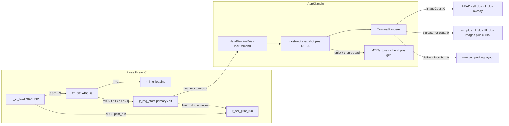
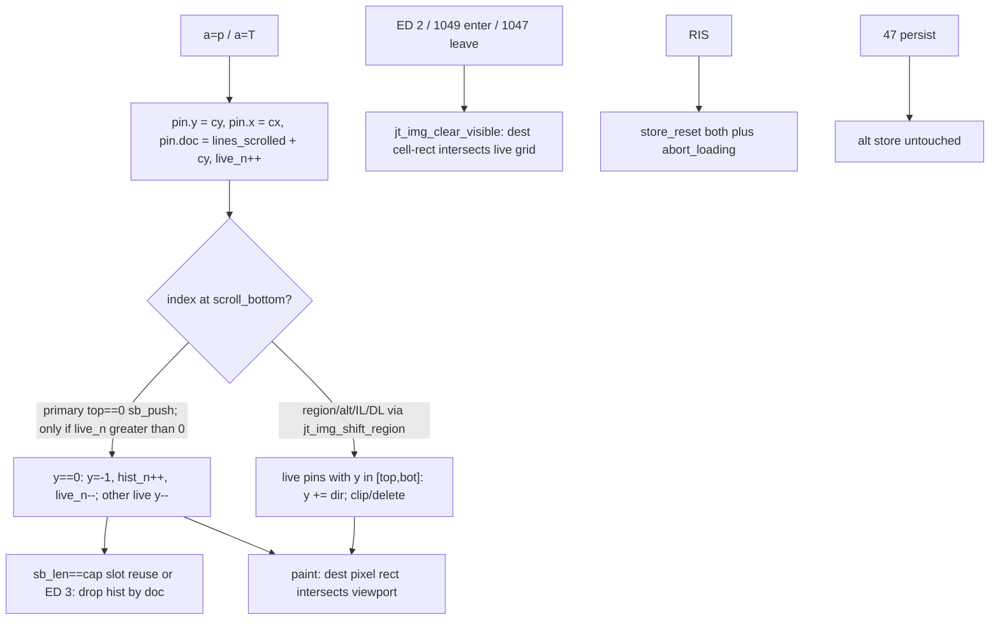

# Jetty — Kitty Graphics Protocol

| Field | Value |
| --- | --- |
| Document | Design (Kitty graphics) |
| Author | TBD |
| Date | 2026-08-25 |
| Updated | 2026-08-29 |
| Status | **Shipped.** PRs 38–44 as planned; PR 45 (animation + relative) also shipped on `master`. |
| Bundle ID | `dev.jetty.app` |
| Baseline | v1 `docs/DESIGN.md`; follow-on `docs/DESIGN-follow-on.md` |
| Audience | Senior engineers who already know v1 (16-byte `Cell`, C VT, linux16term Metal) |

This is the Kitty graphics plan. It does **not** rewrite `docs/DESIGN.md` or `docs/DESIGN-follow-on.md`; those listed graphics as out of *their* scope. v1 locks still hold: 16-byte `Cell`, `TERM=xterm-256color`, no Ghostty wrap, no `KITTY_WINDOW_ID`.

Ghostty (`https://github.com/ghostty-org/ghostty`) is the **parity baseline** for Kitty graphics *semantics*. It is not a library. Do not wrap `libghostty`, Zig, or `ghostty.h`. Study `src/terminal/kitty/graphics_*.zig` and `src/renderer/image.zig` as prior art. The protocol spec is https://sw.kovidgoyal.net/kitty/graphics-protocol/.

### HEAD vs this plan

Proposed Design below is the original **v1-of-graphics** spec (stills, then placeholders). **Do not treat “Not v1” rows as current code.**

| Slice | HEAD |
| --- | --- |
| 38 APC `G` parse | **done** |
| 39 RGB store, put, query `OK`, `kitty-graphics` | **done** |
| 40 GPU `z>=0` | **done** |
| 41 PNG, zlib, file, temp, shm | **done** |
| 42 deletes, `I=`, quota eviction | **done** |
| 43 under-text `z<0` | **done** |
| 44 Unicode placeholders `U+10EEEE` | **done** |
| 45 animation `a=f`/`a=a`/`a=c` + `d=f`; relative `P`/`Q`/`H`/`V` | **done** (opened after 44). Parent chain 8; `ETOODEEP` / `ECYCLE` / `ENOPARENT`. |
| Caps | Later matched Ghostty: max dim **10000**, max one image **400 MiB**, decoded store quota **320_000_000**. `N=` low bit is **transient** (not ignored). |
| APC terminator | ST (`ESC \` or C1 `0x9C`). **BEL does not end APC** (post-plan Ghostty match). |
| RGBA | Premultiplied in the store. shm maps **s×v** bytes, not the page-rounded object. |
| Auto-id reply | Implicit `i` (icat omits `i`) does **not** echo `OK`. |
| Still out | Kitty keyboard / `TERM=xterm-kitty`; JPEG/GIF as `f=`; Sixel; iTerm2 images |

---

## Overview

Jetty is a truthful `TERM=xterm-256color` macOS terminal: locked 16-byte `Cell`, C parse/grid, `MTKView` instanced cells. Apps that display images (`kitten icat`, chafa, yazi, nvim `image.nvim`, notcurses) speak the Kitty graphics protocol over APC `ESC _ G … ST`. At the start of this plan Jetty **drained** APC (`JT_ST_SOS_PM_APC` in `Sources/CVt/jt_vt.c`) and never replied, so those apps fell back to sixel/ASCII or failed.

This plan adds Kitty graphics as a **side table + extra GPU pass**, not a cell-layout change. Direct placements live in a per-screen image store keyed by `(image_id, placement_id)`. Pins are logical cell coordinates plus a history document-line id — the same absolute-line trick OSC 133 already uses (`lines_scrolled + y`). Live pins and history pins are **separate counters**. ASCII `y\n` walks the live list only, and is a no-op when `live_n == 0` even if scrollback still holds images. The GPU binds nothing extra when no placement’s **dest rect** intersects the viewport.

**v1-of-graphics (original shippable slice):** transmit + query + put + delete for still images. Formats RGB/RGBA/PNG, zlib, direct chunked + file + POSIX shm. Direct (cursor-relative) placements with z-index, source crop, dest rows/cols, pixel offsets, `C=1`. Query `OK` is not advertised until put can store a pin. **This slice shipped (38–43).**

**Originally not v1, now shipped:** Unicode placeholders (`U=1`, `U+10EEEE`, PR 44); animation (`a=f` / `a=a` / `a=c`, `d=f`) and relative placements (`P`/`Q`/`H`/`V`, PR 45). We do **not** advertise `xterm-kitty`. JPEG/GIF as `f=` stay out.

---

## Background & Motivation

### Current state at the start of this plan (do not invent)

Pre-38 snapshot. HEAD is the Shipped table above.

| Piece | What the code did then |
| --- | --- |
| `Cell` | 16 bytes (`jt_cell.h`). `extra` at offset 14 is the rare-store id (OSC 8 URI + SGR 58). Zero bits = default empty. |
| `jt_scr.pool_cells` | Live count of cells with a grapheme or rare `extra`. When 0: `fill_row` is lazy `erased=1`, `store_ascii_cells` does not `release_cells`, `stamp_cell` is a plain assign (`jt_grid.c`). |
| APC | `ESC _` / `ESC ^` / `ESC X` → `JT_ST_SOS_PM_APC`. Bytes dropped until BEL. ESC from APC goes to `JT_ST_ESCAPE`; `\` then `handle_esc` default (no-op) and `enter_ground`. **No payload, no `G` dispatch.** |
| OSC/DCS buffer | `jt_vt.osc[4096]`. OSC overflow → `JT_ST_OSC_IGNORE`. DCS uses the same buffer (`finish_dcs`: XTGETTCAP `+q`, DECRQSS `$q`). |
| GPU | Opaque R8 **cell mix** (`cell_fragment`: bg **and** glyph in one instance, blend off) → optional blended `ink_fragment` for **liga overflow** (not a bg/glyph split) → blended overlay (UL / strike / cursor in **one** pass). 32-byte `CellInstance`. Dirty-row memcpy from last presented ring slot. |
| Identity | `TERM=xterm-256color`, `COLORTERM=truecolor`, `TERM_PROGRAM=jetty`, `TERM_PROGRAM_VERSION` from `jt_version.h`. No `KITTY_WINDOW_ID`. |
| Size | `TIOCSWINSZ` already sets `ws_xpixel` / `ws_ypixel` (`pty_spawn.c`). `CSI 14 t` / `16 t` / `18 t` already reply (`TerminalSession.replySizeReport`). |
| Config | `~/.config/jetty/config` `key = value`. `parseBool` accepts only `true`/`1`/`yes`. No graphics key. |
| Follow-on | `docs/DESIGN-follow-on.md` non-goal: “Kitty graphics, Kitty keyboard, `TERM=xterm-kitty`”. PRs 18–37. This plan continues at **38**. |
| `scroll_up` | Primary `top==0` and not alt: `sb_push_falling` then `memmove` `rowmap` and return. It does **not** call `rotate_up`. Region/alt `index` and IL/DL call `rotate_up` / `rotate_down`. CSI `S`/`T` loop `jt_scr_index` / `jt_scr_ri`. |

Incident (PR 7): walking every cell on `fill_row` / `store_ascii_cells` / `stamp_cell` to retain grapheme/rare refs took vtebench `scrolling` 26ms → 64ms. Graphics that is idle on `y\n` must not walk history pins, and must not touch `fill_row`.

### Pain

1. **Apps already send APC `G`.** `icat`, yazi, chafa, nvim image plugins probe with `a=q` then DA1. At the start of this plan Jetty answered DA1 and never answered the query, so they correctly concluded “no graphics.”
2. **Cannot densify `Cell`.** An image id in `extra` or a third content kind would either collide with OSC 8 or force `pool_cells` onto every image cell. Direct Kitty placements are **not** cell contents; they are overlays that scroll with the grid.
3. **Cannot wrap Ghostty.** Ghostty’s store is `ImageStorage` on a page-backed `Screen` with `PageList.Pin`. Jetty has a circular `rowmap` + 50k-row ring. Copy the *protocol* and the *side-table idea*, not the pin type.

### What Ghostty / Kitty / WezTerm / foot actually do

| | Kitty | Ghostty | WezTerm | foot | Jetty (this plan → HEAD) |
| --- | --- | --- | --- | --- | --- |
| Protocol | spec | full (incl. placeholders, relative, animation) | transmit/put; placeholders historically weak | sixel; no Kitty | stills 38–43; placeholders 44; relative + animation 45 |
| Cell | not used for direct put | pin + optional `U+10EEEE` | overlay list | n/a | side table; `Cell` unchanged |
| GPU | compositor layers | dedicated image pass + IOSurface | texture overlays | sixel | `MTKView` extra pass; no IOSurface |
| Quota | 320MB / buffer | 320MB; max dim 10000; max image 400MB | similar | n/a | Plan: 320MB / 8192 / 32MB. **HEAD matches Ghostty:** 320_000_000 / 10000 / 400MB |
| `TERM` | `xterm-kitty` | `xterm-ghostty` | `wezterm` | `foot` | **`xterm-256color`** |

WezTerm is not the dialect to copy (incomplete placeholders, `enable_kitty_graphics` flag). Foot is sixel-only. Kitty is the spec. Ghostty is the implementation to match when the spec is silent.

---

## Goals & Non-Goals

### Goals

- Still-image Kitty graphics that `kitten icat`, chafa, yazi, and non-tmux nvim image plugins can use after an `a=q` probe. **HEAD also:** placeholders (tmux), relative placements, animation frames.
- Keep every v1 lock: 16-byte `Cell`, `TERM=xterm-256color`, no Ghostty wrap, no linux16term growth, no IOSurface copy-forward.
- Idle `y\n`: no per-cell retain/hash/width/memmove on `jt_scr_index` / `fill_row` / ASCII `print_run`. `pool_cells == 0` rules unchanged. `live_n == 0` means `index` does not walk the placement array, even if history still holds images. Canaries must not 2×.
- Honest discovery: reply `OK` to `a=q` only when put can store a pin; do not advertise `xterm-kitty` or `KITTY_WINDOW_ID`.
- Caps so a hostile APC stream cannot OOM.

### Non-Goals (explicit)

| Capability | Why |
| --- | --- |
| `TERM=xterm-kitty` / Kitty keyboard / `fullkbd` | Would lie about `TERM` (v1 lock) |
| Densify `Cell` / Ghostty style table / image id in `extra` | v1 lock; OSC 8 already owns `extra` |
| libghostty / Zig / `ghostty.h` | v1 lock |
| Sixel, iTerm2 inline images | Different protocols; not this document |
| Animation (`a=f`, `a=a`, `a=c`) | Out of the first merge. **Shipped in PR 45.** |
| Relative placements (`P`/`Q`/`H`/`V`) | Need placeholders; later slice. **Shipped in PR 45.** |
| Usage hint `N=` as a real cache policy | Parse and ignore in v1. **HEAD:** low bit is transient (Ghostty). |
| JPEG / GIF as `f=` | Spec is RGB/RGBA/PNG only |
| Walking unread cells to skip BCE | AGENTS.md lock |
| Image atlas packed into `GlyphAtlas` | Wrong lifetime; would evict letters |
| Treating liga ink as a bg/glyph split | HEAD ink is overflow coverage only (`wantInk` in `MetalTerminalView`) |

---

## Key Decisions

1. **Side table, not `Cell`.** Direct placements are not cell contents. `Cell` stays 16 bytes. `extra` stays OSC 8 + Setulc. Rationale: PR 7; `pool_cells` is the idle gate.

2. **Per-buffer `jt_img_store` on primary and alt, plus a parser-owned loading slot.** Ghostty’s `ImageStorage` is per `Screen`. Jetty: `jt_scr` holds two stores; `jt_vt` holds the in-flight chunk assembly. Rationale: 47/1047 persist alt images; 1049 ED 2 on enter clears alt; one in-flight transmit is a protocol rule.

3. **Split `live_n` and `hist_n`. Gate `index` on `live_n == 0`.** Full-screen primary `index` (`scroll_top==0`) converts live `y==0` pins to history using `lines_scrolled` (OSC 133 document id) and decrements other **live** `y`. That walk is **O(`live_n`)**, skipped entirely when `live_n==0` — even if `hist_n>0`. History prune is only on sb slot reuse (`sb_len==cap`) and ED 3. `fill_row` never looks at images. Rationale: after `icat`, a pin sits in history for the rest of the session; walking it on every `y\n` is the PR 7 shape.

4. **C parser for APC `G`; C store; Swift ImageIO only for PNG; Swift Metal for paint.** RGB/RGBA/zlib/base64 stay in C. PNG/file/shm: validate caps, copy payload, `unlockForIO?()`, I/O, `relock?()` in `defer`, commit if `loading.generation` still matches. Closures are nil in unit tests. RGB→RGBA expansion (alpha=255) is C, before `addImage`. Rationale: one parser; `NSLock` is not recursive; `ParserTests.feed` never took the session lock.

5. **v1 protocol slice = stills, direct placement.** Actions `t`/`T`/`q`/`p`/`d`. Media `d`/`f`/`t`/`s`. Formats 24/32/100. `o=z`. No `a=f`/`a=a`/`a=c`, no `U=1`, no `P`/`Q` **in the first merge**. Unsupported actions with an id reply `ENOTSUP` (quiet keys still apply). Retransmit of the same `i` and put of the same `(image_id, placement_id)` **replace** in the first store PR. Rationale: `icat` / chafa / yazi; do not advertise query `OK` before replace-put exists. **HEAD:** 44 adds `U=1`; 45 adds `a=f`/`a=a`/`a=c` and `P`/`Q`/`H`/`V`.

6. **Zero-image GPU path is byte-identical to today.** `imageCount == 0` → no image pipeline bind, no extra `drawPrimitives`, no new cell instance layout, overlay stays one pass. `z >= 0` only in the viewport → today’s cell mix + ink + **decoration overlay** (UL/strike/auto-URL/preedit underline) + image pass + **cursor overlay**. Any **visible** dest rect with `z < 0` → a **new** dense two-range compositing layout (not liga ink); `DirtySkip.fullRebuild` while that bit is true. Rationale: idle neovim must not pay for icat; liga overflow is not a bg pass.

7. **`TERM` stays `xterm-256color`.** Discovery is `a=q` then DA1, plus `TERM_PROGRAM=jetty`. Config `kitty-graphics = true` (default on) lands in the **same PR** that first replies to query. Off: drain APC `G` like today, **no** query reply. Rationale: v1 honesty; lying `TERM=xterm-kitty` was rejected in `DESIGN.md` alternative 6.

8. **Quota 320 MiB decoded RGBA (Kitty/Ghostty store cap), max dim 8192, max one image 32 MiB, max 256 images, max 1024 placements, one loading image.** 320 MiB is the *decoded store* cap; a single image is still 32 MiB **in the first merge**. Evict: (1) `placement_n==0`, oldest generation first; (2) if still over, evict oldest image **and all its placements** (live+hist). Never leave a pin whose `image_id` is missing. If that cannot free `max(needed, one image)`, `ENOSPC` and do not store. Rationale: match Kitty/Ghostty’s 320MB buffer quota. 105×35 @2× fullscreen RGBA is ~17 MiB. **HEAD:** max dim 10000, max image 400 MiB, quota 320_000_000 (`e314e2f`).

9. **`d=a` / ED 2 / `d=p|c|x|y|q` use dest **cell-rect** intersection, not origin-only.** Unplace if the dest cell rectangle intersects the live grid (or the named cell/column/row). History-only pixels (dest entirely in sb, `dest_y1 < 0`) stay on ED 2. RIS is `jt_img_store_reset` on **both** stores + `abort_loading`. ED 0/1 / EL / ECH / ICH / DCH do not move or delete direct pins. Any `a=d` aborts an in-flight chunked upload. Rationale: a `r=10` put at `y=rows-2` then two `index`es leaves origin in history while dest still covers live rows; `CSI 2 J` must clear those remnants.

10. **Do not set `KITTY_WINDOW_ID`.** That env is a Kitty process id. Query is the honest probe.

11. **Auto-assign image ids like Ghostty.** Client `i=0` (and no `I`) still gets `next_auto_id` starting at 2147483647; the assigned `i` is **echoed** in the reply unless quiet suppresses it **when the client supplied `i` or `I`**. There is no stored id=0 image. Query/delete with both `i` and `I` omitted: no reply. Both `i` and `I` set: `EINVAL`. **HEAD:** implicit auto-id (icat omits `i`) does **not** generate a reply (`37b08ab`) — echoing `i=2147483647;OK` leaked into the shell.

---

## Closed Questions (this document)

| Decision | Resolution |
| --- | --- |
| Default | **`kitty-graphics = true`**. Off drains APC and does not reply to `a=q`. Key ships in the first PR that replies `OK`. |
| Quota | **320 MiB** decoded store (Kitty/Ghostty). Single image still **32 MiB**. No config key in the first PRs. |
| PNG | **ImageIO** via `jt_vt_host.png_decode`. Host **drops `session.lock`** around decode. RGB/RGBA goldens do not need it. Decode as **sRGB**. If a PNG golden mismatches Kitty, pin a fixture. |
| shm / files | **In v1.** Sandbox is off. Emulator **process cwd** (not OSC 7). macOS tmp: `/tmp`, `/private/tmp`, `$TMPDIR` only — no `/dev/shm`. |
| Under-text z | **In v1 GPU**, only when a **visible dest rect** has `z < 0`. Dense two-range + always-`fullRebuild`; liga ink is not that layout. |
| Unicode placeholders | **Specified below, implemented after direct GPU** (PR 44). Not required to ship icat. `a=T,U=1` is **`ENOTSUP`** until then. **HEAD: shipped.** |
| Animation | **Out of the first merge.** `ENOTSUP` if addressed until PR 45. **HEAD: shipped** (`a=f`/`a=a`/`a=c`, `d=f`). |
| Relative placements | **Out of v1-of-graphics.** After placeholders. **HEAD: shipped** (`P`/`Q`/`H`/`V`, parent chain 8). |
| CSI 16 t | **Already implemented.** No graphics PR for it. |
| `Cell.extra` for image ids | **Rejected.** |
| GPU pixel format | **`rgba8Unorm`**, matching the C RGBA8 store. Not `bgra8Unorm`. |
| Overlay vs z≥0 | Decorations (UL/strike) with text, **under** z≥0 images. Cursor last. |

Do not reopen v1 closed questions (cell, TERM, ExtraBold, sandbox, no Ghostty wrap).

---

## Proposed Design

### Architecture



Ownership stays v1: parse mutates C under `session.lock`. `write_pty` for `OK` / `ENOENT` / `ENOTSUP` does **not** take that lock (`writePtyBlocking`, same as DA/DECRPM). PNG/file/shm: copy + unlock + I/O + relock (see Parse path).

### Protocol surface

APC form (spec):

```
ESC _ G <key=value, ...> ; <base64 payload> ST
```

ST is `ESC \`. The original plan also accepted BEL (0x07), matching OSC/DCS. **HEAD:** APC `G` ends on ST only (`ESC \` or C1 `0x9C`). BEL is payload. OSC/DCS still take BEL.

#### v1 actions (implement)

| `a` | Meaning | v1 |
| --- | --- | --- |
| `t` (default) | Transmit only | yes |
| `T` | Transmit + put at cursor | yes |
| `q` | Query (try load, do not store, do not replace) | yes (reply `OK` only once put exists) |
| `p` | Put existing image | yes |
| `d` | Delete | yes (all `d=` except `f`/`F`) |

#### Deferred actions in the first merge (parse, do not execute)

| `a` | Meaning | First merge | HEAD |
| --- | --- | --- | --- |
| `f` | Animation frame data | `ENOTSUP` if `i` or `I` set | **shipped** (PR 45) |
| `a` | Animation control | `ENOTSUP` | **shipped** (PR 45) |
| `c` | Compose frames | `ENOTSUP` | **shipped** (PR 45) |
| other | Invalid | `EINVAL` | `EINVAL` |

Quiet `q=0` (default) replies; `q=1` suppresses `OK`; `q>=2` suppresses all (Ghostty `Command.Quiet`). Continuation chunks may carry `q`.

#### v1 keys

**Transmission** (`jt_img_tx`): `f` 24/32/100 (0 → RGBA, unknown → defer `EINVAL` at execute so the id can be echoed), `t` `d`/`f`/`t`/`s`, `s`/`v` width/height, `S`/`O` file size/offset, `i`/`I`/`p`, `o=z`, `m` only when `t=d` (Ghostty/Kitty: ignore `m` on file/shm — mpv relies on this), `N` parsed and ignored **in v1**. **HEAD:** `N` low bit is transient (Ghostty).

**Retransmit of `i`:** if that id already exists, delete the old image **and all its placements** (live+hist), then store the new pixels. Do not display until a new put (spec). Same `(image_id, placement_id)` on put: the new placement **replaces** the old (move/resize without flicker). `p=0` always allocates a new internal placement id (multiple puts of the same image).

**Display** (`jt_img_put`): `i`/`I`/`p`, source `x`/`y`/`w`/`h`, cell offsets `X`/`Y`, dest `c`/`r`, `z` as i32, `C=1` no cursor move (any other `C` moves). `U`, `P`, `Q`, `H`, `V` in v1-of-graphics: if `U!=0` or `P!=0` → `ENOTSUP`. `z`, `H`, `V` parse as i32 (Ghostty `finishValue`). **HEAD:** `U=1` is PR 44; `P`/`Q`/`H`/`V` are PR 45.

**Source crop (Kitty defaults 0 = remainder):** after the image size is known, `src_w == 0` → `width - src_x`; `src_h == 0` → `height - src_y`. Same for omitted keys. A put with no crop stores the full image, not an empty dest.

**Dest rectangle (Kitty, resolved at put):**

| `c`, `r` | Dest |
| --- | --- |
| both set | cell rectangle `c`×`r` |
| only `c` | `r` from source aspect: `r = max(1, round(c * src_h * cell_w / (src_w * cell_h)))` using **put-time** cell px |
| only `r` | `c` from aspect, same formula swapped |
| neither | pixel size `src_w`×`src_h`, truncated to the window; store `pixel_size=1` |

`X`/`Y` are **not** added to `c`/`r` (spec). Clamp `X` to `[0, cell_w)` and `Y` to `[0, cell_h)` at put. Re-clamp at paint if font size changed.

Cursor after put (unless `C=1`): add the **resolved** dest columns and dest rows (the cell rectangle actually used — for `pixel_size`, `ceil(dest_w / cell_w)` and `ceil(dest_h / cell_h)` at **put**). Clamp. Do **not** wrap or `index`. Cursor does not reflow later on zoom.

**`pending_wrap`:** a put uses the current cell (`cx`,`cy`) and does **not** consume wrap. `pending_wrap` stays set. The next **print** still wraps. Relative puts (PR 45) never move the cursor.

**Delete** (`d=`): `a/A`, `i/I`, `n/N`, `c/C`, `p/P`, `q/Q`, `r/R`, `x/X`, `y/Y`, `z/Z`. `f/F` → `ENOTSUP` **in the first merge**. Lowercase unplaces; uppercase also frees image data if `placement_n==0` after the unplace (history pins count as references — do not free while `hist_n` still points at the image). 1-based `x`/`y`. Inverted `r` range matches nothing (Kitty). **HEAD:** `d=f`/`F` shipped with animation (PR 45).

**Dest cell rect** (shared by paint, `d=a`, ED 2, `d=p/c/x/y/q`):

```
x0 = pin.x
y0 = pin.y >= 0 ? pin.y : (int32_t)((int64_t)pin.doc - (int64_t)s->lines_scrolled)
     /* hist origin: y0 is typically negative */
x1 = x0 + (int32_t)cols - 1
y1 = y0 + (int32_t)rows - 1
```

`cols`/`rows` are the put-time resolved cell rectangle (`pixel_size` uses the ceil stored at put). Intersects the live grid iff `x1 >= 0 && x0 < cols_screen && y1 >= 0 && y0 < rows`.

**`d=a` / omitted `d` / `d=A` / ED 2:** unplace if that dest cell rect **intersects the live grid**. Origin may be history (`pin.y < 0`) while dest still covers live rows — those remnants **go**. Dest entirely in scrollback (`y1 < 0`) **stays**. `d=A` then `deleteIfUnused`. Scrollback **viewport** is irrelevant (user scrolled back does not change which pins ED 2 clears). Same helper for 1049-enter / 1047-leave.

**`d=p` / `d=c` / `d=q` / `d=x` / `d=y`:** spec is placements that **intersect** a cell, the cursor cell, a column, or a row. Use the dest cell rect, not `pin.x`/`pin.y`. `d=p,x=3,y=4` (1-based) hits a `r=10` image whose origin is two rows above. `d=q` also matches `z`. `d=z` still matches stored `z` only (virtuals excluded, as before).

Any `a=d`, and any new transmit while `m=1`, **abort** the in-flight loading image (spec: any delete during chunked upload aborts the partial).

**Both `i` and `I`:** `EINVAL`.

**Image numbers (`I`):** create always allocates a new image; reply includes assigned `i` and echoed `I`. Later commands with `I` and no `i` address the newest image with that number (Ghostty `imageByNumber` by generation).

**Auto `i` (Ghostty):** omitted/`0` `i` and omitted/`0` `I` on transmit/put → assign `next_auto_id` (start `2147483647`, skip 0 and in-use), store under that id, echo `i=` in the reply unless quiet. Query with no `i`/`I`: no reply. Delete with no `i`/`I` and `d` not id-based: no extra id echo.

**Query probe (spec):**

```
ESC _ G i=31,s=1,v=1,a=q,t=d,f=24;AAAA ST
CSI c
```

Reply to the query **before** DA1, FIFO in `jt_vt_feed`. `write_pty` from `finish_apc` then the next bytes run DA1. Do not defer the graphics reply to main. **Do not send this `OK` until the store can accept `a=T`/`a=p` (PR 39).** A parse-only PR must not reply.

Response encode (Ghostty `Response.encode`):

```
ESC _ G i=<id>[,I=<num>][,p=<pid>];<OK|errno:detail> ST
```

No encode if there is no id to echo and the action is not a query that supplied one. Messages: `OK`, `EINVAL`, `ENOENT`, `ENOSPC`, `ENOTSUP`, plus optional `:detail` printable ASCII.

### Cell model

**Do not write image ids into cells for direct put.** A put does not fill spaces, does not set `extra`, does not increment `pool_cells`.

```c
/* jt_img.h — sizes are v1 caps */
enum { JT_IMG_MAX_DIM = 8192 };
enum { JT_IMG_MAX_BYTES = 32u * 1024u * 1024u };
enum { JT_IMG_QUOTA = 320u * 1024u * 1024u }; /* decoded store; one image still JT_IMG_MAX_BYTES */
enum { JT_IMG_MAX_IMAGES = 256 };
enum { JT_IMG_MAX_PLACEMENTS = 1024 };
enum { JT_IMG_MAX_APC = 65536 }; /* one APC command */

typedef struct jt_img_pin {
    int32_t x;           /* origin column */
    int32_t y;           /* live logical row, or -1 if history */
    uint64_t doc;        /* lines_scrolled + y at put; hist document id */
} jt_img_pin;

typedef struct jt_img_placement {
    uint32_t image_id;
    uint32_t placement_id; /* 0 never stored; internal ids are assigned */
    uint8_t internal;      /* 1 if client p was 0 */
    uint8_t virtual;       /* v1 always 0 */
    uint8_t pixel_size;    /* 1 = neither c nor r; dest is src px */
    int32_t z;
    uint32_t src_x, src_y, src_w, src_h;
    uint32_t cols, rows;   /* resolved cell rectangle at put; never “infer at paint” */
    uint32_t off_x, off_y; /* X/Y pixel offset in origin cell, put-time clamped */
    jt_img_pin pin;
} jt_img_placement;

typedef struct jt_img {
    uint32_t id, number;
    uint32_t width, height; /* pixels */
    uint8_t *rgba;          /* always RGBA8; RGB expanded in C (A=255) */
    size_t nbytes;
    uint32_t placement_n;   /* live + hist pins that reference this id */
    uint64_t generation;
} jt_img;

typedef struct jt_img_store {
    jt_img *images;         /* compact array or open-address map, cap 256 */
    int32_t image_n;
    jt_img_placement *pl;   /* cap 1024; live and hist mixed, distinguished by pin.y */
    int32_t live_n;         /* pin.y >= 0 */
    int32_t hist_n;         /* pin.y < 0 */
    size_t total_bytes;
    uint64_t generation;    /* content mutations only, not geometry */
    uint32_t dirty;         /* geometry or content; renderer clears */
    uint32_t next_internal_pid;
    uint32_t next_auto_id;  /* 2147483647 */
} jt_img_store;
```

`jt_scr` gains:

```c
jt_img_store *img_primary;
jt_img_store *img_alt;
int32_t img_live_n; /* active store’s live_n, for branch predict on index */
uint8_t kitty_graphics;
```

**Allocate both stores in `jt_scr_init`** (`calloc` + `jt_img_store_init`). Free both in `jt_scr_deinit`. Do **not** wait for `ensure_alt`: a NULL `img_alt` on first 1049h is the default leak path. The alt store may stay empty until first enter; the pointer is never NULL after init.

`img_live_n == 0` is the idle gate for **scroll/index**. It is **not** `live_n + hist_n`. After `icat` the pin is history: `live_n==0`, `hist_n==1`, `y\n` does not walk the array.

**Keep `s->img_live_n` equal to the active store’s `live_n` after every mutation that can change it:** end of `jt_scr_switch_screen_mode` (after 1047-leave / 1049-enter ED 2), `jt_img_clear_visible`, `jt_img_shift_region`, put/delete, `jt_img_on_resize`, RIS (`0`). If it stays at the previous buffer’s count, idle alt `y\n` walks a stale non-zero gate (or skips a live alt store). Golden: 1049h with a primary history pin (`live_n==0` on primary) then alt `y\n` stays in the ~5ms band.

`fill_row` does **not** load `img_live_n`. No image branch on that path.

`placement_n` on an image is live+hist refs (quota / uppercase delete). `store.live_n + store.hist_n` is the placement array occupancy (`<= 1024`).

#### Pin lifetime



| Event | Placements |
| --- | --- |
| `scroll_up` primary `top==0` (`sb_push_falling`) | Call `jt_img_shift_region(s, top, bot, -1, sb_pushed=1)` **only if `img_live_n > 0`**. Convert live `y==0` to history (`y=-1`, `doc = lines_scrolled-1` after the increment). Remaining live `y--`. Do **not** walk `hist_n`. |
| `scroll_up` region/alt (no sb) | `jt_img_shift_region(..., sb_pushed=0)` if `live_n>0`. Live pins with origin in `[top,bot]`: `y--`. Clip dest `rows` if the rect would leave the region; delete if fully clipped (Ghostty `scrollMarginsBegin`). |
| `scroll_down` | `jt_img_shift_region(..., dir=+1, sb_pushed=0)`. |
| `jt_scr_il` / `jt_scr_dl` | Same helper after each rotate, **not** from `rotate_up`/`rotate_down` themselves. |
| `rotate_up` / `rotate_down` | **No image hook.** Primary `y\n` `memmove`s `rowmap` without calling them; hooking them would miss `y\n` or double-shift region IND. |
| `fill_row` | **No image hook.** |
| ED 2 | `jt_img_clear_visible` on the **active** store: dest cell-rect intersects live grid (not origin-only). |
| ED 0 / ED 1 | **No-op** for direct pins (Kitty: other erase must not affect graphics). |
| EL / ECH / ICH / DCH | No-op for direct pins. |
| `sb` wrap (`sb_len==cap`, incoming slot reused) | Drop history pins with `doc < lines_scrolled - sb_len`. O(`hist_n`), only on wrap, not on every `index`. |
| Resize | No reflow. Drop live pins with `x >= nc` **or** `y >= nr` (those live rows were discarded, not pushed to sb — `jt_scr_resize` copies `min(orows,nr)`). Clip dest `cols` to `nc - x`, dest `rows` to `nr - y` for remaining live pins. History: clip `x`/`cols` the same; `doc` stays (`lines_scrolled` unchanged). Row **grow**: do nothing. |
| 47 enter/leave | Switch active store. No clear. Then `img_live_n = active->live_n`. |
| 1047 leave | ED 2 **while still on alt** (`jt_scr_switch_screen_mode` order) → `clear_visible(alt)`. |
| 1049 enter | Switch to alt, then ED 2 on alt → `clear_visible(alt)`. |
| 1049 leave | Switch to primary. DECRC. No image copy. Then `img_live_n = primary->live_n`. |
| ED 3 / `clear_history` | `jt_img_clear_history_pins`: drop `hist_n`, decrement image `placement_n`. Live stay. |
| RIS | `jt_img_store_reset` **both** stores + `abort_loading`. Then `img_live_n = 0`. Independent of ED 2 (which would miss alt). |

**Call sites for `jt_img_shift_region` (only these four):**

```
scroll_up      → shift dir=-1, sb_pushed = (top==0 && !in_alt && incoming>=0)
scroll_down    → shift dir=+1, sb_pushed = 0
jt_scr_il      → once per inserted row, dir=+1, region [cy, scroll_bottom]
jt_scr_dl      → once per deleted row, dir=-1, region [cy, scroll_bottom]
```

CSI `S`/`T` loop `jt_scr_index`/`jt_scr_ri` and inherit `scroll_up`/`scroll_down`. Tests: primary `index`; `DECSTBM` region `index`; `IL`/`DL`; CSI `S`/`T`. Must not double-shift.

**Paint / snapshot visibility (dest rect, not origin):**

`integerRow` / `blitDocumentRow` are a blit index: `0 ..< sb_len` oldest-first scrollback, `sb_len + liveY` live. Pin `doc` is OSC-133 space (`lines_scrolled + y`). After the ring wraps, `lines_scrolled >> sb_len`. **Do not pass `integerRow` as `view_start_doc`.**

`view_start_doc` is the OSC-133 id of `paint[0]`, the same conversion `PromptJump.target` already uses (`Sources/Jetty/Vt/PromptJump.swift`):

```
lo = lines_scrolled >= sb_len ? lines_scrolled - sb_len : 0
if (in_alt)
    view_start_doc = lines_scrolled;          /* alt has no sb; paint[0] = alt y=0 */
else
    view_start_doc = lo + integerRow;         /* PromptJump `top` */
```

C computes this inside `jt_img_snapshot` from `s->in_alt`, `s->lines_scrolled`, `jt_scr_sb_len(s)`, and the caller’s `integer_row`. There is no `live_rows` argument.

```
origin_doc = pin.y >= 0 ? (lines_scrolled + pin.y) : pin.doc
paint_row  = (int32_t)((int64_t)origin_doc - (int64_t)view_start_doc)  /* may be negative */
ox0        = pin.x * cellW + off_x          /* grid-local; no chrome inset */
oy0        = paint_row * cellH + off_y
sx0, sy0   = dest px (cell rect or pixel_size)
```

Intersect `(ox0,oy0,sx0,sy0)` with the paint viewport `(0, 0, cols*cellW, paint_rows*cellH)`. **Clip** the quad: adjust `ox,oy,sx,sy` **and** UV (`u0..u1`, `v0..v1`) to the intersection. After clip, `ox,oy >= 0` and `ox+sx` / `oy+sy` fit the paint viewport, so `int16` instance fields cannot wrap. A `r=5000` put with origin `y=-1` becomes a strip at the top of the live view with UVs starting partway down the texture.

**Snapshot `ox,oy,sx,sy` are clipped grid-local px.** `ImagePaint` adds `originX`/`originY` (`insetLeftPx`/`insetTopPx`, same as cells). `contentOffsetY` stays a vertex uniform. Do not add insets in C — that would double-offset.

A 10-row image whose origin scrolled to `y=-1` still intersects live rows 0–8 after clip. Cap 1024 snap slots. If more intersect, drop highest `z` first (rare; fputs once).

Golden: put, `index` until `sb_len==cap` **and** `lines_scrolled > cap`, pin still maps to the falling row (PromptJump space, not blit index).

Do **not** maintain a reverse `phys → logical` map on every `rotate_up`. That would run on idle `y\n`.

### Parse path

Current `JT_ST_SOS_PM_APC` drops bytes. Split:

```
ESC _
  next byte == 'G' → JT_ST_APC_G, apc_n=0
  else            → JT_ST_SOS_PM_APC drain until ST/BEL (unchanged)
ESC ^ / ESC X     → drain (unchanged)
```

`JT_ST_APC_G` accumulates into `jt_vt.apc` (growable, cap `JT_IMG_MAX_APC`). Overflow → `JT_ST_APC_IGNORE` until ST (OSC rule). On ESC: `finish_apc` then `enter_escape` (so ST’s `\` is `handle_esc` no-op), **same as OSC**. On BEL: `finish_apc` + ground.

`finish_apc` only if `kitty_graphics`. Off: discard, no reply.

**Do not use `osc[4096]`.** A chunk’s base64 payload is 4096 bytes plus control. DCS still owns `osc[]`.

Parser (port Ghostty `graphics_command.zig` `Parser` into C, not a paraphrase of the KV tricks):

- Keys: single ASCII letter. Longer / unknown keys ignored.
- Values: one non-digit byte → that ASCII; else `u32` (or i32 for `z`/`H`/`V`).
- `;` starts payload; payload is base64, decoded in place on complete.
- `feedSlice` once in data state so 4 KiB chunks are not per-byte. `jt_vt_feed` in APC can span until ESC/BEL.

Chunk assembly (`m=1` then `m=0`):

- One `jt_img_loading` on `jt_vt`.
- First command carries full tx keys; later chunks only `m` and optional `q`.
- Another graphics command before `m=0` → abort loading.
- Any `a=d` → abort loading.
- `m` ignored unless `t=d`.
- Cursor for `a=T` is the cursor when the **final** chunk is received.
- Do not display until the sequence validates.

Base64: C decoder, in-place. Invalid → `EINVAL`.

zlib: `inflate` from libz (`Package.swift` `CVt` `linkedLibrary("z")`). `o=z` before format interpret. PNG+zlib requires `S` = compressed PNG size (spec). If compressed payload `> 64 KiB`, inflate after dropping `session.lock` (same hop as PNG).

RGB/RGBA: require `s` and `v`; `nbytes == s*v*bpp`. Cap `s,v <= 8192` and `s*v*4 <= JT_IMG_MAX_BYTES`. **RGB (3 bpp) is expanded to RGBA8 in C** (`A=255`) before `addImage`. Store never holds 24-bit packed pixels.

PNG: after inflate, host `png_decode`. Swift ImageIO (`CGImageSource` + `CGBitmapContext` RGBA, sRGB). Failure → `EINVAL`. Tests: RGB goldens in C; one PNG golden in Swift.

**Lock hop for PNG / file / shm / large zlib** — optional closures on `Parser`, **not** an unconditional `session.lock.unlock()`:

```swift
public var unlockForIO: (() -> Void)?
public var relock: (() -> Void)?
```

`TerminalSession.parseBatch` installs them around `parser.feed` (it already holds `session.lock`). Tests leave them **nil** → decode/read **inline**; `ParserTests.feed` never took the lock.

Glue (`png_decode` / file / shm / zlib>64KiB), every path including errors:

1. Under lock: parse KV, decode base64, check caps, copy payload, bump `loading.generation`.
2. `unlockForIO?()`.
3. ImageIO / `open`+`read` / `shm_open`+`mmap`.
4. `relock?()` in `defer` (must run on failure).
5. If `loading.generation` changed or graphics disabled: free, do not store.
6. Else `addImage` / query reply.

`feed` **returns with the same lock state it entered.** `parseBatch` may still `lock.unlock()` after `feed`; glue that forgets to relock double-unlocks. Mid-feed hop is required (query reply must precede DA1 in the same `feed`); do not defer I/O until `parseBatch` yields.

RGB→RGBA of a capped 32 MiB buffer may still run under the lock (no hop). That is a hitch bound, not an ownership bug.

Do not `replace` a 32 MiB `MTLTexture` under `lockDemand`. That is GPU-side (below).

Files (`t=f` / `t=t`):

- Payload is base64 path, UTF-8.
- Relative paths: resolve against the **emulator process cwd** (`getcwd`), **not** OSC 7 (OSC 7 is the child).
- `realpath` / `open` + `fstat`. Regular files only (`S_ISREG`). Symlink cap 8.
- After resolve, refuse `/proc`, `/sys`, and `/dev/` **except nothing** — product is macOS; **do not** special-case `/dev/shm` (it does not exist as a temp dir here and would fight a `/dev` ban).
- `t=t` unlink **only if** the resolved path contains `tty-graphics-protocol` **and** is under `/tmp`, `/private/tmp`, or `$TMPDIR` (after resolve; `/tmp` → `/private/tmp` on Darwin).
- `S`/`O`: read that window only, cap 32 MiB.
- Goldens: relative path from cwd; `/etc/passwd` → error, no store.

shm (`t=s`):

- Payload is the POSIX **name** (`shm_open`), not a filesystem path.
- `mmap` `S` bytes at `O`. If `S==0`, map the whole object, still cap 32 MiB.
- `munmap`, `close`, `shm_unlink`.

Loading bytes live on `jt_vt` until complete, then move into the **active** store. Query (`a=q`) runs the same load path into a scratch, replies, frees, does not `addImage`.

`jt_vt_feed` GROUND path is unchanged: APC is not GROUND. ASCII `print_run` never sees `ESC _ G`.

### GPU path

Do **not** pack images into `GlyphAtlas`. Do **not** use `OverlayInstance` for images (solid color, no UV). Do **not** reuse `cell_vertex` (UVs divide by **glyph atlas** size).

HEAD `TerminalRenderer.draw`:

1. Opaque `cell_fragment` (bg **and** glyph, blend off).
2. Optional `ink_fragment` if `wantInk` (`ligatures != off` and overflow spans) — **liga coverage over already-painted cells**, not a glyph pass with transparent bg.
3. Overlay (UL + strike + cursor, one buffer).

`imageCount == 0` keeps that sequence, including a combined overlay. Zero counts: **no** `prepare` of image buffers, **no** `setRenderPipelineState` of the image pipeline, **no** extra `drawPrimitives`. Same pattern as `if overlayCount > 0`.

#### `ImageInstance` (32 bytes) and shaders

```c
// CPU / Metal, 32 bytes, 16-byte aligned
//  0  int16_t  ox, oy
//  4  uint16_t sx, sy
//  8  uint16_t u0, v0, u1, v1   // pixel coords into THIS texture
// 16  uint32_t _pad[4]          // pad to 32
```

```metal
struct ImageInstance {
    short ox, oy;
    ushort sx, sy;
    ushort u0, v0, u1, v1;
    uint _pad[4];
};
static_assert(sizeof(ImageInstance) == 32);

struct ImageUniforms {
    float2 viewport;
    float contentOffsetY;
    float _pad0;
    float texW;
    float texH;
    float2 _pad1;
};
static_assert(sizeof(ImageUniforms) == 32);
```

`image_vertex`: same NDC as `cell_vertex` (`contentOffsetY`), UV = mix(u0,u1)/texW, mix(v0,v1)/texH. **Not** glyph atlas uniforms.

`image_fragment`: `texture2d<float>` sample, return `float4(rgb, a)` **straight alpha** (ImageIO/PNG un-premultiplied). Pipeline: blend on, `sourceRGB = sourceAlpha`, `destRGB = oneMinusSourceAlpha` (same as overlay).

Linear sampler (separate from the nearest glyph sampler). One texture bind per unique `id`; batch instances that share a texture. `rgba8Unorm` shader-read. No swizzle.

`TerminalRenderer.draw` grows:

```
draw(..., imageUnderCount: Int, imageOverCount: Int, ...)
```

One image instance buffer, under-text packed at `[0, imageUnderCount)`, over-text at `[imageUnderCount, imageUnderCount+imageOverCount)`. `imageCount = imageUnderCount + imageOverCount`. Either zero: skip that `drawPrimitives`. Both zero: skip pipeline bind.

#### Texture cache

`[UInt32: (generation: UInt64, tex: MTLTexture)]`.

After snapshot (under lock: copy `{id,gen,w,h}` plus RGBA **only for miss/stale gen** into Swift `Data`):

1. `unlockDemand`.
2. Drop cache entries whose `id` is **not** in this snap **or** whose gen is stale.
3. `replace` / allocate `rgba8Unorm` on the remaining misses.
4. Encode.

Do not upload under `lockDemand`. Parse yields on `drawDemand`; a 32 MiB memcpy under the lock would starve `parseBatch`.

#### Dest px (paint)

C snapshot already clipped to the paint viewport and filled grid-local `ox,oy,sx,sy` plus cropped UV. Swift:

```
off_x' / off_y' were applied in C at current cellW/cellH (re-clamp X/Y before dest px)
inst.ox = ImageInstance.i16(originX + Float(snap.ox))   // insetLeftPx; do not add pin.x again
inst.oy = ImageInstance.i16(originY + Float(snap.oy))
inst.sx = ImageInstance.u16(Float(snap.sx))
inst.sy = ImageInstance.u16(Float(snap.sy))
// u0..v1 from snap (already UV-adjusted for the clip)
```

`contentOffsetY` is the vertex uniform (same as cells). Do not bake it into `oy`.

Sort snap by `z`, then `image_id` (spec: same z → lower id below). Split the sorted list at `z < 0` / `z >= 0` for the two instance ranges. Below-bg vs below-text is a **second** split of the under list at `INT32_MIN/2` (`-1073741824`) only when the compositing layout is active.

#### Pass order

```mermaid
sequenceDiagram
  participant R as TerminalRenderer
  alt imageCount == 0
    R->>R: cell mix (blend off)
    R->>R: ink if liga overflow
    R->>R: overlay UL plus strike plus cursor
  else only z >= 0 dest rects visible
    R->>R: cell mix (blend off) GridExpand unchanged
    R->>R: ink if liga overflow
    R->>R: decoration overlay (UL strike auto-URL preedit underline)
    R->>R: image pass z >= 0 (blend on, linear)
    R->>R: cursor overlay (preedit glyph with cursor)
  else some visible dest with z < 0
    R->>R: clear already default bg
    R->>R: images z < -1073741824
    R->>R: dense bg-only range (hasGlyph=0; sx=0 on default-bg)
    R->>R: images -1073741824 <= z < 0
    R->>R: dense glyph range plus liga ink (blend on, no bg in fragment)
    R->>R: images z >= 0
    R->>R: decoration overlay (UL strike auto-URL preedit underline)
    R->>R: cursor overlay (preedit glyph with cursor)
  end
```

The `z < 0` layout is **new shader/instance work**. It is **not** the liga two-range. Liga ink stays coverage on top of the glyph range.

When `imagesUnderText` is true (any **visible clipped dest** has `z < 0`):

- `DirtySkip.fullRebuild` returns **true every frame**, not only when the bit flips. Do **not** call `copyPresentedRow`. HEAD skip memcpy’s dense `row*cols` mix; a sparse under-text buffer would steal the wrong bytes.
- Instance buffer is **dense**, two ranges of `n = paintRows * cols` (liga ink a third range at `2n` with an explicit offset, same as today’s `inkBase`):
  - `[0, n)` bg-only: `hasGlyph=0`; default-bg cells `sx=0` (clearColor shows through); non-default / reverse / selection get a full-cell opaque bg quad.
  - `[n, 2n)` glyphs: ink-style (fg × coverage, `bg` unused, blend on), including letter mix tiles so below-text images show through. Sprites ride this range (cell-boxed, opaque over below-text).
  - `[2n, 2n+n)` liga overflow ink if `wantInk`, else omitted.
- `copyPresentedRow` is unused while this layout is on. When `imagesUnderText` falls back to false, next frame is a full rebuild (Key bit flip already forces that).

**Overlay split** (any `imageCount>0`, including z≥0-only):

- **Decorations** (under z≥0 images): UL, strike, overline, `writeAutoURLOverlays`, `writePreeditUnderlineOverlays`.
- **Cursor last:** DECSCUSR + preedit **glyph** stamps. HEAD already full-rebuilds while marked text is non-empty; keep that. IME ink sits on top of images.

**Idle cost:** no intersecting dest rect → `imageCount = 0` → HEAD draws. One bool on the skip Key when under-text is false is a no-op compare.

**Quantify:** 0 images: 0 additional `drawPrimitives`, 0 additional texture binds. N images, all `z>=0`: overlay split (decorations vs cursor) + 1 image pipeline + K texture draws (K unique ids, often 1). Under-text: dense `n` bg + `n` glyph (+ liga) + two under image draws; skip memcpy off.

DEC 2026 hold: `skipSyncPresent` already returns before prepare.

### Identity / terminfo

Unchanged `set_term_identity`:

```c
setenv("TERM", "xterm-256color", 1);
setenv("COLORTERM", "truecolor", 1);
setenv("TERM_PROGRAM", "jetty", 1);
setenv("TERM_PROGRAM_VERSION", JT_VERSION, 1);
```

Do **not** set `KITTY_WINDOW_ID`. Do **not** add a private terminfo. Do **not** add a fake XTGETTCAP graphics cap. Apps that only check `TERM` for `kitty` will not enable graphics — that is correct. Apps that probe `a=q`+DA1 will.

`CSI 14 t` / `16 t` / `18 t` and `TIOCGWINSZ` already expose pixel size.

### Unicode placeholders (specified now, coded after direct GPU)

Needed for tmux / some nvim configs. **Does not densify `Cell`.** `U+10EEEE` is width 1 in `jt_width.inc`. Combining `U+0305` / `U+030D` are width 0 and already `attach_mark` on the UTF-8 path.

- Transmit with `q=2`, then `a=p,U=1,i=…,c=…,r=…` creates a **virtual** placement (no pin, not drawn by itself). Until PR 44, `U!=0` → `ENOTSUP`. **HEAD: PR 44 shipped.**
- Grid contains `U+10EEEE`. Diacritics → grapheme store → `pool_cells++` **only on that UTF-8 path**, never ASCII `print_run`.
- Scan `paint[]` **after** the existing `lockDemand` blit, never the live grid, never `fill_row`. Gate: `virtual_n==0` → skip the scan.

**Image id from cell `fg` (PackedColor):**

| `color_type(fg)` | Image id bits |
| --- | --- |
| `COLOR_DEFAULT` (0) | no match (id 0, skip) |
| `COLOR_INDEXED` | low 8 bits of payload (`38;5;n`) |
| `COLOR_RGB` | 24-bit `0xRRGGBB` (`38;2`) |

Optional third diacritic: most-significant byte of a 32-bit id (`id |= dia2 << 24`), spec.

**Placement id from underline color, not from `extra` raw:**

`Cell.extra` is a rare-store id. After blit, reuse the existing `ulColors[extra] = rare.ul_color` map (`MetalTerminalView` already calls `jt_rare_get`). Map that **PackedColor** with the same table as fg → placement id. `ul_color == COLOR_DEFAULT` or `extra==0` → placement id 0 → pick a virtual of that image (Ghostty `placeholderTarget` / `preferredOver`). OSC 8 + Setulc already share `extra`; no new cell field.

- Real placeholder images are **not** protocol placements (`a=d` `a/c/p/…` do not affect them). Delete virtuals only for `d=i/I/r/R/n/N`.
- `GridExpand`: if the cell resolved as a placeholder, skip the letter glyph (bg remains).
- Diacritic table: commit Kitty’s `rowcolumn-diacritics.txt` as `jt_img_diacritics.inc`. Inherit-from-left rules, left-to-right on the visible row only.
- Still no `P`/`Q` **until PR 45.** **HEAD: relative placements shipped.**

### Config

```
# ~/.config/jetty/config
kitty-graphics = true
```

Parse with **dedicated** sets, not `AppConfig.parseBool` (`true`/`1`/`yes` only today; `on` would disable):

- true: `true`, `1`, `yes`, `on`
- false: `false`, `0`, `no`, `off`
- unknown: ignore, keep default **true**

Reload (`Cmd+Shift+,`): `false` aborts loading, `jt_img_store_reset` both stores, no query replies. Live, like palette.

No quota key in the first merge (constants in `jt_img.h`).

---

## API / Interface Changes

### C (`jt_vt.h` / `jt_img.h`)

```c
void jt_scr_set_kitty_graphics(jt_scr *s, int on);
int  jt_scr_kitty_graphics(const jt_scr *s);

void jt_img_store_init(jt_img_store *st);
void jt_img_store_reset(jt_img_store *st);   /* both used from RIS */
void jt_img_store_deinit(jt_img_store *st);
void jt_img_abort_loading(jt_vt *p);
/* jt_scr_init allocates img_primary and img_alt; jt_scr_deinit frees both. */

/* Only from scroll_up, scroll_down, jt_scr_il, jt_scr_dl.
 * no-op if img_live_n==0. dir -1 up / +1 down. */
void jt_img_shift_region(jt_scr *s, int32_t top, int32_t bot,
                         int dir, int sb_pushed);

void jt_img_clear_visible(jt_scr *s);       /* ED 2 / 1049 enter / 1047 leave; dest∩live */
void jt_img_clear_history_pins(jt_scr *s);  /* ED 3 */
void jt_img_on_resize(jt_scr *s, int32_t old_cols, int32_t old_rows,
                      int32_t new_cols, int32_t new_rows);

typedef struct jt_img_snap_pl {
    uint32_t image_id, generation;
    int32_t z;
    int32_t ox, oy, sx, sy; /* clipped grid-local px; >=0; ImagePaint adds originX/Y */
    uint32_t u0, v0, u1, v1; /* texture px after dest clip */
    uint32_t img_w, img_h;
} jt_img_snap_pl;

/* integer_row = scrollPhysics.integerRow (blit index). C converts to
 * PromptJump OSC-133 id of paint[0]; no live_rows. */
int32_t jt_img_snapshot(const jt_scr *s, int32_t integer_row,
                        int32_t paint_rows,
                        int32_t cell_w, int32_t cell_h,
                        jt_img_snap_pl *dst, int32_t cap,
                        uint64_t *store_gen);
/* rgba pointer valid only while session.lock is held. */
const uint8_t *jt_img_rgba(const jt_scr *s, uint32_t id, uint64_t gen,
                           uint32_t *w, uint32_t *h, size_t *n);
```

Host:

```c
/* Called from finish_apc. Glue copies, optional unlockForIO, decodes, relock.
 * rgba out is malloc'd RGBA8. Return 0 on failure. */
int (*png_decode)(void *ctx, const uint8_t *png, size_t n,
                  uint32_t *w, uint32_t *h, uint8_t **rgba, size_t *rn);
```

`write_pty` already exists for replies.

### Swift

- `Parser.unlockForIO` / `relock`: optional; `parseBatch` installs; tests leave nil.
- `AppConfig.kittyGraphics: Bool = true` with the true/false sets above.
- `TerminalRenderer.draw(..., imageUnderCount:, imageOverCount:)`.
- `DirtySkip.Key.imagesUnderText: Bool` — **`fullRebuild` true whenever it is true**, not only on edge.
- New `ImagePaint.swift` — adds `originX`/`originY` to clipped grid-local snap; z sort; under/over split.
- Overlay split when `imageCount>0`: decorations (UL/strike/auto-URL/preedit underline) vs cursor (+ preedit glyph).
- Tests: `KittyGraphicsTests.swift`. GPU skip golden in `DirtySkipTests`.

### `Package.swift`

`CVt`: `linkedLibrary("z")`.  
`Jetty`: add `.linkedFramework("ImageIO")` (do not rely on a transitive CoreGraphics re-export).

---

## Data Model Changes

No database. In-memory only.

`jt_scr` grows two store pointers (allocated in `jt_scr_init`) + `int32_t img_live_n` + `uint8_t kitty_graphics`. Still no change to `Cell`.

Migration: none. Config key is additive; unknown keys already ignored.

---

## Alternatives Considered

### A. Image id in `Cell.extra` / a new content kind (rejected)

- **Pros:** Paint can walk cells it already walks; scroll “just works” with the grid.
- **Cons:** `extra` is OSC 8 + ul color. A new kind still needs retain/release → `pool_cells` on every image cell. `fill_row` would scan whenever any image is on the screen, including after `icat` in scrollback. Repeats PR 7. Direct Kitty placements are not characters.
- **Risk:** High (canaries). **Not chosen.**

### B. Wrap Ghostty `libghostty-vt` image store (rejected)

- **Pros:** Instant full protocol.
- **Cons:** User lock. Zig, style-table cells, `PageList.Pin`, IOSurface-era renderer assumptions. Dual cell models.
- **Risk:** Product-level. **Not chosen.**

### C. Overlay-only `z>=0`, never a real compositing layout (not chosen for v1 GPU)

- **Pros:** One extra pass; no expand change.
- **Cons:** `z=-1` (under text) would paint over letters. `z < INT32_MIN/2` must sit under non-default bg. Liga ink is overflow coverage, not a bg/glyph split — claiming it already exists is false in HEAD.
- **Risk:** Medium (wrong pixels). **Not chosen.** v1 still uses HEAD cell mix when every **visible dest** has `z>=0` (icat).

### D. Document-line id only, no O(`live_n`) shift on region scroll (rejected)

- **Pros:** `index` is a no-op besides `lines_scrolled`.
- **Cons:** IL/DL/alt/`DECSTBM` region index do not change `lines_scrolled`. Images would stick while text moves.
- **Risk:** High. **Not chosen.** Gate the shift on `live_n==0`, not “no shift.”

### E. WezTerm-style “enable flag + partial dialect” (rejected as dialect)

- **Pros:** Smaller.
- **Cons:** Apps already target Kitty/Ghostty. A private subset produces “works in Ghostty, broken in Jetty” bugs. We still *slice* by action, but implemented actions match the spec.
- **Risk:** Medium. **Not chosen** as a dialect; the v1 *slice* is still smaller than Ghostty.

### F. Gate `index` on total `placement_n` including history (rejected)

- **Pros:** One counter.
- **Cons:** After one `icat`, every `y\n` walks the array. PR 7 analog. AGENTS.md canaries use an empty store and would not catch it.
- **Risk:** High. **Not chosen.** `live_n` vs `hist_n`.

**Recommend** side table + `live_n` gate + dest-rect snapshot + HEAD GPU when no under-text + a real compositing PR for `z<0`.

---

## Security & Privacy Considerations

| Threat | Mitigation |
| --- | --- |
| Hostile APC OOM | `JT_IMG_MAX_APC` per command; one loading image; 32 MiB/image; 320 MiB decoded-store quota; 256 images; 1024 placements. Overflow: ignore until ST, `ENOSPC` on store. |
| `t=f` arbitrary file read | Emulator cwd; `realpath`; regular files only. Refuse `/proc`, `/sys`, `/dev/` after resolve. Golden: `/etc/passwd` fails. |
| `t=t` deleting random files | `unlink` only if path contains `tty-graphics-protocol` **and** is under `/tmp`, `/private/tmp`, or `$TMPDIR` after resolve. No `/dev/shm` clause. |
| `t=s` shm | Name only; `S==0` maps whole object still capped 32 MiB; `shm_unlink` after read. |
| Parse hitch / GPU hitch | PNG/file/shm/large zlib `unlockForIO?` (nil in tests). Texture `replace` after `unlockDemand`. Cache drops ids not in the snap. |
| Graphics reply injection | Responses are ASCII `OK` / errno from our encoder, not echoed payload. |
| Query used as oracle | Same as Kitty; no extra auth. Config off disables replies. Query `OK` not sent until put exists. |

---

## Observability

No metrics framework. Match rare-pool style:

- First time each cap trips: `fputs("jetty: kitty-graphics: quota\n", stderr)` (and `apc-overflow`, `too-many-placements`, `png-fail`). Once per process.
- Debug: none in v1 (no inspector).

Canaries (release, 105×35) must still print on stderr from `ScreenTests.testScrollRegionParseCost` / `testPrintRunCost` / `testSyncHoldParseCost`. Graphics idle (`live_n==0`, `hist_n==0`): those numbers stay in the AGENTS.md band.

**Required extra canary (PR 39):** put one RGB image, `index`×`rows` so it is history (`live_n==0`, `hist_n==1`), then 1 MiB `y\n`. Must stay in the ~16ms band. Empty-store canaries do not prove this.

A 2× jump is a regression — fix before commit.

---

## Rollout Plan

1. PR 38 is parse-only (no query `OK`). Independently mergeable; `icat` still falls back.
2. PR 39 is the first honest E2E: store + put + query `OK` + `kitty-graphics` key. Rollback: `kitty-graphics = false`.
3. PR 40+41: visible `icat` (RGB then PNG).
4. Canaries in **every** PR, plus the history-image `y\n` canary from 39 on.
5. Placeholders (PR 44) after icat. Animation was a later document; **PR 45 shipped** animation + relative placements.

No staged percentage rollout (single-user macOS app). No compile-time flag.

---

## Risks

| Risk | Severity | Mitigation |
| --- | --- | --- |
| `index` walks history pins after icat | High | Gate on `live_n==0`. History-image 1 MiB `y\n` canary in PR 39. `fill_row` has no image branch. |
| Origin-only snapshot hides tall images | High | Dest-rect intersection; golden `r=10` at `y=rows-2`, `index` twice. |
| Under-text implemented as liga ink | High | Dedicated compositing PR; HEAD mix when no visible `z<0`. |
| Query `OK` before put | High | No `OK` until PR 39. |
| PNG/file under lock hitch | Medium | Unlock around I/O; upload after `unlockDemand`; `rgba8Unorm`; cache prune. |
| Double-shift region IND | Medium | Hook only `scroll_up`/`scroll_down`/`il`/`dl`. Tests listed. |
| File cwd / `/dev` vs tmp | Medium | Process cwd; no `/dev/shm`; `/etc/passwd` golden. |
| Apps that only check `TERM` for kitty | Low | Honest. Query works. Do not lie. |
| Placeholder diacritic table wrong | Low | Deferred to PR 44; committed Kitty table. |

---

## Open Questions

None remaining from the first merge. Quota, PNG sRGB, and `a=T,U=1` → `ENOTSUP` **until PR 44** are Closed Questions above. Animation/relative were closed as “later”; **PR 45 shipped them.**

---

## Testing & benches

Tests travel with the code they prove. New file `Tests/JettyTests/KittyGraphicsTests.swift` plus C-level cases driven through `Parser.feed`.

| Test | Expect |
| --- | --- |
| `sizeof(Cell)==16` still | unchanged |
| APC `ESC _ hello ST` | no print, no reply (drain) |
| parse-only `a=q` (PR 38) | **no** graphics reply; DA1 still |
| `a=q` then `CSI c` after store (PR 39) | graphics `OK` then DA1 `?1;2c` |
| `kitty-graphics=false` | no graphics reply, DA1 still |
| `a=t,f=24,s=2,v=2` + 12-byte RGB + `a=p` | placement at cursor; cells still spaces; store is RGBA |
| retransmit same `i` | old placements gone; not shown until new put |
| two `a=p` same `(i,p)` | second replaces first |
| `a=T` no `i` | assigned `i` echoed; `q=2` no reply but stored |
| `I=13` only | reply `i=…,I=13;OK` |
| both `i` and `I` | `EINVAL` |
| Chunk `m=1` then `m=0` | one image; mid-command other `G` aborts; `a=d` aborts |
| `m=1` on `t=s` | ignored; one-shot load |
| Oversize `s=9000` | First merge: `EINVAL` / no store (max dim 8192). HEAD: 9000 is in range (max dim 10000) |
| Dest: only `c=10`; only `r=5`; neither; both; `C=1` | cursor and stored cols/rows as dest rules |
| `pending_wrap` then put | wrap bit still set; put at current cell |
| `r=10` at `y=rows-2`, `index` twice | dest still intersects live rows (not origin-only) |
| that remnant + `CSI 2 J` | no live dest pixels; hist-only dest stays |
| `d=p` on a covered non-origin cell | placement deleted |
| put, `index` until `sb_len==cap` and `lines_scrolled>cap` | pin still maps to falling row (PromptJump space) |
| `r=5000` origin `y=-1` | clipped strip at top; `int16` oy does not wrap |
| omitted source `w`/`h` | full image, not empty dest |
| `index` with `live_n==0`, `hist_n==1`, 1 MiB `y\n` | ~16ms band (required canary) |
| `index` with `live_n==0`, `hist_n==0` | existing canaries |
| put at y=0, `index`×rows | pin in history; dest visible when scrolled |
| primary `index`; region `index`; `IL`/`DL`; CSI `S`/`T` | pins follow once, not twice |
| resize shrink rows | live `y >= nr` dropped; dest `rows` clipped |
| resize grow | pins unchanged |
| 1049h ED 2 | alt live empty; primary kept |
| 47h persist | alt pin survives 47l/47h |
| ED 0 / ED 1 / EL | pins unchanged |
| ED 3 | history pins gone; live stay |
| RIS | **both** stores empty, loading aborted |
| `d=a` while scrolled in history | dest∩live gone; dest entirely in sb stays |
| 1049h with primary `hist_n==1` then alt `y\n` | ~5ms band (`img_live_n` refreshed) |
| PNG `feed` with no session lock | `OK`/`EINVAL`; no unlock of unheld `NSLock` |
| `a=d,d=p,x=1,y=1` | intersecting put gone |
| `a=f` with `i=1` | First merge: `ENOTSUP`. HEAD: stores a frame (PR 45) |
| `q=2` | no reply |
| GPU: no intersecting dest | `imageCount==0`; DirtySkip memcpy still skips idle rows |
| PNG 1×1 via ImageIO | one placement |
| relative file path | reads emulator cwd |
| `/etc/passwd` | fail, no store |
| `t=t` without `tty-graphics-protocol` | no unlink |

Canaries: `testScrollRegionParseCost`, `testPrintRunCost`, `testSyncHoldParseCost` in **every** PR with graphics compiled in. Plus the history-image canary from PR 39.

---

## References

- Kitty graphics spec: https://sw.kovidgoyal.net/kitty/graphics-protocol/
- Ghostty `src/terminal/kitty/{graphics.zig,graphics_command.zig,graphics_storage.zig,graphics_image.zig,graphics_exec.zig,graphics_unicode.zig,graphics_animation.zig}`
- Ghostty `src/renderer/image.zig` (placement draw, not a template to copy IOSurface)
- Jetty `Sources/CVt/{jt_vt.c,jt_grid.c,jt_cell.h,jt_vt.h}`, `Sources/Jetty/Render/{TerminalRenderer.swift,GridExpand.swift,DirtySkip.swift,MetalTerminalView.swift,CellInstance.swift}`, `Sources/Jetty/Vt/PromptJump.swift`, `Sources/Jetty/Config/Config.swift` (`parseBool`)
- Jetty `docs/DESIGN.md` (v1 non-goal; alternative 6 reject `xterm-kitty`), `docs/DESIGN-follow-on.md` (out of that grouping), `docs/vs-ghostty.md`, `AGENTS.md`
- WezTerm Kitty support: incomplete vs spec; do not copy the dialect
- foot issue #481: no Kitty graphics; sixel only

---

## PR Plan

Follow-on used PRs 18–37. This stack starts at **38**. Each PR is independently reviewable and mergeable. Tests travel with the code they prove. Canaries must not regress. No Ghostty linkage. No cell densify. Query replies never take `session.lock`.

Prefer small **honest** E2E slices. A query `OK` before put is not mergeable.

### PR 38 — APC `G` parse only (no query `OK`)

- **Title:** `feat: parse Kitty APC G without advertising support`
- **Status:** **done**
- **Files:** `Sources/CVt/jt_vt.c`, `jt_vt.h`, new `jt_apc.c` (KV + base64 + quiet parse + response encoder unused), `Tests/JettyTests/KittyGraphicsTests.swift`
- **Dependencies:** none (v1 + follow-on done)
- **Changes:** `ESC _ G` → `JT_ST_APC_G` growable buffer cap 64 KiB. Drain non-`G` APC as today. `finish_apc` on ST/BEL. **Do not** `write_pty` `OK` for `a=q`. Unknown `a` / `a=q`: no reply (icat still falls back via DA1-only). Overflow ignore-until-ST. Canary: APC is not GROUND. Golden: `a=q` then `CSI c` → **only** DA1.

### PR 39 — RGB store, put, query `OK`, config, lifetime

- **Title:** `feat: Kitty RGB store, put, query, and pin lifetime`
- **Status:** **done**
- **Files:** new `Sources/CVt/jt_img.c` / `jt_img.h`, `jt_grid.c` (`scroll_up`/`scroll_down`/`jt_scr_il`/`jt_scr_dl`/`jt_scr_ed`/`jt_scr_ris`/`jt_scr_resize`/`jt_scr_init`/`jt_scr_deinit`/`jt_scr_switch_screen_mode` only), `jt_vt.h` `jt_scr` fields, `jt_apc.c` replies, `Config.swift` `kitty-graphics` (true-set includes `on`), `Parser.swift` / session reload, `Screen.swift` snapshot, tests
- **Dependencies:** PR 38
- **Changes:** Both stores allocated in `jt_scr_init`. `img_live_n` refreshed on switch/RIS/clear/shift. `a=t`/`T`/`q`/`p` for `f=24/32`, `t=d`, chunk `m`. RGB→RGBA in C. Auto `i` assign+echo. Retransmit same `i` deletes old image+placements. Same `(i,p)` put replaces. Dest rules (`c`/`r`/neither), source `w`/`h` 0 = remainder. `C=1`, `pending_wrap` not consumed. `X`/`Y` clamp at put. Quiet. `d=a/A` / ED 2 = dest cell-rect ∩ live grid. `live_n`/`hist_n`; `jt_img_shift_region` at the four call sites; **no** `fill_row` hook; **no** `rotate_up` hook. Resize rows+cols. RIS resets both stores. `kitty-graphics` default true; false drains, no reply. Goldens: query then DA1; history-image 1 MiB `y\n` ~16ms; `r=10` remnant + `CSI 2 J`; sb wrap `lines_scrolled>cap`; 1049h then alt `y\n` ~5ms. **No GPU.**

### PR 40 — GPU pass for `z>=0`

- **Title:** `feat: Metal Kitty image pass above cells`
- **Status:** **done**
- **Files:** new `ImagePaint.swift`, `CellInstance.swift` only if overlay split helpers, `TerminalRenderer.swift` (image pipeline, linear sampler, `rgba8Unorm` cache, `draw` under/over counts), `MetalTerminalView.swift` snapshot dest-rect under lock, copy RGBA, **unlock**, upload, prune cache; overlay split decorations vs cursor when `imageCount>0`. **Do not** change `GridExpand` cell mix.
- **Dependencies:** PR 39
- **Changes:** `imageCount==0` → identical draws to HEAD (one overlay pass). `jt_img_snapshot(integer_row, …)` uses PromptJump space; clip dest+UV so `int16` cannot wrap; `ImagePaint` adds `originX`/`originY` only. Visible `z>=0` → mix + ink + decorations (UL/auto-URL/preedit underline) + images + cursor. Cache drops ids not in snap. Golden: idle memcpy-skip; `r=5000` origin `y=-1` strip; sb wrap still paints the falling row.

### PR 41 — PNG, zlib, file, temp, shm

- **Title:** `feat: Kitty PNG zlib file and shm transmit`
- **Status:** **done**
- **Files:** `jt_img.c`, `jt_apc.c`, `Package.swift` (`libz`, `ImageIO`), `Parser.swift` `unlockForIO`/`relock`/`png_decode`, `CVtBridge.swift`, `TerminalSession.parseBatch` installs hop, tests
- **Dependencies:** PR 39 (parallel with 40)
- **Changes:** `o=z` inflate (`unlockForIO` if payload `> 64 KiB`). `f=100` ImageIO via optional hop. Tests leave closures nil. `t=f`/`t=t`/`t=s`: emulator cwd, no `/dev/shm`, `S==0` shm maps whole object capped. `m` ignored on non-direct. Goldens: 1×1 PNG with **no** session lock; relative path; `/etc/passwd` fails; shm; temp unlink only with `tty-graphics-protocol` under `/tmp`/`/private/tmp`.

### PR 42 — Remaining deletes, image numbers, quota eviction

- **Title:** `feat: Kitty delete variants, image numbers, quota`
- **Status:** **done**
- **Files:** `jt_img.c`, tests
- **Dependencies:** PR 39
- **Changes:** `d=i/I/n/N/c/C/p/P/q/Q/r/R/x/X/y/Y/z/Z`. Intersection is dest **cell rect**, not origin. `I=` newest. Evict unused then oldest image+placements against the **320 MiB decoded-store** quota (one image still 32 MiB); never dangling pins; `ENOSPC` if cannot free. `f/F` → `ENOTSUP`. Retransmit-replace already in 39. Golden: `d=p` on a covered non-origin cell.

### PR 43 — Under-text compositing (`z < 0`)

- **Title:** `feat: Kitty negative-z compositing pass`
- **Status:** **done**
- **Files:** `GridExpand.swift` (dense `[0,n)` bg-only + `[n,2n)` glyphs), `TerminalRenderer.swift` / shaders, `DirtySkip.swift` (`fullRebuild` while `imagesUnderText`), `MetalTerminalView.swift`, tests
- **Dependencies:** PR 40
- **Changes:** **New** layout, not liga two-range. While `imagesUnderText`: always full rebuild, no `copyPresentedRow`. Dense `n = paintRows*cols`. Auto-URL + preedit underline in decoration overlay (under z≥0 images); cursor + preedit glyph last. `z>=0` only: PR 40 path. Golden: `z=-1` under `A`; `z < INT32_MIN/2` under `CSI 44 m` bg; skip memcpy off while under-text.

### PR 44 — Unicode placeholders (v2 of graphics, same product)

- **Title:** `feat: Kitty unicode placeholders U+10EEEE`
- **Status:** **done**
- **Files:** `jt_img.c` virtual placements, `jt_img_diacritics.inc`, `MetalTerminalView` scan of `paint[]` when `virtual_n>0`, `GridExpand` skip glyph on resolved placeholder, tests
- **Dependencies:** PR 40, PR 42
- **Changes:** `U=1` put. Fg/ul packing table (indexed vs RGB vs default; `jt_rare_get` for placement id). `a=d` only `i/I/r/R/n/N` affect virtuals. **Still no `P`/`Q`.** Golden: 2×2 with `U+0305`/`U+030D` and indexed fg 42. `print_run` of `y\n` never interned a grapheme.

### PR 45 — later plan, not this stack: animation + relative placements

- **Title:** *(do not open until 38–44 are done)* — opened after 44.
- **Status:** **done.** `feat: Kitty animation a=f/a=a/a=c and d=f`; `feat: Kitty relative placements P/Q/H/V`.
- **Files:** `graphics_animation` port to C, `P`/`Q`/`H`/`V`, parent chain 8, `ETOODEEP` / `ECYCLE` / `ENOPARENT`
- **Dependencies:** PR 44
- **Changes:** Originally out of this document’s first ship. mpv-in-terminal and placeholder-relative groups. Spec pointers in Ghostty `graphics_animation.zig` / `resolveParent`. Virtual+relative is `EVIRTUAL_REL`.

---

**Tracks:** 38 parse (no advertise); 39 honest CPU E2E (query+put+`live_n`+config); 40 GPU over-text dest-rect; 41 media ∥ 40; 42 deletes/quota; 43 under-text compositing; 44 placeholders. **38–45 all shipped.** Usable `icat` is 39+40+41. 44 is tmux. 45 is animation + relative.
