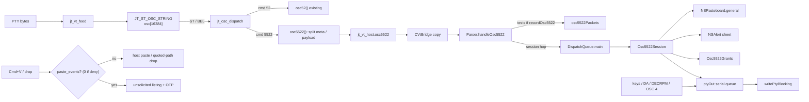
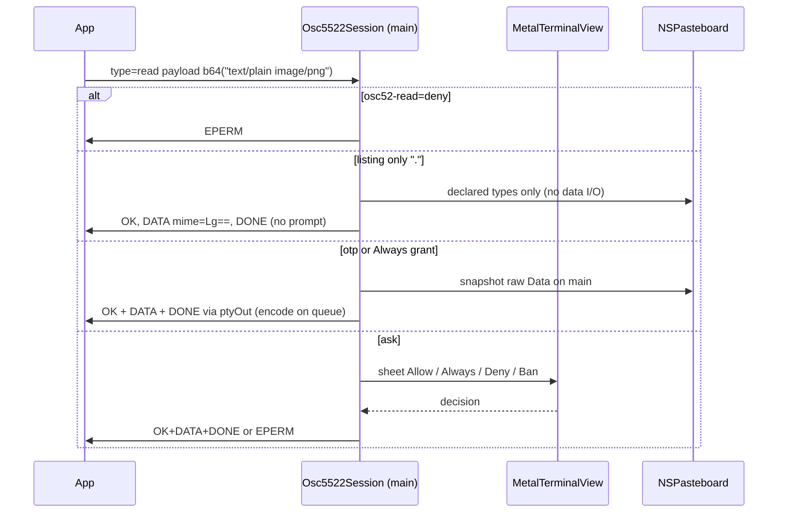

# OSC 5522 — Kitty advanced clipboard protocol

| Field | Value |
| --- | --- |
| Document | Design (OSC 5522) |
| Author | TBD |
| Date | 2026-08-31 |
| Updated | 2026-08-31 (open questions resolved) |
| Status | **Draft** |
| Bundle ID | `dev.jetty.app` |
| Branch | `osc-5522` (from `master`) |
| Baseline | v1 `docs/DESIGN.md`; follow-on `docs/DESIGN-follow-on.md`; Kitty graphics `docs/DESIGN-kitty-graphics.md` |
| Spec | https://sw.kovidgoyal.net/kitty/clipboard/ |
| Ancillary | https://rockorager.dev/misc/bracketed-paste-mime/ (mode 5522 paste events) |
| Audience | Senior engineers who already know Jetty’s C VT, OSC 52 hop, and 16-byte `Cell` lock |

This is the Kitty clipboard protocol plan. It does **not** reopen v1 locks: 16-byte `Cell`, `TERM=xterm-256color`, no Ghostty wrap, no linux16term growth, no per-cell work on the ASCII `y\n` path.

Kitty (`kitty/clipboard.py`) is the **reference implementation**. Ghostty (`src/terminal/kitty/clipboard*.zig`) is prior art for semantics where the prose spec is silent. Neither is a library.

HEAD today: `jt_osc.c` `case 5522:` is an explicit no-op (same ignore list as OSC 1337). OSC 52 write-allow / read-ask already ships. Private mode 5522 is unknown (`dec_mode_state` default `known = 0` → DECRPM `Ps=0`).

---

## Overview

OSC 52 can only move **plain text**. Editors, file managers, and image-aware TUIs want PNG, HTML, and other MIME types, chunked so a multi-megabyte payload does not have to fit in one OSC string, with a real **EPERM** instead of OSC 52’s empty-payload deny. Kitty defined OSC 5522 for that. Mode 5522 (DECSET `CSI ? 5522 h`) additionally turns a user paste into an unsolicited MIME listing plus a one-time password, so the application can pull the representation it wants without a second permission prompt.

Jetty implements the **full** protocol on macOS:

1. Parse OSC 5522 in C (`jt_osc.c`), same host-callback split as OSC 52.
2. Own the multi-packet **write** transaction, MIME mapping, and permission grants in Swift.
3. Advertise private mode 5522 only when paste events actually work.
4. Never touch `jt_scr_index` / `fill_row` / ASCII `print_run`. `loc=primary` is **ENOSYS** (macOS has no primary selection).
5. `osc52-read=deny` is a complete OSC-read off switch: 5522 **queries** get EPERM; `CSI ? 5522 h` is ignored so DECRPM stays **0** (not `1`); Cmd+V / drop is host paste / quoted-path. MIME paste requires the default `ask`.

Work happens on git branch **`osc-5522`** cut from `master`. Four stacked PRs; each is independently reviewable.

---

## Background & Motivation

### Current clipboard machine (HEAD)

| Piece | File | Behavior |
| --- | --- | --- |
| OSC parse | `Sources/CVt/jt_osc.c` `osc52()` | `OSC 52 ; <kind> ; <b64\|?>`. Kind `c`/`p`/`s`; unknown → `c`. `?` → `osc52_read`. Else `osc52_write` with raw b64. |
| Host | `jt_vt_host.osc52_write` / `osc52_read` in `Sources/CVt/jt_vt.h` | Glue `Sources/Jetty/Vt/CVtBridge.swift` copies bytes. |
| Session | `Sources/Jetty/Vt/TerminalSession.swift` `applyOsc52Write` / `askOsc52Read` | Hop `DispatchQueue.main.async`. **Must not** take `session.lock`. Write: `NSPasteboard.general.setString` if `osc52WriteAllow`. Read: `NSAlert` “Allow clipboard read?”; deny / `osc52-read=deny` → empty OSC 52 payload + BEL. |
| Config | `Sources/Jetty/Config/Config.swift` | `osc52-write = allow\|deny` (default allow). `osc52-read = ask\|deny` (default ask). **No silent allow** (v1 lock). |
| Host paste | `Sources/Jetty/Input/Clipboard.swift`, `MetalTerminalView.paste(_:)` | File URLs → POSIX-quoted paths; else clipboard image → temp PNG path; else `string`. If `screen.bracketedPaste` (mode 2004), wrap `ESC [ 200 ~` … `ESC [ 201 ~` via `Clipboard.pasteBytes`. `writePtyBlocking`. |
| OSC buffer | `Sources/CVt/jt_vt_int.h` `uint8_t osc[4096]` | OSC overflow (`osc_n >= 4096`) → `JT_ST_OSC_IGNORE`; BEL/ST drop without `jt_osc_dispatch`. DCS **shares** the buffer but **silently truncates** (`osc_n < 4096`), it does not IGNORE. |
| Mode 5522 | `Sources/CVt/jt_vt.c` `dec_mode_state` / DECSET | Unknown. `CSI ? 5522 $ p` → `\033[?5522;0$y`. |
| OSC 5522 | `jt_osc.c` case 5522 | `break;` — payload discarded. |

OSC 52 replies with **BEL**. OSC 4 queries write ST from C via `write_pty` on the parse thread (tiny). Large PTY writes (paste, OSC 52 read reply) use `writePtyBlocking` in `Sources/Jetty/Vt/PtyIO.swift` (poll `POLLOUT`, never hold `session.lock`).

### Pain

1. **Apps already send OSC 5522.** neovim clipboard providers, Kitty’s own clipboard kitten, and anything speaking the 2022+ protocol get silence. They cannot distinguish “not supported” from “hung.”
2. **OSC 52 cannot carry images.** Jetty’s Cmd+V path already special-cases a clipboard PNG as a quoted temp path (`Clipboard.writeImage`). Mode 5522 is the protocol way for the *application* to take `image/png` itself.
3. **OSC buffer is too small for a legal 5522 chunk.** Spec: chunk **≤ 4096 bytes before base64**. Encoded size is `4 * ceil(4096/3) = 5464`. Plus `5522;type=wdata:mime=<b64>;` and optional `id`/`pw`/`name`. A spec-compliant max chunk is **~7 KiB** and today’s `osc[4096]` sends it to `OSC_IGNORE`.
4. **Primary selection does not exist on macOS.** OSC 52 currently accepts kind `p` and still writes `NSPasteboard.general`. OSC 5522 must answer **ENOSYS** for `loc=primary` instead of lying.

### What Kitty / Ghostty actually do (semantics we copy)

The prose spec and `kitty/clipboard.py` disagree in places. Ghostty documents this in `clipboard.zig` and follows **kitty**. Jetty does the same:

- Malformed metadata (any record without `=`, including empty metadata) and unknown/missing `type` → **silent drop**, no reply.
- `mime` / `name` / `pw` values are strict RFC 4648 base64 of UTF-8. Other keys are verbatim. Unknown keys ignored. Duplicate keys: last wins.
- `id` is sanitized by **stripping** characters outside `[a-zA-Z0-9-_+.]`, truncated to 512, echoed on every reply (omitted if empty).
- Password without a non-empty `name` is **not a password**.
- `type=write` **replaces** any in-flight write. `type=wdata` without MIME (commit) with no in-flight write → silent ignore.
- `wdata` payloads for one MIME form **one** base64 stream split at arbitrary packet boundaries; only the concatenation must be padded. A packet that ends on terminal padding **restarts** the stream (independently padded chunks work). Padding followed by more data **inside one packet** is EINVAL.
- Invalid **metadata** base64 / UTF-8 (`mime` / `name` / `pw`) on `wdata` or `walias`, or `walias` with empty target MIME, aborts an in-flight write with **EINVAL**. Invalid `read` → silent drop (reads have no EINVAL). **`wdata` payload is raw bytes** (PNG etc.); only the base64 alphabet/padding is checked, never UTF-8. `walias` and `read` MIME **lists** (decoded payload) must be UTF-8.
- Empty payload section is omitted (`;` + b64 only when payload is non-empty), **except** the targets (`.`) listing DATA packet which is always sent.
- Kitty extra status **EFBIG** when write exceeds `clipboard_max_size` (not in the public status list; both Kitty and Ghostty send it). Jetty sends EFBIG too.
- Listing MIME types (payload `.` only) is **not** permission-gated.
- Paste-event OTP is one-time, consumed even on direction mismatch (Ghostty `Grants.use`).

---

## Goals & Non-Goals

### Goals

- OSC 5522 read, write, wdata, walias with multiplexer `id` echo.
- Private mode 5522 paste events, including DECRQM/DECSET/DECRST and precedence over 2004.
- Permission: read **ask** (OSC 52 default); write **allow** (OSC 52 default). `osc52-read=deny` is EPERM on 5522 **queries**, ignores `CSI ? 5522 h` (DECRPM not `1`), and Cmd+V / drop is host paste / 2004. `osc52-write=deny` is EPERM on writes. Session Always/Ban. **Stored passwords** in `~/.config/jetty/clipboard-passwords` (0600). Paste-event / drop OTP, 5 s timeout. Mode 5522 paste events cover Cmd+V **and** drag-drop.
- `loc=primary` → **ENOSYS** on every path. No fake primary pasteboard.
- Caps so a hostile stream cannot OOM: OSC string 16 KiB, decoded write 64 MiB, served read 8 MiB, MIME/alias/id/name/pw length limits below.
- Idle `y\n`: no new work on `jt_scr_index` / `fill_row` / `store_ascii_cells` / `stamp_cell` / ASCII `print_run`. Canaries must not 2×.
- Tests travel with the code they prove: `Tests/JettyTests/Osc5522Tests.swift` (same target as `ClipboardTests.swift`).

### Non-Goals (explicit)

| Capability | Why |
| --- | --- |
| Primary selection | macOS has none. ENOSYS. |
| Silent `osc52-read = allow` / `osc52-write = ask` | v1 lock: no silent read allow. Write stays `allow\|deny` only. Stored passwords skip the **read** sheet under `ask`; they never create a write prompt. |
| Bypassing `osc52-write=deny` / `osc52-read=deny` with a password, Always, stored file, or paste OTP | Config deny is user policy. Cmd+V / drop under deny: DECRPM 0, `paste_events` 0, host paste / quoted-path drop (Key Decision 4). |
| Changing OSC 52 wire format or its BEL replies | 52 stays. 5522 is additive. OSC 52 kind `p` still aliases clipboard. |
| `TERM=xterm-kitty` / Kitty keyboard | v1 lock. |
| Wrapping Ghostty / growing linux16term | v1 lock. |
| Tmux control mode / being a multiplexer | Jetty is one PTY per window. Still echo `id`; still EBUSY on overlapping reads. |
| AppleScript `input text` as a 5522 paste | `ScriptTerminal.inputText` keeps 2004 wrap. It is not a clipboard paste. |
| Advertising mode 5522 before paste events work | DECRPM `Ps=0` until PR 4. Spec: terminals that report the mode MUST implement the whole protocol. |
| Densify `Cell` / graphics / Sixel | Unrelated. |

---

## Key Decisions

1. **C splits the OSC; Swift owns protocol semantics, write state, pasteboard, and prompts.** Match OSC 52: `jt_osc.c` does not talk to AppKit. Rationale: clipboard I/O is host; the VT hot path stays C. Kitty graphics stays in C because it mutates the image store; 5522 does not touch the grid.

2. **Raise `jt_vt.osc[]` from 4096 to 16384 (`JT_OSC_CAP`).** A spec-legal max packet is ~7 KiB and **fits in 8 KiB**. 16 KiB is the next power-of-two **headroom** for unknown metadata keys, not because 8 KiB misses a legal chunk. Do **not** grow a second OSC buffer. Do **not** stream OSC bytes into Swift before ST/BEL. DCS keeps **silent truncate** at `JT_OSC_CAP` (not IGNORE). Shared-buffer side effect: OSC 52 writes can carry ~12 KiB decoded text (was ~3 KiB). OSC 8 `uribuf[4096]` is unchanged.

3. **Hop every 5522 packet to main, same class as `osc52_*`.** Parse thread copies metadata+payload and `DispatchQueue.main.async`s. **Must not** take `session.lock` on main. Production `Parser` does **not** retain packets. Charge `max(meta.count + payload.count, 4096)` against `osc5522QueuedBytes` (cap `2 * maxWriteBytes`). Over cap: enqueue **one** overflow marker, then **drop** further hops until main drains to 0.

4. **`osc52-write` / `osc52-read` are the policy for 5522. Deny is honest at DECRQM, not only in `paste(_:)`.** No new allow/deny keys. **No `osc52-write=ask`.** Write allow → no write prompt. Write deny → EPERM (no Always / OTP / stored-password override). Read **ask** → prompt unless listing, session Always, stored password match, or valid paste OTP. Read **deny** → EPERM on `type=read` (including OTP and stored passwords). **Discovery:** Swift writes `jt_scr.osc52_read_ask` (like `kitty_graphics`). When it is 0, C `CSI ? 5522 h` is a no-op, `paste_events` is forced 0, and `dec_mode_state(5522)` returns **0** (not supported) — never `Ps=1`. Live `applyLiveConfig` deny calls `jt_scr_set_osc52_read_ask(s, 0)`, which clears the bit. 5522-only TUIs that probe DECRQM keep 2004. Cmd+V / drop is host paste / quoted-path because `paste_events` is 0. MIME paste requires default `ask`.

5. **`loc=primary` is ENOSYS, including paste events.** Never set `loc=primary` on an unsolicited listing. OSC 52 kind `p` is unchanged (still writes general) — out of scope.

6. **Advertise mode 5522 only in the paste-events PR.** Until then DECRQM stays `Ps=0`. After PR 4, with `osc52-read=ask`: `CSI ? 5522 h/l` stored on `jt_scr.paste_events`; RIS clears it next to `bracketed_paste`; if 5522 and 2004 are both set, **5522 wins** and 2004 is not emitted for that paste. With `osc52-read=deny`: DECRPM is `0` and `h` does not set the bit (Key Decision 4).

7. **Replies always use ST (`ESC \`).** Spec says ST. OSC 52 keeps BEL. Do not echo BEL for 5522 (saves a terminator field in C; clients must accept ST).

8. **Follow kitty where spec and kitty disagree** (silent drop of bad metadata, streaming base64 across `wdata` packets, EFBIG, `type=write` replaces in-flight, listing DATA always sent). Ghostty already did this; we copy those rules, not Zig. **Jetty-only policy (not Ghostty `clipboard_grants.zig`):** Ban comes from Kitty; 5 s OTP timeout comes from the ancillary spec.

9. **Session grants plus a 0600 stored-password file.** Always/Ban live on `TerminalSession` keyed by password bytes; cleared on `stop()` / deinit. OTP is a one-time grant with a 5 s deadline. A new Cmd+V or drop **replaces** the previous OTP. Permanent passwords live in `~/.config/jetty/clipboard-passwords` (not `config`). Session Ban wins over stored. Config deny wins over stored. Stored passwords never prompt writes.

10. **New branch `osc-5522` from `master`.** Four stacked PRs (parse → write → read/grants/stored passwords → paste events including drag-drop). Do not merge DECRQM support before paste events.

11. **Packet parse is three-way: `drop` / `invalid(op:id:)` / `packet`.** `nil`-only parse cannot EINVAL a live write. Malformed metadata / unknown `type` → `drop`. Failed strict b64/UTF-8 on `mime`/`name`/`pw` → `invalid` with `type=` if known. `invalid` on `wdata`/`walias` with a live write → EINVAL + `IgnoringWrites`. `invalid` on `read` → drop. Do not UTF-8-check `wdata` payload bytes.

12. **MIME listing is declared-types only.** `available(pb)` reads `pb.types` and infers MIME; it never calls `data(forType:)` / `string(forType:)` / `readObjects`. Paste-event listings stay metadata. `UTType.preferredMIMEType` is **out** (no new `Package.swift` framework). Closed table + inference is the implementation.

13. **Pasteboard write never uses `pb.setString` after `writeObjects`.** Non-file MIME: one `NSPasteboardItem`, setString/setData **on the item**, `writeObjects([item])`. `text/uri-list` with **N** `file:` URLs: **N items**. Item 0 gets non-file MIME + RFC 2483 body + `NSFilenamesPboardType` + first `.fileURL`. Extra items are **`.fileURL` only** (so `readObjects` returns N and `string(forType: .string)` is not concatenated N times).

14. **Concurrent extra `type=read` is EBUSY**, not Kitty’s EPERM. Clients must not retry until the user dismisses. Prefer `beginSheetModal`. If the no-window fallback `runModal` is used, EBUSY is unreachable (main is blocked) — do not synthesize it.

15. **One serial PTY writer for every `writeToPty`.** Keys, parse-thread `write_pty`, tiny 5522 statuses, paste-event listings, and content DATA all enqueue on `ptyOut` (**not** `session.lock`). Encode DATA on that queue. Served read cap **8 MiB**. `stop()` must **not** hang behind `writePtyBlocking`: atomic `ptyOutStop`, publish `masterFD = -1` under `session.lock`, `close(fd)` on the **caller** (so poll sees `POLLHUP`), then `ptyOut.sync` drain. Never assign `masterFD` off the lock. `dataReplyInFlight` is generation-scoped.

16. **Drag-drop is a mode-5522 paste event.** When `paste_events` is set, `performDragOperation` calls `sendPasteEvent` on the **dragging** pasteboard (snapshot, not `NSPasteboard.general`) so the app reads what was dropped. MUST NOT emit 2004 / quoted-path paste for that drop. Deny / DECRPM 0 keeps today’s quoted-path / string drop. AppleScript `input text` stays 2004.

---

## Proposed Design

### Architecture



Idle ASCII `y\n` never enters `JT_ST_OSC_STRING`. `case 5522` is not on the ground scan.

### Sequence — write

```mermaid
sequenceDiagram
  participant App
  participant C as jt_osc.c
  participant S as Osc5522Session (main)
  participant PB as NSPasteboard
  App->>C: OSC 5522;type=write:id=w1 ST
  C->>S: hop packet
  Note over S: loc=primary → ENOSYS, ignore until next type=write
  Note over S: osc52-write=deny → EPERM
  App->>C: OSC 5522;type=wdata:mime=<b64>;<b64 chunk> ST
  C->>S: hop
  S->>S: streaming base64 into spool
  App->>C: OSC 5522;type=walias;mime=<target>;<b64 aliases> ST
  C->>S: hop aliases
  App->>C: OSC 5522;type=wdata ST
  C->>S: commit
  S->>PB: clearContents + writeObjects (1 item, or N file-URL items)
  S->>App: OSC 5522;type=write:status=DONE:id=w1 ST
```

### Sequence — read with prompt



### Sequence — paste event (mode 5522)

```mermaid
sequenceDiagram
  participant User
  participant View as MetalTerminalView
  participant S as Osc5522Session
  participant App
  User->>View: Paste (Cmd+V)
  View->>S: pasteEvent()
  Note over S: skipped entirely if osc52-read=deny (host paste instead)
  S->>S: replace any previous OTP; grant one-time read, 5s deadline
  S->>App: OSC 5522 type=read status=OK:pw=<b64>
  S->>App: DATA mime=Lg== ; b64 of space-separated types plus trailing newline
  S->>App: DONE :pw=<b64>
  App->>S: type=read :pw=…:name=UGFzdGUgZXZlbnQ= ; b64("image/png")
  S->>S: OTP matches → consume, no sheet
  S->>App: OK + DATA image/png + DONE via ptyOut
```

### C vs Swift ownership

| Concern | Owner | File |
| --- | --- | --- |
| OSC string capture, 16 KiB cap, IGNORE | C | `Sources/CVt/jt_vt.c`, `jt_vt_int.h` |
| Split `5522;metadata;payload`, host callback | C | `Sources/CVt/jt_osc.c`, `jt_vt.h` |
| DECSET/DECRST/DECRQM/RIS for mode 5522 | C (reads `osc52_read_ask`) | `jt_vt.c` `handle_csi` / `dec_mode_state`, `jt_grid.c` `jt_scr_ris` |
| Metadata parse, id sanitize, strict base64, write spool | Swift | `Sources/Jetty/Input/Osc5522.swift` |
| NSPasteboard MIME map | Swift | `Sources/Jetty/Input/Osc5522Pasteboard.swift` |
| Grants, OTP, prompts, hop | Swift | `Osc5522.swift` + `TerminalSession.swift` |
| `osc52_read_ask` (config → C) | Swift writes, C reads | `jt_scr_set_osc52_read_ask`, `applyLiveConfig` |
| All PTY writes | Swift `ptyOut` | `TerminalSession.writeToPty` |
| Sheet UI | Swift | `Sources/Jetty/Render/MetalTerminalView.swift` |
| Cmd+V / keybind / drag-drop paste | Swift | `MetalTerminalView.paste(_:)`, `performDragOperation`, `Clipboard.swift` |
| Stored passwords file | Swift | `Sources/Jetty/Config/ClipboardPasswords.swift` |
| Config policy | existing keys | `Config.swift` — no new allow/deny |

C does **not** decode base64, does **not** retain write state across packets, does **not** call `NSPasteboard`.

### OSC buffer

Today:

```c
/* Sources/CVt/jt_vt_int.h */
uint8_t osc[4096];
```

```c
/* Sources/CVt/jt_vt.c JT_ST_OSC_STRING */
} else if (p->osc_n >= 4096) p->state = JT_ST_OSC_IGNORE;
```

Change to a named cap used by both OSC and DCS:

```c
/* jt_vt_int.h */
#define JT_OSC_CAP 16384
uint8_t osc[JT_OSC_CAP];
```

```c
/* jt_vt.c — replace both 4096 compares with JT_OSC_CAP; do not change DCS into IGNORE */
case JT_ST_OSC_STRING:
    /* … */
    else if (p->osc_n >= JT_OSC_CAP) p->state = JT_ST_OSC_IGNORE;
    else p->osc[p->osc_n++] = b;
case JT_ST_DCS_IGNORE:
    /* silent truncate, HEAD behavior */
    else if (p->osc_n < JT_OSC_CAP) p->osc[p->osc_n++] = b;
```

Budget for one packet: `"5522;"` (5) + metadata (id 512 + b64 mime ≤ 344 + b64 name ≤ 344 + b64 pw ≤ 172 + keys ≈ 1.5 KiB) + `5464` payload ≈ **7 KiB**.

**Why 16384, not 8192.** The budget above is **~7 KiB** and **fits in 8 KiB**. 16 KiB is the next power-of-two **headroom** for unknown keys and future metadata, not because a spec-legal chunk misses 8 KiB. A packet over 16 KiB → `OSC_IGNORE` → **no dispatch**. If a write is in-flight, the dropped `wdata` does not abort it; the next `type=write` replaces, or a later commit may EINVAL on incomplete padding.

**Shared-buffer side effects (not 5522-specific):**

| Path | HEAD | After |
| --- | --- | --- |
| OSC 52 write | b64 payload cap 4096 ≈ **3 KiB** decoded | cap 16384 ≈ **12 KiB** decoded |
| OSC 8 URI | still `uribuf[4096]`, `min(un, 4095)` in `jt_osc.c` | **unchanged** |
| DCS XTGETTCAP / DECRQSS | truncate at 4096 | truncate at 16384; still not IGNORE |

`jt_vt` is `calloc`’d (`jt_vt_create`). +12 KiB per session. Not on the `y\n` path. Tests: 5464-byte payload dispatches; `JT_OSC_CAP+1` OSC does not. PR 1 retouches `osc[4096]` in `docs/DESIGN.md` (parser state machine) and `docs/DESIGN-kitty-graphics.md` (OSC/DCS buffer row).

### C dispatch

Remove `case 5522:` from the ignore list in `jt_osc_dispatch`. Add:

```c
/* jt_vt.h — next to osc52_* */
void (*osc5522)(void *ctx, const uint8_t *meta, size_t nm,
                const uint8_t *payload, size_t np);
```

`payload` may be `NULL` with `np=0` when there is no `;` after metadata (`type=write` / commit `type=wdata` with no payload section).

```c
/* jt_osc.c */
static void osc5522(const jt_vt_host *h, const uint8_t *p, int n, int i) {
    if (!h || !h->osc5522) return;
    const uint8_t *meta = p + i;
    int mn = n - i;
    const uint8_t *pay = NULL;
    int pn = 0;
    for (int k = 0; k < mn; k++) {
        if (meta[k] == ';') {
            mn = k;
            pay = meta + k + 1;
            pn = (n - i) - k - 1;
            break;
        }
    }
    h->osc5522(h->ctx, meta, (size_t)mn, pay, (size_t)pn);
}
```

Glue (`CVtBridge.swift`) **must copy** before return; `osc[]` is reused. Same pattern as `jtHostOsc52Write`.

`Parser.swift` — production must **not** retain chunks (`Parser.reset()` is not called on a live session; a 64 MiB write is ~10k packets):

```swift
public var recordOsc5522 = false
public var osc5522Packets: [(meta: [UInt8], payload: [UInt8])] = []
public var onOsc5522: (([UInt8], [UInt8]) -> Void)?

func handleOsc5522(_ meta: [UInt8], _ payload: [UInt8]) {
    if recordOsc5522 { osc5522Packets.append((meta, payload)) }
    onOsc5522?(meta, payload)
}

public func reset() {
    /* existing clears … */
    osc5522Packets.removeAll()
    recordOsc5522 = false
}
```

Parser tests set `recordOsc5522 = true` and assert the split. They do not hit NSPasteboard. Session wiring copies once into the hop closure; the write spool is the only long-lived copy.

### Swift packet parse (`Osc5522.swift`)

```swift
public enum Osc5522 {
    public static let maxWriteBytes = 64 * 1024 * 1024
    public static let maxQueuedBytes = 2 * maxWriteBytes
    public static let maxReadBytes = 8 * 1024 * 1024
    public static let queueQuantum = 4096
    public static let readChunk = 4096
    public static let maxIdLen = 512
    public static let maxPwLen = 128
    public static let maxMimeLen = 256
    public static let maxNameLen = 256
    public static let maxWriteMimes = 64
    public static let maxWriteAliases = 64
    public static let maxReadMimes = 8
    public static let maxListingMimes = 16
    public static let otpTimeout: TimeInterval = 5
    public static let targetsMime = "."
    public static let pasteEventName = "Paste event" // client sends this; we do not require the string

    public enum Op: String { case read, write, wdata, walias }
    public enum Status: String {
        case OK, DATA, DONE, ENOSYS, EPERM, EBUSY, EIO, EINVAL, EFBIG
    }

    public struct Packet: Equatable {
        public var op: Op
        public var primary: Bool      // loc=primary
        public var id: String         // sanitized, maybe empty
        public var mime: String       // decoded, maybe empty
        public var pw: String         // decoded, empty if no name
        public var name: String
        public var payload: [UInt8]   // still encoded
    }

    public enum ParseResult: Equatable {
        case drop
        /// `op` is set when `type=` was a known operation so the write
        /// machine can EINVAL a live `wdata`/`walias`. `id` is sanitized.
        case invalid(op: Op?, id: String)
        case packet(Packet)
    }
}
```

Parse rules — `Osc5522.ParseResult.parse(meta:payload:)` (unit-tested, no PTY):

1. Split metadata on `:`. Every record must contain `=`. Else **`drop`**.
2. `type=` required and must be `read`/`write`/`wdata`/`walias`. Else **`drop`** (unknown or missing type is not EINVAL).
3. `loc=primary` → `primary=true`. Any other `loc` → clipboard (not an error).
4. `id=` strip to `[A-Za-z0-9-_+.]`, cap 512. Sanitized id is available even on `invalid`.
5. `mime`/`name`/`pw`: strict RFC 4648 decode (standard alphabet, padding required, **no** whitespace). Decoded must be UTF-8. Failure, or mime/name over length → **`invalid(op:id:)`**. Over-long pw → treat as absent (cannot match a grant), not invalid.
6. `pw` without non-empty `name` → clear both (spec).
7. Unknown keys ignored. Last duplicate wins.

Session dispatch of `ParseResult`:

| Result | Idle | Accumulating | IgnoringWrites |
| --- | --- | --- | --- |
| `drop` | no-op | no-op | no-op |
| `invalid` `read` / `write` / unknown | no-op | no-op | no-op |
| `invalid` `wdata` / `walias` | no-op | EINVAL + IgnoringWrites | no-op |
| `packet` | as the state machine | as the state machine | `type=write` may restart |

Tests: `type=wdata:mime=!!!` with a live write → EINVAL (not hang). `type=bobr` → drop. `type=read` with bad `mime` b64 → drop. **Do not UTF-8-validate `wdata` payload** (binary). UTF-8-validate decoded `walias` and `read` MIME **lists** only.

**Strict base64.** Foundation `Data(base64Encoded:)` accepts whitespace and is **wrong**. Implement `Osc5522.strictDecode` / `Osc5522.StreamingBase64` in the same file (table-driven, reject any char not in the 64-alphabet or `=`). Streaming state:

- Accumulate 4-char groups.
- Packet boundary that lands on complete padding: `finish()` succeeds and **resets** (next packet is a new stream — kitty).
- `finish()` with leftover 1–3 chars → Invalid (missing padding) — EINVAL at MIME switch or commit.
- `=` not at end of a group, or data after padding in the **same** packet → Invalid.

Encode replies with `Data.base64EncodedString()` (Foundation encoder is padded standard) — encoder is not the problem; decoder is.

### Reply encoder

Field order matches kitty / Ghostty tests (do not permute; clients regex this):

```
OSC 5522 ; type=<op>:status=<ST>[:loc=primary][:id=<id>][:mime=<b64 mime>][:pw=<b64 pw>] [; <b64 payload>] ST
```

`loc=primary` only on read `OK` when the request (or paste) was primary — Jetty never sets it.

Empty payload → no `;`. Targets listing DATA always includes `:mime=Lg==` even if the list is empty.

```swift
public struct Osc5522.Reply {
    var op: Op
    var status: Status
    var id: String = ""
    var mime: String? = nil
    var pw: String? = nil
    var payload: [UInt8] = []   // raw; encoder base64s
    func bytes() -> [UInt8]     // always ST 0x1B 0x5C
}
```

Read success: `OK`, then optional listing DATA, then per-MIME DATA chunks of `readChunk` raw bytes, then `DONE`. `id` on every packet. Paste-event `pw` on every packet (ancillary spec MAY; we **do**, matching Ghostty).

### Reply write — one serial PTY writer

HEAD already has two writers: parse-thread `host.write_pty` (DA, DECRPM, OSC 4, APC replies) via `parser.ptyWriter` → `TerminalSession.writeToPty`, and main-thread keys/paste/OSC 52 via the same `writeToPty`. Both call `writePtyBlocking` (`PtyIO.swift`: `jt_pty_write` + `poll` 250 ms, **no fd lock**). Darwin `PIPE_BUF` is 512; a 5522 DATA packet is ~5.5 KiB, so a third concurrent writer would splice bytes **inside** an OSC.

**One queue, every PTY write:**

```swift
private let ptyOut = DispatchQueue(label: "dev.jetty.pty.out", qos: .userInteractive)
private let ptyOutStop = OSAllocatedUnfairLock(uncheckedState: false)

public func writeToPty(_ bytes: [UInt8]) {
    guard !bytes.isEmpty else { return }
    if ptyOutStop.withLock({ $0 }) { return }
    let copy = bytes
    ptyOut.async { [weak self] in
        guard let self else { return }
        if self.ptyOutStop.withLock({ $0 }) { return }
        self.lock.lock()
        let fd = self.masterFD
        self.lock.unlock()
        guard fd >= 0 else { return }
        _ = writePtyBlocking(fd: fd, copy)
    }
}
```

Callers — **all** of them — go through `writeToPty` (or a DATA helper that also `ptyOut.async`s):

| Source | Today | After |
| --- | --- | --- |
| keys, paste, focus, OSC 52 | main `writeToPty` | `ptyOut.async` |
| C `write_pty` (DA / DECRPM / OSC 4 / APC) | parse thread, sync | same `writeToPty` → `ptyOut.async` |
| 5522 tiny OK/DONE/errors/listing | would have been main | `writeToPty` |
| 5522 content DATA | n/a | `ptyOut.async` per OSC packet |

Do **not** `ptyOut.sync` from parse while holding `session.lock`. `writeToPty` on `ptyOut` may take `session.lock` only to **read** `masterFD`. Never **assign** `masterFD` except under that lock (`spawn` / `stop`, same as HEAD).

**DATA path (generation-scoped):**

```swift
private var dataReplyInFlight = false
private var dataReplyGen: UInt64 = 0   // main-thread only
```

1. Served read cap `maxReadBytes` = **8 MiB** total decoded. Truncate leftover; still send DONE.
2. Main snapshots pasteboard **raw** `Data` (capped). Does **not** base64-encode 8 MiB on main.
3. `dataReplyGen += 1`; let `gen = dataReplyGen`; `dataReplyInFlight = true`. Enqueue on `ptyOut`: encode each `readChunk` into an OSC packet, `writePtyBlocking` that packet, then DONE. One `async` per packet so a DA/key can run **between** packets, never in the middle of one `write()`.
4. After DONE: `DispatchQueue.main.async { if self.dataReplyGen == gen { self.dataReplyInFlight = false } }`. A newer read that bumped `gen` keeps the flag true. A stale clear must not drop it.
5. Dispatch table: `dataReplyInFlight` → EBUSY for overlapping `type=read` (including OTP).

**Paste listing and sheet vs in-flight DATA:**

- `sendPasteEvent()`: if `dataReplyInFlight`, **do not** write a 5522 listing (it would land between DATA chunks). Return `false`; `paste(_:)` falls through to host paste / 2004 for **that** Cmd+V only. Do not mint a new OTP.
- Sheet **Allow** (and Always): re-enter the dispatch table with the original request. If `dataReplyInFlight` (e.g. an OTP follow-up started DATA), reply **EBUSY** and do not send a second content stream. Deny/Ban still EPERM without a table re-entry for DATA.

**`stop()` — do not hang behind `writePtyBlocking`:**

HEAD (`TerminalSession.swift` ~323–337): `pipeline?.stop()`, then under `session.lock` `close` + `masterFD = -1` + capture `childPID`, then `waitpid`. Keep all of that. `writePtyBlocking` polls `POLLOUT` with no deadline; `ptyOut.sync { close(fd) }` would sit **behind** the poll and never wake it.

```swift
public func stop() {
    pipeline?.stop()
    pipeline = nil
    ptyOutStop.withLock { $0 = true }
    lock.lock()
    let fd = masterFD
    masterFD = -1
    let pid = childPID
    childPID = 0
    lock.unlock()
    if fd >= 0 { close(fd) }          // caller thread, not ptyOut: poll sees POLLHUP/EBADF
    ptyOut.sync { }                   // drain skipped writes; does not hold session.lock
    dataReplyInFlight = false         // main; session is stopping
    /* grants / write state dropped */
    if pid > 0 {
        var status: Int32 = 0
        while waitpid(pid, &status, 0) < 0 && errno == EINTR {}
    }
}
```

In-flight `writePtyBlocking` returns on `POLLHUP` / `n < 0`. Queued work sees `ptyOutStop` or `masterFD == -1` and returns. `writePtyBlocking` itself is unchanged.

`spawn()` still assigns `masterFD` / `childPID` under `session.lock` only (`TerminalSession.swift` ~309–313). After a successful `jt_pty_spawn` (`fd >= 0`), also `ptyOutStop.withLock { $0 = false }` under that same lock (or immediately after). A session that `stop()`s then `spawn()`s again must accept `writeToPty` (keys, DA, 5522). Do not clear the flag if spawn fails.

### Write transaction state machine

`Osc5522Session` (owned by `TerminalSession`, mutated on **main**):

```
Idle ──type=write (clipboard)──► Accumulating
Idle ──type=write loc=primary──► IgnoringWrites  (reply ENOSYS)
Idle ──type=wdata (no mime)────► Idle            (silent)
Idle ──type=wdata/walias──────► Idle            (silent)
Accumulating ──type=write──────► Accumulating    (replace spool)
Accumulating ──type=wdata mime─► Accumulating    (append / switch MIME)
Accumulating ──type=walias + mime─► Accumulating
Accumulating ──type=walias, mime empty─► IgnoringWrites (EINVAL)
Accumulating ──invalid wdata/walias meta─► IgnoringWrites (EINVAL)
Accumulating ──type=wdata ∅────► Idle            (commit → pasteboard, DONE)
Accumulating ──EINVAL/EIO/EFBIG► IgnoringWrites  (error reply)
IgnoringWrites ──type=write────► Accumulating or IgnoringWrites
IgnoringWrites ──wdata/walias──► IgnoringWrites  (drop)
```

```swift
final class Osc5522WriteState {
    var id: String
    var primary: Bool
    var pw: String
    var name: String
    var spool: [UInt8] = []
    var entries: [(mime: String, start: Int, len: Int)] = []
    var aliases: [(alias: String, target: String)] = []
    var current: Int? = nil
    var decoder = Osc5522.StreamingBase64()
    let maxSize: Int
}
```

Switching MIME calls `decoder.finish()`. Re-using a MIME starts a fresh region (overwrites mapping, kitty). More than `maxWriteMimes` extra types are ignored (log, do not abort). Same for aliases over `maxWriteAliases`. Alias payload: strict b64 → UTF-8 → `split` on ASCII whitespace (Python `str.split()`). Invalid UTF-8 alias list → EINVAL. **`type=walias` with empty `mime` and a live write → EINVAL** (kitty/Ghostty). Alias whose target has no data at commit is dropped. Chained aliases apply in arrival order against the evolving map.

Commit:

1. `osc52WriteAllow == false` → EPERM, discard (policy may have changed mid-flight).
2. `primary` → ENOSYS (already replied at `type=write`; should not reach commit).
3. Pasteboard write via `Osc5522Pasteboard.write` (one item, or N file-URL items; see below).
4. DONE with `id`.

Pasteboard I/O failure → EIO.

### MIME ↔ NSPasteboard

`Sources/Jetty/Input/Osc5522Pasteboard.swift`. **`UTType.preferredMIMEType` is out** — no `UniformTypeIdentifiers` on the Jetty target (`Package.swift` does not link it). Implementation is a closed table plus declared-type inference. Tests use a **named** `NSPasteboard`, never `.general`.

`normalizeMime(_)`: split on `;`, take the type/subtype, lowercase, strip spaces. `text/plain;charset=utf-8` → `text/plain`. Requests match the canonical form. Listings emit the canonical form only.

#### Listing — `available(_ pb: NSPasteboard) -> [String]`

**Declared types only.** Use `pb.types ?? []`. Never `data(forType:)`, `string(forType:)`, or `readObjects` — those force promised files, iCloud, and large image materialization. Paste-event listings must stay metadata (ancillary spec + Ghostty `ghosttyAvailableMimes`).

Walk declared types in order; append inferred MIME if not already present; stop at `maxListingMimes`. **16 is a DoS cap**, not full ancillary “list all types.”

| Declared `PasteboardType` / UTI | Infer |
| --- | --- |
| `.string`, `public.utf8-plain-text`, `public.utf16-plain-text`, `NSStringPboardType`, `com.apple.traditional-mac-plain-text` | `text/plain` |
| `.html`, `public.html` | `text/html` |
| `.rtf`, `public.rtf` | `text/rtf` |
| `.rtfd`, `com.apple.flat-rtfd` | `text/rtfd` |
| `.png`, `public.png` | `image/png` |
| `.tiff`, `public.tiff` | `image/tiff` **and** `image/png` (convert on **read** of png only; listing does not decode) |
| `public.jpeg` | `image/jpeg` |
| `.pdf`, `com.adobe.pdf` | `application/pdf` |
| `.fileURL`, `public.file-url`, `NSFilenamesPboardType` | `text/uri-list` **and** `text/plain` |
| `rawValue` matches `type/subtype` (one `/`, no spaces, already canonical or normalize-able) | that MIME (Jetty-written custom types) |

Join with **spaces**, trailing **`\n`** if non-empty (kitty). Empty clipboard: still send DATA `mime=Lg==` with **no** payload section.

#### Read — `data(_ pb, mime:) -> Data?`

Only after permission / OTP. This **may** call `data(forType:)`.

| Canonical MIME | Recipe |
| --- | --- |
| `text/plain` | `pb.string(forType: .string)` → UTF-8; else utf8-plain-text data. If the only declared source is `.fileURL`, **unquoted** paths joined by **`\n`** (spaces stay inside a path; not POSIX-quoted; not space-joined). |
| `text/html` | `data(forType: .html)` |
| `text/rtf` / `text/rtfd` | `.rtf` / `.rtfd` |
| `image/png` | `data(forType: .png)` else TIFF via `Clipboard.pngFromTIFF` |
| `image/tiff` | `data(forType: .tiff)` |
| `image/jpeg` | `data(forType: public.jpeg)` |
| `application/pdf` | `data(forType: .pdf)` |
| `text/uri-list` | `readObjects(NSURL, fileURLsOnly)` → RFC 2483: `absoluteString` joined by **`\r\n`**, trailing `\r\n` if non-empty. Else data for pasteboard type `text/uri-list`. |
| other | `data(forType: PasteboardType(rawValue: mime))` |

Cap **total** served bytes for the request at `maxReadBytes` (8 MiB). Skip missing types (no DATA). `maxReadMimes` data types (`.` does not count). Unavailable-only: OK then DONE, no DATA.

#### Write — `write(_ pb, contents: [(mime: String, data: Data)]) -> Bool`

**Never** `pb.setString` / `pb.setData` after `writeObjects`.

```
pb.clearContents()
// Split contents into non-file MIME vs uri-list.
let body = uri-list body, \r\n-normalized, or nil
let fileURLs = parseFileURLs(body)   // scheme file: only
func stampNonFile(_ item: NSPasteboardItem) { /* setString/setData on the item */ }

if fileURLs.isEmpty {
    let item = NSPasteboardItem()
    stampNonFile(item)
    if let body { item.setData(body, forType: .init("text/uri-list")) }
    return pb.writeObjects([item])
}

// N file URLs → N items so readObjects(NSURL, fileURLsOnly) returns N.
// Non-file MIME + uri-list body + NSFilenamesPboardType only on item 0
// (apps that concatenate every item’s .string must not see N copies).
var items: [NSPasteboardItem] = []
for (i, url) in fileURLs.enumerated() {
    let item = NSPasteboardItem()
    if i == 0 {
        stampNonFile(item)
        item.setData(body!, forType: .init("text/uri-list"))
        item.setPropertyList(fileURLs.map(\.path),
                             forType: .init("NSFilenamesPboardType"))
    }
    item.setString(url.absoluteString, forType: .fileURL)
    items.append(item)
}
return pb.writeObjects(items)
```

`uriListBody`: split on `\r\n` / `\n` / `\r`, drop empties, join with `\r\n`, append `\r\n` if non-empty (RFC 2483). **Do not open** files. Failure → EIO.

Tests: zero files → 1 item; two `file:` URLs → `readObjects` count 2; `string(forType: .string)` is the text once, not concatenated N times. Extra items declare only `.fileURL`.

Do not put temp PNG files on disk for 5522 (that is the *host paste* path only).

### Permission UX

This is a **security dialog**, not product chrome. The “no helper text” UI rule does not apply. Keep copy short.

`MetalTerminalView` presents an `NSAlert` **sheet** (`beginSheetModal(for:)`) on `view.window`. Fallback `runModal` only if `window == nil`. `TerminalSession` does not own the alert (tests have no AppKit sheet). Callback:

```swift
enum Osc5522Decision { case allow, always, deny, ban }

struct Osc5522Prompt {
    var direction: Osc5522Grants.Direction // read only this ship; no write-ask
    var name: String                       // sanitized; empty → generic
    var offersAlways: Bool                 // pw+name present
}

public var onOsc5522Prompt: ((Osc5522Prompt, @escaping (Osc5522Decision) -> Void) -> Void)?
```

Sheet:

- `messageText`: `Allow clipboard read?`
- `informativeText`: if `name` non-empty, that name only (already sanitized: no C0/C1/bidi, cap 256). **No** subtitle about “the rest of this session.”
- Buttons, **Deny is the default** (first button / Return): `Deny`, `Allow`. If `offersAlways`: also `Always`, `Ban`.
- Difference from OSC 52 (Allow first) is intentional: 5522 can exfiltrate images.

Sanitize `name` with the same rules as `title_ok` in `jt_osc.c` (control + bidi stripped) before display.

`onOsc5522Prompt == nil` → Deny (EPERM). Used by unit tests.

Sheet completion (Allow / Always / Deny / Ban) runs on main. **Allow and Always re-enter the dispatch table** with the original request (so `dataReplyInFlight` / Ban / deny still apply). They do not send OK+DATA blindly. Deny/Ban → EPERM without starting DATA.

**Read dispatch order** (first match wins):

| # | Condition | Action |
| --- | --- | --- |
| 1 | `loc=primary` | ENOSYS |
| 2 | `osc52-read=deny` | EPERM (OTP / Always / Ban are **not** consulted) |
| 3 | MIME list is only `.` (zero data types) | listing, no prompt |
| 4 | Ban grant for this `pw` | EPERM |
| 5 | `dataReplyInFlight` | **EBUSY** (including OTP — one DATA stream) |
| 6 | Always grant for this `pw` | allow, no prompt |
| 7 | stored password match (`pw` + `name`) | allow, no prompt |
| 8 | matching unused paste OTP **and** non-empty `name` | allow, consume OTP (sheet may still be open) |
| 9 | sheet already open | EBUSY (unauthenticated only) |
| 10 | `osc52-read=ask` | sheet |

Write: **never** prompt. `allow` → commit. `deny` → EPERM at `type=write` (and enter `IgnoringWrites`). Stored passwords do **not** create a write prompt and do **not** override write deny.

One prompt at a time. A second **unauthenticated** `type=read` while the sheet is open → **EBUSY** (Kitty sends EPERM). OTP follow-up during a sheet is **allowed only if `dataReplyInFlight` is false** (row 5 before row 7). Clients must **not retry until the user dismisses**. Prefer sheet. If `runModal` fallback runs, main is blocked and EBUSY is **unreachable** — do not synthesize it.

Tests: hanging prompt callback → second unauthenticated read EBUSY; OTP + `dataReplyInFlight` → EBUSY; OTP + open sheet + idle IO → allow; sheet Allow after OTP already started DATA → EBUSY (re-enters table).

### Password grants and OTP

```swift
struct Osc5522Grants {
    struct Entry {
        var pw: String
        var read: Bool
        var write: Bool
        var readBan: Bool
        var writeBan: Bool
        var oneTime: Bool
        var deadline: Date?    // OTP only
    }
    var entries: [Entry] = []  // cap 32, evict oldest
}
```

Grant mix is **Jetty policy**, not a Ghostty clone: **Ban** is from Kitty; **5 s OTP deadline** is from the ancillary spec; Ghostty `clipboard_grants.zig` has neither. `Entry.write` / prompt `direction: write` are unused this ship (no write prompt).

- Always on a prompt → `read=true`, `oneTime=false`.
- Ban → `readBan=true`.
- Paste event: 22-char OTP from `SecRandomCopyBytes` using Ghostty/Kitty’s unconfused alphabet `23456789abcdefghijkmnopqrstuvwxyzABCDEFGHJKLMNPQRSTUVWXYZ` (`otp_len = 22`). `oneTime=true`, `deadline=now+5s`, `read=true`. Echo the **raw password string** in `pw` (protocol base64-encodes it on the wire). A new paste **replaces** (invalidate) the previous OTP.
- `use(pw, .read)`: if expired, drop and fail. If `oneTime`, remove **even on direction mismatch**. Compare with `timingSafeEqual` on UTF-8 bytes.
- Cmd+V OTP is scoped to **live `NSPasteboard.general`**. Drop OTP is scoped to the **drop snapshot** (not general). A later `loc=primary` read with that OTP still ENOSYS and still consumes the OTP (mismatch). A general `type=read` without the drop OTP cannot read the snapshot.
- Client **must** send `name` with the OTP; without it the pw is ignored (spec) and we fall back to the normal ask path — the OTP remains until timeout or a correctly named use. (If we consumed on nameless use, a buggy client would burn the paste.) `pasteEventName` is **not** required of the client (ancillary SHOULD). Document this in tests.

`TerminalSession.stop()` clears **session** grants, OTP, and write state. Stored passwords stay on disk.

### Stored passwords

Path: **`~/.config/jetty/clipboard-passwords`** (same directory as `AppConfig.configURL()`: `XDG_CONFIG_HOME` ?? `~/.config`, then `jetty/clipboard-passwords`). **Not** `config`. World-readable `config` must never hold secrets.

Create: `AppConfig.ensureClipboardPasswordsFile()` next to `ensureConfigFile` — mkdir parents, create empty file if missing, `chmod 0600` (`0o600`). On load, if the file exists and is group/other-readable, still parse it and `chmod 0600` (tighten; one `fputs` warning).

Format (same `key = value` / `#` comments as `config`; blank line optional between records):

```
# ~/.config/jetty/clipboard-passwords
# chmod 0600. Trusted programs send pw + name on OSC 5522 type=read / type=write.

name = neovim
password = 550e8400-e29b-41d4-a716-446655440000

name = yazi
password = 7c9e6679-7425-40de-944b-e07fc1f90ae7
```

Parser (`Sources/Jetty/Config/ClipboardPasswords.swift`): skip empty/`#` lines; `name` starts a record; `password` fills it; flush on next `name` or EOF. Drop records missing either. Duplicate `name`: last wins. Cap **32** records. Truncate `name` to `maxNameLen`, `password` to `maxPwLen`. Empty file / missing file → no stored grants.

User add/remove: **edit the file** (no settings UI). `applyLiveConfig` / open-config flow does not open this file unless the user does. Reload: load at process start (`main.swift` next to `AppConfig.load()`) and again in `applyLiveConfig` (user saved the file). Hold the list on `Osc5522StoredPasswords` (process-wide, replaced on reload).

Trusted app: send `pw=<b64 password>:name=<b64 name>` on `type=read` (and on `type=write` if it wants; write allow still needs no prompt). Name without password is ignored (spec). Password without name is ignored (spec).

Match (only if `osc52-read=ask`): request `name` **byte-equal** to stored name (UTF-8 after the same sanitize as prompts: no C0/C1/bidi); request `pw` **timing-safe equal** to stored password (UTF-8 bytes). Do not log either value.

Precedence (deny already applied at dispatch row 2):

| vs stored | Winner |
| --- | --- |
| `osc52-read=deny` / `osc52-write=deny` | config deny (EPERM) |
| session Ban for this `pw` | Ban (EPERM) for the rest of the session |
| session Always | Always (no need to hit disk) |
| stored match | allow read, no sheet |
| no match | sheet under `ask` |

Stored passwords never skip write deny and never open a write sheet.

Tests (temp file, not `~/.config`): parse two records; `#` / missing password dropped; last duplicate name wins; match requires both name and pw; wrong name does not match; deny still EPERM; session Ban still EPERM; `chmod` of a created file is `0o600`.

### Private mode 5522

`jt_scr` new flag, next to `bracketed_paste`:

```c
/* jt_vt.h jt_scr */
uint8_t focus_event, bracketed_paste, paste_events, osc52_read_ask, sync_output;
```

Name: **`paste_events`** everywhere (not `mode_5522`). Default 0 (`memset`). **`osc52_read_ask` default 1** (config default is ask) — set explicitly in `jt_scr_init`. **RIS clears `paste_events`** next to `bracketed_paste`; RIS does **not** change `osc52_read_ask` (that is config, not DEC).

Swift owns the config bit; C owns DECSET/DECRQM. Mirror, same pattern as `jt_scr_set_kitty_graphics`:

```c
void jt_scr_set_osc52_read_ask(jt_scr *s, int on) {
    if (!s) return;
    s->osc52_read_ask = on ? 1 : 0;
    if (!s->osc52_read_ask) s->paste_events = 0;
}
```

```c
/* jt_vt.c dec_mode_state */
case 2004: on = s && s->bracketed_paste; break;
case 5522:
    if (!s || !s->osc52_read_ask) { known = 0; break; } /* DECRPM 0 */
    on = s->paste_events;
    break;

/* DECSET/DECRST priv=='?' */
case 2004: scr->bracketed_paste = (uint8_t)set; break;
case 5522:
    if (set) {
        if (scr->osc52_read_ask) scr->paste_events = 1;
        /* else no-op: stays 0, DECRPM stays 0 */
    } else {
        scr->paste_events = 0;
    }
    break;
```

`uint16_t params[]` holds 5522 (fits). Not in `xtsave`.

`Screen.swift`:

```swift
public var pasteEvents: Bool { implPtr.pointee.paste_events != 0 }
public func setOsc52ReadAsk(_ on: Bool) { jt_scr_set_osc52_read_ask(implPtr, on ? 1 : 0) }
```

Same **three** call sites as `setKittyGraphics` (HEAD: `main.swift` ~409 no lock / session not running; `MetalTerminalView` init ~104; `applyLiveConfig` under `session.lock` ~1649–1652):

```swift
session.osc52ReadAsk = config.osc52Read == .ask
session.screen.setOsc52ReadAsk(session.osc52ReadAsk)
```

`jt_scr_init` defaults `osc52_read_ask = 1`. Without the spawn/init sites, `osc52-read=deny` at process start would leave C at 1 until a live reload.

DECRPM after PR 4: `1` set, `2` reset, **`0` when `osc52_read_ask` is 0** (paste-events mode unsupported under deny, so 5522-only apps keep 2004). Never `4`. **Do not add case 5522 until PR 4.**

### Host paste path

`MetalTerminalView.paste(_:)` today:

```swift
@objc public func paste(_ sender: Any?) {
    guard let str = Clipboard.pasteboardPayload() else { return }
    pasteText(str)
}
```

Change to:

```swift
@objc public func paste(_ sender: Any?) {
    session.lock.lock()
    let mimePaste = session.screen.pasteEvents   // 0 when deny (C bit)
    session.lock.unlock()
    if mimePaste, session.sendPasteEvent(from: .general, snapshot: false) {
        return
    }
    guard let str = Clipboard.pasteboardPayload() else { return }
    pasteText(str)
}
```

`sendPasteEvent(from pb: NSPasteboard, snapshot: Bool) -> Bool` (main):

1. If `dataReplyInFlight`: return `false` (no listing, no new OTP). Caller uses host paste / 2004 / quoted-path drop for **this** gesture so a listing is not spliced between DATA chunks.
2. `available(pb)` (declared types only).
3. Invalidate any previous OTP. Mint a new one, 5 s, one-time read.
4. If `snapshot` (**drop**): copy MIME data **now** into the OTP grant (`[String: Data]`, cap `maxReadBytes`). The dragging pasteboard is gone after `performDragOperation` returns; do **not** point the OTP at `NSPasteboard.general`. Follow-up `type=read` with this OTP serves the snapshot only (missing types omitted). If `!snapshot` (**Cmd+V**): listing from `pb` now; follow-up reads **live** `NSPasteboard.general` (clipboard can change; Kitty-style).
5. If a permission **sheet** is open: leave it up. OTP follow-up allowed only if `dataReplyInFlight` is still false. Sheet Allow later re-enters the table.
6. `writeToPty` of `ReadSuccess(list: true, pw: otp, available: mimes)` — OK + DATA `.` + DONE on **`ptyOut`**. **No `id`.** **No `loc`.** Return `true`.
7. Do **not** call `Clipboard.pasteBytes` on the success path.

Cmd+V: `sendPasteEvent(from: .general, snapshot: false)`.

If `paste_events` is set, 5522 wins over 2004 (ancillary: MUST NOT emit both). Under deny the bit is **0**, so host paste / 2004 / quoted-path drop runs.

Empty listing: still send OK + DATA `mime=Lg==` (no payload) + DONE.

Second Cmd+V / drop while the first OTP is live and **DATA is not in flight**: **replace** the OTP (and any drop snapshot). The old OTP no longer authorizes reads. If `dataReplyInFlight`, this gesture is host paste / quoted-path drop and the OTP is unchanged.

### Drag-drop (`performDragOperation`)

Kitty paste events are the system clipboard. A drop’s bytes live on **`sender.draggingPasteboard`**, which is not `NSPasteboard.general` and does not survive return. Serve the **dragging** pasteboard for that event’s OTP.

```swift
public override func performDragOperation(_ sender: NSDraggingInfo) -> Bool {
    if isQuitConfirmOpen { return false }
    session.lock.lock()
    let mimePaste = session.screen.pasteEvents
    session.lock.unlock()
    if mimePaste {
        if session.sendPasteEvent(from: sender.draggingPasteboard, snapshot: true) {
            return true
        }
        // DATA in flight: fall through to quoted-path / string (same as Cmd+V)
    }
    let pb = sender.draggingPasteboard
    /* HEAD: files → droppedPaths; else string */
    …
}
```

- Listing MIME: `Osc5522Pasteboard.available(draggingPasteboard)` (declared types: file-url → `text/uri-list` + `text/plain`, string → `text/plain`, png, …).
- Follow-up with the drop OTP: snapshot only. A `type=read` **without** that OTP still hits general (and the sheet) — it cannot snoop the drop.
- MUST NOT emit `200~` or quoted POSIX paths for a 5522 drop.
- `osc52-read=deny` / `paste_events == 0`: today’s quoted-path / string drop unchanged.
- AppleScript `input text` stays `Clipboard.pasteBytes` ± 2004.

`dropOperation` can still advertise `.copy` for fileURL/string; optional later: also png/html. Not required for this ship.

### Multiplexer `id` and EBUSY

Jetty is not a multiplexer. Still:

- Sanitize and echo `id` on every response packet for that request.
- Unsolicited paste events: no `id`.
- Overlapping **reads:** `dataReplyInFlight` → EBUSY for **every** new read including OTP. Sheet open → EBUSY for **unauthenticated** reads only. Clients must not retry until the sheet is dismissed / DATA finishes.
- Overlapping **writes**: new `type=write` **replaces** (kitty). Do not EBUSY.
- Read during `Accumulating` write: allowed (kitty). Pasteboard is last-writer-wins.

### Config

No new allow/deny keys. Reuse:

```
osc52-write = allow          # allow | deny  — also OSC 5522 writes
osc52-read = ask             # ask | deny    — 5522 queries; deny → DECRPM 5522 is 0, h ignored
```

`main.swift` spawn, `MetalTerminalView` init, and `applyLiveConfig` assign `session.osc52WriteAllow` / `osc52ReadAsk` **and** `session.screen.setOsc52ReadAsk` (init/spawn: session not parsing yet; live reload under `session.lock`).

Do **not** add `osc5522 = off`. Do **not** add `osc52-write=ask`. Policy is the existing two keys. Discovery is DECRQM (after PR 4). `osc52-read=deny` after PR 4 is honest: mode reports unsupported, Cmd+V / drop is host paste / quoted-path.

Passwords are **not** in `config`. They live in `clipboard-passwords` (0600). Reload that file on `applyLiveConfig`.

Write size cap is a named constant, not a config key (can add `clipboard-max-size` later).

### Threading (lock table)

Follow `docs/DESIGN-follow-on.md` hop classes. Add `osc5522` next to `osc52_*`:

| Callback | Thread | Lock | Rule |
| --- | --- | --- | --- |
| `osc5522` | parse | must not take lock | copy meta+payload, `main.async`, return |
| `osc52_*` | parse | must not take lock | unchanged |

`parseBatch` holds `session.lock` during `jt_vt_feed`. The 5522 glue copies into Swift `Array` **before** return; C `osc[]` may be overwritten by the next sequence in the same batch.

Main handler must not `session.lock.lock()`. It may read `osc52WriteAllow` / `osc52ReadAsk` without the lock (they are set from main in `applyLiveConfig`). Every `writeToPty` enqueues on `ptyOut` (Key Decision 15). `masterFD` is assigned only under `session.lock`. `stop()` closes the fd on the **caller** after publishing `-1` under the lock, then drains `ptyOut`.

Queued-bytes cap (`OSAllocatedUnfairLock` / atomic on `TerminalSession`):

- Quantum per hop: `max(meta.count + payload.count, Osc5522.queueQuantum)` with `queueQuantum = 4096`. Empty `type=write` / commit packets therefore cost 4 KiB each, not 1. ~32k empty packets fill `2 * 64 MiB`, not 10^8.
- If `queued + quantum > maxQueuedBytes`:
  - If `overflowArmed` is false: enqueue **one** overflow marker (no payload copy), set `overflowArmed = true`.
  - Else: **drop** the packet (do not hop, do not increment).
- Main: overflow marker → EFBIG if Accumulating, else EBUSY if a read is in flight, else ignore. Decrement the quantum when each hop (or the marker) finishes.
- Resume: when `queuedBytes == 0`, clear `overflowArmed`. No further hops until then.

This is a watermark of 0. Do not keep queueing synthetic events.

---

## API / Interface Changes

### C (`jt_vt.h`)

```c
typedef struct jt_vt_host {
    /* … existing … */
    void (*osc52_write)(void *ctx, uint8_t kind, const uint8_t *b64, size_t n);
    void (*osc52_read)(void *ctx, uint8_t kind);
    void (*osc5522)(void *ctx, const uint8_t *meta, size_t nm,
                    const uint8_t *payload, size_t np);
    /* … */
} jt_vt_host;
```

`jt_scr.paste_events` and `jt_scr.osc52_read_ask` (`uint8_t`). `jt_scr_set_osc52_read_ask`. No change to `Cell`, pools, or `pool_cells`.

### Swift host

`Parser` only assigns `host.osc5522 = jtHostOsc5522` and forwards to `onOsc5522`. The hop matches OSC 52 and lives on **`TerminalSession`**:

```swift
// TerminalSession.init — same hop class as onOsc52Write, plus the queue cap
session.parser.onOsc5522 = { [weak self] meta, payload in
    guard let self else { return }
    let q = max(meta.count + payload.count, Osc5522.queueQuantum)
    self.queueLock.lock()
    defer { self.queueLock.unlock() }
    if self.overflowArmed {
        return // drop until drain
    }
    if self.osc5522QueuedBytes + q > Osc5522.maxQueuedBytes {
        self.overflowArmed = true
        self.osc5522QueuedBytes += Osc5522.queueQuantum
        DispatchQueue.main.async {
            MainActor.assumeIsolated { self.handleOsc5522Overflow() }
        }
        return
    }
    self.osc5522QueuedBytes += q
    DispatchQueue.main.async {
        MainActor.assumeIsolated { self.handleOsc5522(meta: meta, payload: payload, quantum: q) }
    }
}
```

`handleOsc5522` / `handleOsc5522Overflow` decrement `osc5522QueuedBytes` by `quantum` **under `queueLock` when the main hop returns** — including after deciding to present a sheet (do **not** wait for sheet dismissal; a 4 KiB quantum must not stall the watermark for the whole dialog). When the count hits 0, clear `overflowArmed`. Overflow with a live write → EFBIG; with a live read → EBUSY.

### Wire (normative examples)

Write `"hello"` as `text/plain`:

```
→ OSC 5522;type=write ST
→ OSC 5522;type=wdata:mime=dGV4dC9wbGFpbg==;aGVsbG8= ST
→ OSC 5522;type=wdata ST
← OSC 5522;type=write:status=DONE ST
```

Read listing:

```
→ OSC 5522;type=read;Lg== ST
← OSC 5522;type=read:status=OK ST
← OSC 5522;type=read:status=DATA:mime=Lg==;dGV4dC9wbGFpbgo= ST
← OSC 5522;type=read:status=DONE ST
```

(`dGV4dC9wbGFpbgo=` is `text/plain\n`.)

Primary:

```
→ OSC 5522;type=read:loc=primary;Lg== ST
← OSC 5522;type=read:status=ENOSYS ST
```

---

## Data Model Changes

No migration of `config`. New optional file `clipboard-passwords` (0600), created empty if missing.

In-memory:

- `jt_vt.osc[16384]` — parser object, one per session.
- `Osc5522WriteState.spool` — 0…64 MiB during an in-flight write; released on commit/abort.
- `Osc5522Grants.entries` — ≤ 32 session passwords, each ≤ 128 bytes.
- One OTP + deadline + optional drop snapshot (`[String: Data]`).
- `Osc5522StoredPasswords` — ≤ 32 disk records, reloaded on `applyLiveConfig`.
- `osc5522Packets` only if `Parser.recordOsc5522` (tests). Production hop copies once.
- `dataReplyInFlight` + `dataReplyGen` (main-thread) + `ptyOut` serial queue (all PTY writes).
- `jt_scr.osc52_read_ask` (Swift-written at the three `setKittyGraphics` sites; C reads in DECSET/DECRQM).

`stop()`: `pipeline.stop()`, atomic `ptyOutStop`, publish `masterFD = -1` under `session.lock`, `close(fd)` on the caller, `ptyOut.sync` drain, drop **session** grants/write state/OTP snapshot, `waitpid`. Does **not** delete `clipboard-passwords`. RIS does **not** clear grants or `osc52_read_ask`. RIS **does** clear `paste_events`.

---

## Alternatives Considered

### 1. Own the 5522 write state machine in C (like APC `G`)

**Rejected.** Kitty graphics mutates `jt_img_store` on the grid. Clipboard mutates `NSPasteboard` and `NSAlert`. Putting a 64 MiB spool in `jt_vt` mixes host I/O into the parser object. OSC 52 already left the host at the callback. Follow that split.

**Pros:** one place for the packet parser. **Cons:** C would still hop for AppKit; Swift would still own grants. Two state machines.

### 2. Growable OSC capture (Ghostty) instead of 16 KiB fixed

**Rejected for this ship.** Ghostty allocates per OSC. Jetty’s OSC overflow rule is “ignore until BEL/ST” (`docs/DESIGN.md`). 8 KiB already fits a spec-legal ~7 KiB packet; 16 KiB is headroom. Growable capture would let a hostile client force multi-megabyte allocations **before** we see `type=` and apply `maxWriteBytes`. Fixed cap + IGNORE is the existing denial-of-service posture.

**Pros:** tolerate non-compliant huge chunks. **Cons:** unbounded parse-time alloc; changes OSC 0/2/4/8/52 overflow behavior if shared. OSC 52 payload grows to ~12 KiB decoded as a *shared-buffer* side effect of 16 KiB; that is accepted.

### 3. Fake a primary selection with a second `NSPasteboard`

**Rejected.** macOS apps do not share a primary. Reporting OK for `loc=primary` would lie to Linux-oriented clients (tmux, vim). ENOSYS is the spec’s answer and what Kitty sends when `supports_primary_selection` is false.

**Pros:** maybe fewer client errors. **Cons:** two clipboards no other macOS app can paste; OSC 52 kind `p` already silently aliases `c` — do not extend that lie.

### 4. Advertise DECRQM 5522 as soon as read/write work, no-op the mode bit

**Rejected.** Spec: a terminal that reports the mode MUST implement paste events, and MUST NOT send 2004 for the same paste. A no-op `CSI ? 5522 h` **while reporting `Ps=1` or `2` after `h`** would make conforming apps skip 2004 paste and then receive nothing. Under deny we report **`Ps=0`** and ignore `h`, which is the opposite: apps keep 2004.

### 5. Report DECRPM `1` under deny and skip 5522 only in `paste(_:)`

**Rejected (rev 2 hole).** 5522-only TUIs probe DECRQM, enable 5522, often disable 2004, then wait for listings. `dec_mode_state` is C and cannot see a Swift-only branch. Mirror `osc52_read_ask` into C.

---

## Security & Privacy Considerations

OSC 52 is already a **High** risk (`docs/DESIGN.md`: remote write of the local clipboard; read asks). OSC 5522 is richer.

| Threat | Severity | Mitigation |
| --- | --- | --- |
| Remote read of images / files via MIME | **High** | Default read **ask**. Listing `.` has no content. Deny → EPERM on queries, DECRPM 5522 is 0, `h` ignored. No silent allow. No OTP/Always bypass of deny. |
| Remote write of huge / hostile MIME | **High** | Default write **allow** (same as OSC 52 / Ghostty — document). Cap 64 MiB. `osc52-write=deny` → EPERM. Custom MIME types are opaque bytes on the pasteboard, not executed. `text/uri-list` write accepts `file:` URLs onto the pasteboard only — **never** `open` / `read` file contents as a side effect of write. |
| Stolen paste OTP used later | **High** | 22-char CSPRNG (Ghostty/Kitty alphabet), 5 s deadline, one-time, consumed on first `use`. Nameless `pw` ignored. Drop OTP cannot read `NSPasteboard.general`. |
| Stolen stored password file | **High** | Separate 0600 file, not `config`. Deny still EPERM. Do not log. |
| Password Always forever | Medium | Session Always/Ban: 32-entry LRU, cleared on `stop()`. Stored file: 0600, not `config`. Deny and session Ban still win. Do not log secrets. |
| Prompt spoof / bidi name | Medium | Sanitize `name` (C0/C1/bidi). Deny is default button. |
| Double prompt (list then read) | Low | Listing exempt (spec). |
| Main-queue DoS with empty `type=write` floods | Medium | Per-packet quantum ≥ 4 KiB; one overflow marker; drop until drain. |
| Main-thread freeze / spliced PTY writes / hung `stop()` | **High** if we got it wrong | `ptyOut`; encode DATA off main; 8 MiB cap; `stop()` closes fd on the caller then drains; `dataReplyGen`. |
| Concurrent multiplexer races | Low (no mux) | EBUSY on overlapping reads; `id` echo. |
| OSC 52 vs 5522 policy split | Low | Same config keys. |

Sandbox stays **off**. v1 ships with **no entitlements file** (`docs/DESIGN.md`; there is no `Resources/jetty.entitlements` in the tree). Do not add one. `NSPasteboard` does not need TCC for general pasteboard in a non-sandboxed app.

Do not log password bytes or clipboard contents.

---

## Observability

Same as v1: no telemetry.

- `fputs` on EFBIG / invalid base64 abort (debug, not a gate). Optional later: `JETTY_LOG=vt`.
- Tests print nothing except the existing ScreenTests timing canaries on stderr. Do **not** add 5522 timings to those canaries.
- Manual check: in a Jetty window, `printf '\033]5522;type=read;Lg==\033\\'` should sheet or list; `printf '\033[?5522$p'` after PR 4 should print `\033[?5522;2$y`.

---

## Performance

| Path | Budget |
| --- | --- |
| ASCII `y\n` / `jt_scr_index` / `fill_row` / `store_ascii_cells` / `stamp_cell` | **Zero** new work. `pool_cells == 0` rules unchanged. |
| OSC 5522 idle (no OSC in the stream) | One extra `case` in `jt_osc_dispatch` only when an OSC **finishes**. Ground scan unchanged. |
| `jt_vt` size | +12 KiB (`JT_OSC_CAP` 4K→16K). One per session. |
| Write spool | ≤ 64 MiB decoded, released at commit. |
| Read reply | ≤ 8 MiB served. All PTY writes (tiny + DATA + keys + DA) on `ptyOut`. Encode DATA off main. |
| Canaries (release, 105×35, 1 MiB) | scrolling ~27 ms; regions ~18 ms; fullscreen ~16 ms. A 2× jump is a regression — fix before commit. In-process: `ScreenTests.testScrollRegionParseCost` / `testPrintRunCost` must stay in the existing band after PR 1’s OSC cap change. |

Do not add retain/hash/width/memmove on the print/scroll path to “support” 5522. There is no cell involvement.

---

## Rollout Plan

Greenfield feature on a **new branch**, not a flag dual-path.

1. Cut `osc-5522` from current `master`.
2. Land PRs 1–4 on that branch (stack or sequential merges to `osc-5522`, then one merge to `master` if preferred). Each PR must be green: `swift test --disable-sandbox` and release canaries for PR 1 (buffer size).
3. Manual: neovim / a Kitty clipboard client over ssh; Cmd+V and a file drop with mode 5522 on/off; `loc=primary` ENOSYS; a stored-password read under `ask`.
4. Rollback: `osc52-write=deny` and `osc52-read=deny` disable the dangerous parts without a rebuild. After PR 4, `osc52-read=deny` forces DECRPM 5522 to `0` and ignores `h`, so 5522-only apps keep 2004. `CSI ? 5522 l` clears the bit under `ask`. Full rollback = revert the merge.

No staged percentage rollout. No `osc5522=off` flag.

---

## Open Questions

All resolved 2026-08-31.

1. **Permanent stored passwords — ship now.** File `~/.config/jetty/clipboard-passwords` (0600, not `config`). `name` / `password` records. User edits the file. Session Ban and config deny still win. See Stored passwords.
2. **No write-ask.** `osc52-write = allow | deny` only. Stored passwords do not create a write prompt. Write deny is EPERM.
3. **Drag-drop is a mode-5522 paste event.** Listing + OTP from the **dragging** pasteboard snapshot. Deny keeps quoted-path / string drop. AppleScript `input text` stays 2004.
4. **Send EFBIG** when a write exceeds 64 MiB. Not in the public status list; Kitty and Ghostty send it.
5. **Leave OSC 52 kind `p` as-is** (aliases clipboard). OSC 5522 `loc=primary` is ENOSYS.

---

## References

- https://sw.kovidgoyal.net/kitty/clipboard/
- https://rockorager.dev/misc/bracketed-paste-mime/
- Kitty reference: `kitty/clipboard.py` (`ClipboardRequestManager.parse_osc_5522`, `WriteRequest`, `send_paste_event`, `READ_RESPONSE_CHUNK_SIZE = 4096`)
- Ghostty prior art (not a library): `src/terminal/kitty/clipboard.zig`, `clipboard_command.zig`, `clipboard_write.zig`, `clipboard_response.zig`, `clipboard_grants.zig`; OSC capture `src/terminal/osc/parsers/kitty_clipboard_protocol.zig`
- Jetty OSC 52: `Sources/CVt/jt_osc.c` `osc52()`, `Sources/Jetty/Vt/TerminalSession.swift` `applyOsc52Write` / `askOsc52Read`, `docs/DESIGN.md` Key Decision 10 and Security table
- Jetty hop rules: `docs/DESIGN-follow-on.md` host callback classes
- Jetty paste: `Sources/Jetty/Input/Clipboard.swift`, `Sources/Jetty/Render/MetalTerminalView.swift` `paste(_:)`
- DEC modes: `Sources/CVt/jt_vt.c` `dec_mode_state` / `handle_csi`, `Tests/JettyTests/ParserTests.swift` `testBracketedPasteAndFocusModes`
- AGENTS.md performance lock (PR 7 `fill_row` incident)
- RFC 4648 §4 standard base64 (padding required)
- RFC 2483 §5 `text/uri-list` (`\r\n` line endings)

---

## Risks

| Risk | Severity | Mitigation |
| --- | --- | --- |
| OSC cap 16 KiB still clips a non-compliant giant packet | Low | IGNORE; write may later EINVAL. Spec-compliant clients chunk. |
| Foundation base64 used by mistake on decode | **High** | Dedicated `strictDecode` + tests with whitespace and missing padding. Never `Data(base64Encoded:)` on input. |
| Deadlock: main handler takes `session.lock` while parse holds it | **High** | Same rule as OSC 52. Code review + a test that hops without locking. |
| Mode 5522 advertised before paste events | **High** | DECRQM stays 0 until PR 4. |
| 64 MiB write OOM | Medium | Hard cap EFBIG; queued-bytes cap with 4 KiB quantum; one spool per session. |
| TIFF→PNG on every listing | Low | Listing is declared-types only (`.tiff` infers `image/png`); convert on read of `image/png` only. |
| UI freeze / spliced writes | **High** | 8 MiB cap; one `ptyOut`; `stop()` closes fd on the caller then drains; generation-scoped `dataReplyInFlight`. |
| Canary regression from `osc[16384]` | Low | Struct size only; run release ScreenTests in PR 1. |

---

## Test plan

Tests live in `Tests/JettyTests/` (`Osc5522Tests.swift`, plus `ParserTests.swift` / `ClipboardTests.swift`). Do not put 5522 goldens in `ScreenTests` canaries. Production `Parser` does not append packets unless `recordOsc5522`.

| Test | File | Asserts |
| --- | --- | --- |
| Split meta/payload; missing `;`; empty payload | `ParserTests.swift` | `recordOsc5522`; `osc5522Packets` |
| Max legal `wdata` (~7 KiB) dispatches; `JT_OSC_CAP+1` does not | `ParserTests.swift` | count 1 vs 0 |
| Metadata **drop** (no `=`, unknown type, empty) vs **invalid** (`wdata` mime `!!!`) | `Osc5522Tests.swift` | `ParseResult` |
| Live write + invalid `wdata` mime → EINVAL, not hang | `Osc5522Tests.swift` | |
| `walias` empty mime + live write → EINVAL | `Osc5522Tests.swift` | |
| id strip/truncate; loc; last-key-wins; pw without name | `Osc5522Tests.swift` | |
| Strict b64: whitespace, missing pad, `=` in middle | `Osc5522Tests.swift` | Invalid |
| Streaming: split mid-group; independently padded chunks; pad+data same packet | `Osc5522Tests.swift` | |
| `wdata` PNG payload is not UTF-8-rejected | `Osc5522Tests.swift` | |
| Write replace; commit without begin; alias; MIME overwrite; 64 MiB+1 EFBIG | `Osc5522Tests.swift` | |
| Reply bytes exact (Ghostty fixtures): DONE, listing `text/plain\n`, chunk at 4096 | `Osc5522Tests.swift` | ST terminator |
| ENOSYS `loc=primary` read and write | `Osc5522Tests.swift` + named pasteboard | |
| Listing no prompt; data prompt; deny config EPERM; OTP does not bypass deny | `Osc5522Tests.swift` with injected prompt | |
| Second unauthenticated read during hanging prompt → EBUSY | `Osc5522Tests.swift` | |
| OTP + `dataReplyInFlight` → EBUSY; OTP + sheet + idle IO → allow | `Osc5522Tests.swift` | |
| Listing not written while DATA in flight; stale `gen` clear keeps flag | `Osc5522Tests.swift` | |
| Sheet Allow after OTP already started DATA → EBUSY | `Osc5522Tests.swift` | |
| OTP consume, timeout, nameless pw ignored, second paste replaces OTP | `Osc5522Tests.swift` | |
| Stored file parse; last name wins; match needs name+pw; deny/Ban beat stored | `Osc5522Tests.swift` | temp file, 0600 |
| Drop OTP serves snapshot, not `NSPasteboard.general` | `Osc5522Tests.swift` | named dragging pb |
| `available` is declared-types only (no data I/O); `.fileURL` → uri-list+plain; charset stripped | `Osc5522Tests.swift` | named pasteboard |
| Write: no files → 1 item; two `file:` URLs → `readObjects` count 2; `.string` once | `Osc5522Tests.swift` | no N-concat |
| TIFF declared → listing has `image/png` without decoding; read png converts | `Osc5522Tests.swift` | |
| DECRQM 0 before PR 4; after: 2 default, 1 when set, RIS clears | `ParserTests.swift` | |
| Mode 5522 + 2004 + ask: paste sends 5522 listing, **not** `200~` | `ClipboardTests.swift` | |
| Mode 5522 + ask: `performDragOperation` listing, **not** quoted paths / `200~` | `ClipboardTests.swift` | dragging pb |
| Mode 5522 + deny: drop stays quoted-path / string | `ClipboardTests.swift` | |
| `osc52-read=deny` + `CSI ? 5522 h` → DECRPM **not** `1`; Cmd+V host paste | `ParserTests.swift` / `ClipboardTests.swift` | |
| Deny at launch: `setOsc52ReadAsk(false)` then `5522 h` → DECRPM `0` | `ParserTests.swift` | no live reload |
| `y\n` canaries unchanged | `ScreenTests` release | existing band |

Inject `onOsc5522Prompt` in tests — **no** `NSAlert.runModal` on CI.

---

## PR Plan

Branch: **`git checkout -b osc-5522 master`**. Stack these four PRs on that branch (or merge 1→2→3→4 into `osc-5522` then one PR to `master`). Split is by review surface: C capture, write/pasteboard, read/security, paste-mode. Do not land DECRQM 5522 in 1–3.

### PR 1 — Parse OSC 5522 + 16 KiB OSC cap

- **Title:** `feat: parse OSC 5522 packets and raise OSC cap to 16KiB`
- **Files:** `Sources/CVt/jt_vt_int.h` (`JT_OSC_CAP`), `Sources/CVt/jt_vt.c` (OSC IGNORE + DCS truncate both use `JT_OSC_CAP`; DCS stays truncate), `Sources/CVt/jt_osc.c` (dispatch, remove ignore-case), `Sources/CVt/jt_vt.h` (`osc5522` callback), `Sources/Jetty/Vt/CVtBridge.swift`, `Sources/Jetty/Vt/Parser.swift` (`recordOsc5522`), `Sources/Jetty/Input/Osc5522.swift` (three-way `ParseResult` + strict base64 + reply encoder), `docs/DESIGN.md` (`osc[4096]` → `JT_OSC_CAP`), `docs/DESIGN-kitty-graphics.md` (OSC/DCS buffer row), `Tests/JettyTests/ParserTests.swift`, `Tests/JettyTests/Osc5522Tests.swift`
- **Dependencies:** none (from `master`)
- **Changes:** Capture metadata/payload; copy out of `osc[]`; Swift `ParseResult` (`drop` / `invalid` / `packet`) + `Reply.bytes`. Tests opt in with `recordOsc5522`. No pasteboard, no DECSET 5522, DECRQM still `Ps=0`. Prove a 5464-byte payload is not IGNORE; invalid `wdata` mime is `invalid` not `drop`. Run release `ScreenTests.testScrollRegionParseCost` / `testPrintRunCost`.

### PR 2 — Write path (wdata / walias / pasteboard)

- **Title:** `feat: OSC 5522 clipboard write`
- **Files:** `Sources/Jetty/Input/Osc5522.swift` (write state machine; `invalid` wdata/walias → EINVAL), `Sources/Jetty/Input/Osc5522Pasteboard.swift` (new: `available` declared-types, `write` N-file items), `Sources/Jetty/Vt/TerminalSession.swift` (`handleOsc5522`, hop, queued-bytes quantum, `ptyOut`), `Tests/JettyTests/Osc5522Tests.swift`
- **Dependencies:** PR 1
- **Changes:** In-flight write on main. `loc=primary` ENOSYS. `osc52-write=deny` EPERM. Streaming base64, aliases, empty `walias` mime EINVAL, 64 MiB EFBIG, EINVAL/EIO. Commit via the pasteboard recipe (`text/uri-list` `\r\n`; N `file:` URLs → N items, non-file MIME **only on item 0**, extra items `.fileURL` only). `type=write` replaces. No user prompt on write. **Review gate:** `available` must not call `data(forType:)`; two-file `readObjects` is 2; `.string` is not concatenated N times. No `Package.swift` / UniformTypeIdentifiers. No `main.swift` edits. Route `writeToPty` through `ptyOut`; `stop()` closes fd on the caller then drains.

### PR 3 — Read path + permission grants

- **Title:** `feat: OSC 5522 clipboard read, session grants, stored passwords`
- **Files:** `Sources/Jetty/Input/Osc5522.swift` (grants, OTP helpers, stored match), `Sources/Jetty/Config/ClipboardPasswords.swift` (new: path, parse, 0600), `Sources/Jetty/Config/Config.swift` (`ensureClipboardPasswordsFile`), `Sources/Jetty/Vt/TerminalSession.swift` (`askOsc5522Read`, DATA on `ptyOut`, `dataReplyGen`, encode off main, `stop()`), `Sources/Jetty/Render/MetalTerminalView.swift` (sheet; **do not** change `paste(_:)` / `performDragOperation` yet), `Sources/JettyApp/main.swift` (load stored passwords next to `AppConfig.load()`), `Tests/JettyTests/Osc5522Tests.swift`
- **Dependencies:** PR 2
- **Changes:** Listing `.` without prompt. Data read: ask sheet; Allow re-enters the dispatch table. Stored passwords file (0600, not `config`); Ban and deny beat stored. `dataReplyGen`. Content DATA on `ptyOut`, 8 MiB cap. Dispatch table: stored match after Always, before OTP. No mode 5522 yet. **Review gate:** secrets never in `config`; tests use a temp file.

### PR 4 — Private mode 5522 paste events

- **Title:** `feat: DEC mode 5522 paste events`
- **Files:** `Sources/CVt/jt_vt.h` (`paste_events`, `osc52_read_ask`, `jt_scr_set_osc52_read_ask`), `Sources/CVt/jt_vt.c` (DECSET/DECRQM ignore `h` when `!osc52_read_ask`), `Sources/CVt/jt_grid.c` (`jt_scr_ris` / init), `Sources/Jetty/Vt/Screen.swift`, `Sources/JettyApp/main.swift` (spawn `setOsc52ReadAsk`, same site as `setKittyGraphics`), `Sources/Jetty/Render/MetalTerminalView.swift` (`paste(_:)`, `performDragOperation`, init, `applyLiveConfig`), `Sources/Jetty/Vt/TerminalSession.swift` (`sendPasteEvent(from:snapshot:)`), `Tests/JettyTests/ParserTests.swift`, `Tests/JettyTests/ClipboardTests.swift`, `Tests/JettyTests/Osc5522Tests.swift`
- **Dependencies:** PR 3
- **Changes:** `CSI ? 5522 h/l/$ p`. RIS clears `paste_events` only. `setOsc52ReadAsk` at the **three** `setKittyGraphics` sites. Deny at launch: DECRPM `0`. `sendPasteEvent` returns false while DATA in flight. Ask: 5522 wins over 2004 for Cmd+V **and** drag-drop (dragging pasteboard snapshot). Deny: quoted-path drop unchanged. AppleScript `input text` stays 2004.

**Why four PRs, not one:** the C cap+callback is a performance/parse review; write is pasteboard/MIME; read/grants/stored passwords is a security review; paste mode + drag-drop changes host input. Each is mergeable: 1 is inert to apps (DECRQM 0); 2–3 help clients that send 5522 without probing the mode; 4 is when we advertise.

**Why not more:** parser-only without write still cannot round-trip a test against NSPasteboard; do not split MIME mapping from write.
