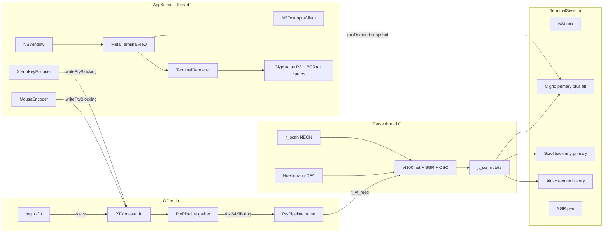

# Jetty — truthful xterm-256color macOS terminal

| Field | Value |
| --- | --- |
| Document | Design (v1 lock) |
| Author | TBD |
| Date | 2026-08-21 |
| Updated | 2026-08-29 |
| Status | **Shipped.** PRs 1–17 on `master`. Later product: `docs/DESIGN-follow-on.md`, `docs/DESIGN-kitty-graphics.md` |
| Bundle ID | `dev.jetty.app` |
| Audience | Senior engineers familiar with linux16term / Ghostty / ghosvt |

This is the **v1 lock**. Closed Questions below stay closed. Do not reopen the 16-byte `Cell`, `TERM=xterm-256color`, sandbox off, or no-Ghostty-wrap.

linux16term is frozen. Copy selected files into jetty; do not submodule it. Do not grow `linux16term/Sources/CVt/l16_vt.c`. Do not dual-path inside linux16term. Do not wrap Ghostty, link `libghostty-vt`, use Zig, or fork ghosvt.

**HEAD is not this document’s v1 snapshot.** Compact 32-byte instances, ligatures, dirty-row skip, DEC 2027, Kitty graphics, and the daily-driver host UX live in the later docs. Proposed Design below is the v1 machine as specified; where HEAD differs, the later document wins.

### Shipped after v1 (pointers, not a reopen)

| Later | Document / PRs | Still out |
| --- | --- | --- |
| Daily-driver follow-on | `docs/DESIGN-follow-on.md` 18–32, 34–36 | Secure input (33) |
| Kitty graphics | `docs/DESIGN-kitty-graphics.md` 38–45 | Kitty keyboard, `TERM=xterm-kitty`, Sixel |
| Extra VT / host on the same tree | CSI 16 t, 22/23 t title stack, DSR 996/998, XTGETTCAP, DECRQSS, reverse-wrap 1045, AppleScript, Cmd+N cwd inherit | CSI 21 t **title report** (injection) |

---

## Overview

linux16term is a correct **linux console**: 2-byte CP437 cells, `TERM=linux-16color`, CGA intensity as color bits, IBM VGA 8×16, no alt screen. That machine cannot run modern TUIs (neovim, tmux, bat, delta, CJK, truecolor). Stretching it would lie about the cell and the `TERM`.

**jetty** is a new Swift 6 + C macOS app with linux16term’s engineering DNA and an **xterm** cell/`TERM`. First stop: a truthful fully compliant `xterm-256color` terminal with truecolor and mouse, advertised as stock `/usr/share/terminfo/78/xterm-256color` on this Mac plus the daily-driver extras that file does not list (SGR 38;2 / 38:2, SGR mouse 1006, bracketed paste 2004, focus 1004, DEC 2026, OSC 8 / 7 / 133, Smulx / Setulc).

The CPU cell is a **16-byte** C `struct Cell` with independently tagged `fg`/`bg` (`PackedColor`), inline attrs, and a rare-store id. The VT hot path (scan, parser, SGR, OSC, UTF-8, grid mutate, alt screen, scrollback, damage) is **new C**, reusing linux16term **patterns** (`l16_scan.c` NEON, Hoehrmann DFA, `l16_vt_feed` + C grid, Swift overlay types) but not the linux-16color semantics. AppKit / Metal / PTY pipeline / config copy from linux16term. Ghostty is prior art for **xterm semantics**, not a library.

---

## Background & Motivation

### Product contrast

| | linux16term | ghosvt | jetty |
| --- | --- | --- | --- |
| Cell | 2-byte CP437 + 16×16 attr | Ghostty 8-byte style-table cell via `libghostty-vt` | 16-byte inline `Cell`, colors tagged per channel |
| `TERM` | `linux-16color` | `xterm-ghostty` | `xterm-256color` (stock file) |
| `COLORTERM` | unset | `truecolor` | `truecolor` |
| SGR 1 / 21 | intensity on / off | bold / **double underline** (`sgr.zig`) | **xterm**: bold / double underline |
| Alt screen | none | yes (Ghostty) | `smcup=\E[?1049h` required |
| Font | IBM VGA 8×16 (VileR) | unpatched JetBrains Mono + Symbols Nerd Font | **JetBrainsMono Nerd Font Mono** (patched Mono cut) |
| Launch | 80×25, VGA `scale` | fullscreen AppDelegate | **105×35**, font size **20**, windowed |
| Parser | C `l16_vt.c` linux SGR / CP437 | Zig `libghostty-vt` | **new** C xterm VT |
| GPU | `MTKView` instanced cells, dirty rows | Ghostty cells + Kitty + IOSurface-era extras | linux16term `MTKView` path. Kitty graphics later: extra pass, still no IOSurface. |

linux16term `DESIGN.md` is the contrast document. Do not copy its SGR table, 2-byte cell, `kbs=\177`, or F1=`ESC [[A`.

### Pain

1. **Wrong machine for daily TUIs.** neovim / tmux / bat / delta need 256 / truecolor, alt screen, UTF-8 cells, mouse SGR, OSC 8, curly underline.
2. **Cannot grow linux16term.** The 2-byte cell and `TERM=linux-16color` are the product. A 16-byte Unicode cell under that `TERM` is a lie.
3. **Cannot wrap Ghostty.** User constraint. Ghostty cells are an 8-byte style-table design (`page.zig` `style_id`). jetty’s cell is 16-byte inline with per-color tags so mixed SGR (`38;5;n` fg + `48;2;r;g;b` bg) is honest.

### Stock terminfo (this Mac)

Reconstructed with `infocmp -x xterm-256color` from `/usr/share/terminfo/78/xterm-256color`. Plain `infocmp` omits extended names (`Ms`, `E3`, `Se`, `Ss`, `Cs`, `Cr`, `AX`, `XT`).

Boolean / numeric (v1-relevant):

```
am, bce, ccc, km, mir, msgr, npc, xenl, AX, XT
colors#256, cols#80, it#8, lines#24, pairs#32767
```

`cols#80` / `lines#24` are terminfo defaults, **not** the product geometry. Launch is 105×35 via `TIOCSWINSZ`, same rule as linux16term vs `pcansi-25`.

Decoded `setaf` / `setab` (param `p1` = 0…255):

| Index | `setaf` (FG) | `setab` (BG) |
| --- | --- | --- |
| 0–7 | `CSI 30–37 m` | `CSI 40–47 m` |
| 8–15 | aixterm `CSI 90–97 m` (`9` then `n-8`) | aixterm `CSI 100–107 m` (`10` then `n-8`) |
| 16–255 | `CSI 38;5;n m` | `CSI 48;5;n m` |

Truecolor is **not** in this file. Still implement SGR `38;2` / `48;2` (semicolon and ISO colon). Advertise `COLORTERM=truecolor`.

Do **not** bundle a private terminfo in v1. No cap required for daily use is missing from the stock file; extras below are sequences apps send regardless of terminfo.

---

## Goals & Non-Goals

### Goals

- macOS 14+ Apple Silicon. Swift 6 app + Metal Shading Language + C for PTY spawn **and** the VT/parser/grid hot path.
- Truthful `TERM=xterm-256color` against stock `/usr/share/terminfo/78/xterm-256color`, plus user-required extras in [VT subset](#vt-subset).
- 16-byte `Cell` as locked. Zero bits = empty default cell. Indexed and default colors stay tagged until **paint**.
- UTF-8 PTY. Unicode in the cell. Wide East-Asian / emoji via a generated width table (Ghostty `codepointWidth` rules, **no DEC 2027 in v1** — follow-on PR 34 adds the mode, default off). Combining marks → grapheme store. CJK/emoji **paint** from system fallback faces + a BGRA atlas (the bundled Mono face has no CJK). CJK **input** via `NSTextInputClient`.
- Multi-window AppKit, one PTY per window, linux16term chrome (Cmd+N, close, hide, copy/paste/select all, zoom font size, fullscreen = more cells).
- Sandbox **off**. `login -flp` needs a real TTY.
- Config file only: `~/.config/jetty/config` (`XDG_CONFIG_HOME` honored), linux16term-style `key = value`.

### Non-Goals (explicit)

v1 list. **Later** is HEAD, not a v1 reopen.

| Capability | v1 | Later |
| --- | --- | --- |
| libghostty-vt / Zig / `ghostty.h` / `CGhosttyVT` / `GHOSTTY_STATIC` | User constraint | still out |
| Fork ghosvt / dual-path inside linux16term / grow `l16_vt.c` | User constraint | still out |
| Kitty graphics | Not implemented; do not advertise | **shipped** (`docs/DESIGN-kitty-graphics.md`). `TERM` stays `xterm-256color`. No `KITTY_WINDOW_ID`. |
| Kitty keyboard / `TERM=xterm-kitty` / `fullkbd` | Not implemented; do not advertise | still out |
| Sixel, iTerm2 inline images, tmux control mode | Out of scope | still out |
| DEC 2027 grapheme clustering | Terminal-typical widths in v1 | **shipped** follow-on PR 34 (mode, default off) |
| Mouse UTF-8 1005, pixel 1016, urxvt 1015 | User: SGR 1006 or X10 only | still out |
| Full XTWINOPS (move, iconify, maximize, CSI 1–3 t, 21 t title report) | Ignore except CSI 14 t / 18 t | CSI **16 t** and **22/23 t** title stack shipped. CSI 21 t title report still out. |
| Tabs, splits, `VtManager`, WebKit | Lightweight product surface | still out |
| Settings GUI | Config file only | still out |
| Scrollback compressor / byte cap | 50k **rows**, uncompressed | still 50k rows |
| IOSurface copy-forward / Ghostty span blit / Highway | User: linux16term `MTKView` | still out |
| 8-byte Ghostty style-table cell | User: 16-byte inline | still locked |
| Ligatures (`liga` / `calt`) | Off in v1; shaper must still be able to grow | **shipped** follow-on PR 22; default `programming` |
| Private terminfo overlay | Stock file is sufficient | still none |
| 8-bit C1 CSI (`0x9B`) as a control in UTF-8 | Bytes `≥ 0x80` go through the UTF-8 DFA; decoded C1 (U+0080–U+009F) is ignored | still ignored as a control. APC 8-bit ST (`0x9C`) **does** end APC (Ghostty). |
| Linux `CSI [[` F-key swallow | That is linux console, not xterm | still out |

---

## Key Decisions

1. **New product, new C VT.** Freeze linux16term. Copy PTY / Metal / AppKit / config **files**; write a new xterm parser and 16-byte grid. Rationale: linux SGR 1/21/5 and CP437 cannot become xterm without lying. Growing `l16_vt.c` mixes two machines.

2. **16-byte inline cell, colors tagged per channel.** Locked by user. Mixed SGR (`setaf 196` + `48;2;…`) is representable. Zero is the default empty cell. No cell-wide INDEXED/TRUECOLOR/EXTERNAL union. No Ghostty style table.

3. **C hot path, Swift chrome.** Parser, SGR, OSC, UTF-8, grid, alt screen, scrollback, damage in C. PTY pipeline, AppKit, Core Text atlas, Metal expand/paint, key/mouse encode, config, selection in Swift. One parser — no Swift dual-path behind a flag.

4. **Stock `xterm-256color`, `COLORTERM=truecolor`.** Rely on `/usr/share/terminfo/78/xterm-256color`. Implement terminfo + daily extras (truecolor, 1006, 2004, 1004, 2026, OSC 8/7/133, Smulx/Setulc, CSI 14/18 t). Do not advertise `xterm-kitty`.

5. **SGR is xterm, not linux.** SGR 1 = bold (face at paint). SGR 21 = double underline (`ghostty/src/terminal/sgr.zig`). SGR 22 = bold+dim off. Indexed/default colors are not resolved until paint so OSC 4 / OSC 10 / OSC 11 still affect already-written cells.

6. **Metal = linux16term `MTKView`, cell-boxed R8 glyphs.** Instanced 80-byte `CellInstance` quads, triple-buffer shared MTLBuffers. Glyph pass copies linux16term `cell_vertex`/`cell_fragment` (nearest R8, **`isBlendingEnabled = false`**, UVs are the full cell). A **second** blended pipeline draws underline/strike/overline/DECSCUSR bar/underline extras and cell-boxed BGRA emoji. C `dirty[rows]` is stored in v1; expand still rebuilds every **visible** viewport row (linux16term `draw` never reads `dirtyRows`). GPU dirty-skip is a follow-on, not a v1 gate. Compact 32-byte instances allowed later if drop-in. Do **not** build linux16term’s 256-glyph VGA tile sheet. Do **not** do ghosvt ink-bearing quads in v1 (italic/Nerd icons may clip to the cell).

7. **Font = bundled JetBrainsMono Nerd Font Mono, size 20, ligatures off.** Grid family name **`JetBrainsMono Nerd Font Mono`** (Mono cut so PUA icons are 1-cell). Regular/Bold/Italic/BoldItalic from Nerd Fonts **v3.4.0** `JetBrainsMono.zip`. Disable `liga`/`calt` via Core Text feature settings. Atlas keys stay general enough to add ligature runs later. Sprites for box-drawing / braille / sextants. CJK from system faces (`CTFontCreateForString`, reject LastResort). Color emoji from Apple Color Emoji into a BGRA atlas.

8. **Launch 105×35, zoom = font size.** Cell pixel size from Core Text metrics × backing scale. Resize / fullscreen / zoom all recompute cols/rows and `TIOCSWINSZ`. No letterbox.

9. **Scrollback 50k rows, primary only.** Row cap, not bytes. No compressor. Alt screen has no history. `E3=\E[3J` clears history.

10. **OSC 52 write allow / read ask.** Ghostty defaults (`clipboard-write = allow`, `clipboard-read = ask`). Config can deny write. OSC 8 never auto-opens; Cmd-click with scheme allowlist.

11. **SPM-only app, sandbox off.** Match linux16term: SwiftPM libraries + executable, shaders as a string in `TerminalRenderer.swift`, fonts as SPM resources. Optional `scripts/build-app.sh` wraps a `.app` + ad-hoc sign + `Info.plist` (`LSUIElement` no, sandbox off). No xcodeproj in v1 — linux16term shipped without one; jetty has no `libghostty-vt.a` to force-load.

12. **CSI param cap 24, with `:` subparams.** Ghostty `Parser.MAX_PARAMS = 24` (Kakoune SGR uses 17). linux16term’s 16 would clip. Colon separator bitset like `parse_table.zig` / `sgr.zig`.

13. **Bold is a face, not bright.** SGR 1 selects the Bold (or BoldItalic) CT file at paint. It does **not** map to palette n+8 (`xterm` `boldColors` / aixterm 90–97). `CSI 91 m` is indexed 9; `CSI 31;1 m` is palette[1] + bold face.

14. **IME is required.** `MetalTerminalView` implements `NSTextInputClient`. Option-as-meta only when no marked range / no IME composition. Without this, CJK never reaches the PTY.

15. **DECRQM in v1.** neovim/tmux discover 2026/2004/1006/1049 via `CSI ? … $ p`, not terminfo (`Sync` is absent from this Mac’s `xterm-256color`). Reply DECRPM for every v1 mode. DA2 (`CSI > c`) is **not** DA1.

---

## Closed Questions

Recorded 2026-08-21. Do not reopen.

| Decision | Resolution |
| --- | --- |
| Display name | **Jetty** |
| Repo | this tree |
| Bundle ID / `CFBundleName` | `dev.jetty.app` / `Jetty` |
| `TERM` / `COLORTERM` / `TERM_PROGRAM` / version | `xterm-256color` / `truecolor` / `jetty` / `0.1.0` |
| Config path | `~/.config/jetty/config` (`XDG_CONFIG_HOME`) |
| Platform / language | Apple Silicon, macOS 14+, Swift 6 + MSL + C (PTY **and** VT hot path) |
| Sandbox | **Off** |
| Cell | Locked 16-byte C struct (see below). No packed attribute, no style table, no cell-wide color union |
| Wide states | Ghostty `page.zig`: narrow / wide / spacer_tail / spacer_head |
| DEC 2027 | Not in v1 |
| Hyperlink + underline color | Rare store keyed by `Cell.extra` |
| Parser home | New C VT. Do not grow `l16_vt.c`. No Swift dual parser |
| Metal | linux16term `MTKView` + instanced cells + dirty rows. Not IOSurface copy-forward |
| `CellInstance` | Keep linux16term 20-float / 80-byte unless shrinking is trivial |
| Font | **JetBrainsMono Nerd Font Mono**, 20 pt default, liga/calt off, OFL-1.1 + Hoehrmann MIT in `THIRD_PARTY_LICENSES.md` |
| Launch geometry | 105×35 cells |
| Scrollback | 50k rows, no compressor, primary only, ED 3 and RIS clear |
| Windows | linux16term multi-window, one PTY each; no tabs/splits/VtManager/WebKit |
| Terminfo | Stock file; no private overlay unless a later cap is missing |
| Truecolor | SGR 38;2 / 48;2 semicolon **and** ISO colon; `COLORTERM=truecolor` |
| Mouse | Tracking 9/1000/1002/1003; reports SGR 1006 if enabled else X10; skip 1005/1016; 1007 default **on** |
| Bracketed paste / focus | 2004 and 1004 in v1 |
| DEC 2026 | In v1; Alacritty hold-parse until ESU; GPU paints committed frames |
| OSC 8 / Smulx / Setulc / OSC 7 / 133 | In v1 |
| CSI 14 t / 18 t | Size reports only; other window-ops ignored |
| OSC 52 | Write allow (config may deny); read asks |
| SGR 1 / 21 | Bold / double underline (xterm/Ghostty), not linux intensity |
| Copy-on-select | On; off while mouse tracking is on |
| Ligatures | Off now; do not paint the shaper into a corner |
| Name vs Eclipse Jetty | Accept; bundle is `dev.jetty.app` |
| maxterm | Ignore entirely |

Do not treat later shipping as a reopen of these rows. Follow-on / Kitty docs: DEC 2027 (PR 34, default off); `CellInstance` 32 bytes (PR 23); ligatures default `programming` (PR 22); OSC 133 jump UI (PR 25); GPU dirty-skip (PR 20); CSI 16 t and 22/23 t title stack (not CSI 21 t report); Kitty graphics without `xterm-kitty`.

### Locked here (not reopened; engineering choices)

| Choice | Lock |
| --- | --- |
| C ABI prefix | `jt_` (`jt_vt_feed`, `jt_pty_spawn`, …) |
| CSI `MAX_PARAMS` | 24 (Ghostty; Kakoune) |
| DEC 2026 timeout | 150 ms (Alacritty `vte` `SYNC_UPDATE_TIMEOUT`) |
| Live-grid scroll | Circular origin like `l16_vt.c` `phys_y` / `origin` |
| Default 0–15 | VGA-like 00/80/C0/FF cube corners, **not** Ghostty `color.Name.default` and **not** xterm `*colorN` (`cd0000` / `0000ee` / `e5e5e5`) |
| OSC 8 underline | Do not auto-underline; TUIs send SGR 4. Hover: pointing-hand cursor when the cell has a URI and tracking is off (or Cmd held) |
| Modes 47 / 1047 / 1049 | Ghostty `Terminal.zig` `switchScreenMode` (xterm `charproc.c` `srm_ALTBUF` / `srm_OPT_ALTBUF` / `srm_OPT_ALTBUF_CURSOR`). 47: switch + cursor copy, no ED 2. 1047: same on enter; ED 2 **alt on leave** then switch + cursor copy. 1049: DECSC / switch / ED 2 / DECRC. Not independent-per-buffer cursors |
| Font family (grid) | `JetBrainsMono Nerd Font Mono` (not the non-Mono `JetBrainsMono Nerd Font` cut) |
| Nerd Fonts pin | `https://github.com/ryanoasis/nerd-fonts/releases/download/v3.4.0/JetBrainsMono.zip` sha256 `76f05ff3ace48a464a6ca57977998784ff7bdbb65a6d915d7e401cd3927c493c` |
| Bold vs bright | Face-only; reject `boldColors` |
| Glyphs | Cell-boxed R8; reject ink-bearing quads in v1 |
| IME | `NSTextInputClient`; reject Option-meta-only |
| DECRQM | Implement; reject set/reset-only 2026 |
| OSC 133 | Parse/store keyed by absolute line id; **no UI** in v1 (jump is follow-on PR 25) |
| GPU dirty-skip | Follow-on. v1 stores `dirty[]` and expands the visible viewport every frame (PR 20 shipped later) |
| Width LUT | 2 bits × `0x110000` = **272 KiB** (`278_528` B), not 140 KiB |
| Zoom step | 1 pt, clamp 8…72; Cmd+0 restores config `font-size` |
| 8-bit C1 | Not executed; `≥ 0x80` is UTF-8; decoded C1 is ignored. APC 8-bit ST (`0x9C`) ends the string; OSC/DCS treat `0x9C` as payload |
| Linux `CSI [[` swallow | Not implemented |
| Grapheme / rare pools | Refcounted id pools; cell copy shares the id |
| Width table | Generated 2-bit packed LUT, committed C, `scripts/gen-width-table.py` |
| Build | SwiftPM only + `scripts/build-app.sh`; no v1 xcodeproj |

---

## Proposed Design

### Identity

Child environment (`Sources/CPty/pty_spawn.c` `set_term_identity`, copied from linux16term and ghosvt `pty_spawn.c` with **xterm** values):

```c
static void set_term_identity(void) {
    setenv("TERM", "xterm-256color", 1);
    setenv("COLORTERM", "truecolor", 1);
    setenv("TERM_PROGRAM", "jetty", 1);
    setenv("TERM_PROGRAM_VERSION", "0.1.0", 1);
    /* no TERMINFO override — stock /usr/share/terminfo */
}
```

Spawn path is linux16term `exec_login_shell`: `/usr/bin/login [-q] -flp $USER /bin/bash --noprofile --norc -c "exec -l <shell>"`. `-q` if `~/.hushlogin` exists. Fallback `execl(shell, shell, "-l", NULL)`. Master `O_NONBLOCK`. `forkpty` + `TIOCSWINSZ` including `ws_xpixel` / `ws_ypixel` from cell px.

Strip nothing else from the linux16term spawn (it already has no Ghostty include, no banner, no multi-VT). Rename symbols `l16_*` → `jt_*`. Change `dprintf` identity to `jetty:`.

Swift overlay: `enum Terminfo { static let termName = "xterm-256color" }`.

### Architecture



Ownership matches linux16term `TerminalSession.swift`:

- Session owns the master fd. `PtyPipeline` never closes it.
- Parse thread mutates the C grid under `NSLock`. `writePtyBlocking` **does not** take that lock (`PtyIO.swift`; DA/DSR/mouse/paste).
- Main thread `lockDemand` / `unlockDemand` (atomic `drawDemand` + 1 ms `yieldToDemand`, same as linux16term / Ghostty).
- Gather thread only `read`/`poll`s.

Do not put a Swift parser behind a flag.

### 16-byte cell (locked)

`Sources/CVt/jt_cell.h`. Do **not** `__attribute__((packed))`. Natural layout is 16 bytes with `extra` at offset 14.

```c
typedef struct Cell {
    uint32_t content; /* scalar or grapheme index + kinds */
    uint32_t fg;      /* PackedColor */
    uint32_t bg;      /* PackedColor */
    uint16_t attrs;
    uint16_t extra;   /* 0 = none; else rare-store id */
} Cell;

_Static_assert(sizeof(Cell) == 16, "Cell must be 16 bytes");
_Static_assert(offsetof(Cell, extra) == 14, "Cell field order");

#define COLOR_TYPE_SHIFT 24
#define COLOR_PAYLOAD    0x00FFFFFFu
#define COLOR_DEFAULT    0u
#define COLOR_INDEXED    (1u << COLOR_TYPE_SHIFT)
#define COLOR_RGB        (2u << COLOR_TYPE_SHIFT)
/* type 0 default, 1 indexed (low 8), 2 truecolor 0xRRGGBB */

#define CONTENT_PAYLOAD    0x001FFFFFu
#define CONTENT_KIND_SHIFT 21
#define CONTENT_KIND_MASK  (3u << CONTENT_KIND_SHIFT)
#define CONTENT_SCALAR     0u
#define CONTENT_GRAPHEME   (1u << CONTENT_KIND_SHIFT)

#define CONTENT_WIDE_SHIFT 23
#define CONTENT_WIDE_MASK  (3u << CONTENT_WIDE_SHIFT)
#define WIDE_NARROW        0u
#define WIDE_FULL          (1u << CONTENT_WIDE_SHIFT) /* Ghostty wide */
#define WIDE_TAIL          (2u << CONTENT_WIDE_SHIFT) /* spacer_tail */
#define WIDE_HEAD          (3u << CONTENT_WIDE_SHIFT) /* spacer_head */

#define ATTR_BOLD          (1u << 0)
#define ATTR_DIM           (1u << 1)
#define ATTR_ITALIC        (1u << 2)
#define ATTR_BLINK         (1u << 3)
#define ATTR_REVERSE       (1u << 4)
#define ATTR_HIDDEN        (1u << 5)
#define ATTR_STRIKETHROUGH (1u << 6)
#define ATTR_OVERLINE      (1u << 7)
#define ATTR_UL_SHIFT      8
#define ATTR_UL_MASK       (7u << ATTR_UL_SHIFT)
#define UL_NONE            0u
#define UL_SINGLE          (1u << ATTR_UL_SHIFT)
#define UL_DOUBLE          (2u << ATTR_UL_SHIFT)
#define UL_CURLY           (3u << ATTR_UL_SHIFT)
#define UL_DOTTED          (4u << ATTR_UL_SHIFT)
#define UL_DASHED          (5u << ATTR_UL_SHIFT)
```

Swift overlay (`Sources/Jetty/Cell.swift`) is accessors + `RGB`, not a second layout. Tests assert `MemoryLayout<Cell>.stride == 16` and the C `_Static_assert`s.

**Zero bits = empty default cell:** `content=0` (U+0000 scalar, narrow), `fg=0`/`bg=0` (default), `attrs=0`, `extra=0`. Printable space is scalar `0x20` with the current pen, not a zero cell. BCE erase fills space + current pen (including default/indexed/RGB as tagged).

**Hot path:** copy the pen into the cell. Do not resolve indexed → RGB, do not resolve default → palette. OSC 4 mutates `palette[256]`; OSC 10/11 mutate default fg/bg; paint looks up.

**Wide integrity** (Ghostty `page.zig` `Cell.Wide` + checks around the spacer rules):

| Cell | Meaning | Paint |
| --- | --- | --- |
| `WIDE_NARROW` | width 1 | glyph |
| `WIDE_FULL` | width 2 head | glyph, occupies this cell + next |
| `WIDE_TAIL` | spacer after wide | do not render; must follow `WIDE_FULL` |
| `WIDE_HEAD` | soft-wrap spacer at end of line | do not render; next line starts the wide glyph |

Printing a width-2 scalar at `cols-1` with wrap: write `WIDE_HEAD` at the last column, set `wrap[y]`, wrap (IND), write `WIDE_FULL` + `WIDE_TAIL` on the next line (Ghostty spacer_head). **ICH/DCH:** if the deleted or shifted span splits a `WIDE_FULL`/`WIDE_TAIL` pair, blank **both** cells (`0x20` + current pen) so no dangling tail remains. EL 0/2 on a row that starts with a tail following a previous-row head: blank the tail; do not walk to the previous row. Tests: `WIDE_TAIL` not following `WIDE_FULL` is a bug.

**Graphemes:** combining marks and other width-0 scalars after a base go to a grapheme store. The cell `content` kind becomes `CONTENT_GRAPHEME` with a 21-bit id (`CONTENT_PAYLOAD`). Store entry is the full cluster: `cps[0]` = base, `cps[1..]` = combining / ZWJ / VS16. No DEC 2027: width is the **base** codepoint’s `codepointWidth`, not the cluster.

Intern key = exact `uint32_t` sequence. `jt_grapheme_intern(scr, cps, n) → id` increments refs on hit. `jt_grapheme_get(const jt_scr *, uint32_t id, uint16_t *n) → const uint32_t *cps`. Paint rasterizes with `CTLine` of that cluster (not base-only), then **cell-boxes** the ink into the R8 (or BGRA) atlas tile — clip if the cluster is wider than the cell.

**Rare store (`extra`):** hyperlink + underline color in **one** slot. Intern key = `(osc8_id or "", uri or "", ul_color PackedColor)`. `extra == 0` means none.

```c
typedef struct jt_rare {
    const char *osc8_id;   /* NULL if none */
    const char *uri;       /* NULL / empty = no link */
    uint32_t ul_color;     /* PackedColor; COLOR_DEFAULT = use fg */
} jt_rare;

int jt_rare_get(const jt_scr *s, uint16_t id, jt_rare *out);
uint16_t jt_rare_intern(jt_scr *s, const char *osc8_id, const char *uri, uint32_t ul);
```

SGR 58 and OSC 8 change independently: intern a **new** key (old id decref). Do not mutate an existing slot in place (other cells may share it).

**Refcount:** parse-thread only. Cell copy (`ICH` shift, scroll `memcpy` of a row) incref; overwrite / clear decref and free at 0. RIS / alt-switch / resize that drops cells decref.

**Snapshot:** `lockDemand` copies the **visible** cells with a plain `memcpy`. For each unique grapheme/rare id in that slice, copy the payload into a Swift `Snapshot` sidecar (codepoints array, uri string, ul color). Then `unlockDemand`. Expand reads `Snapshot` only — no pool lookup after unlock, no extra refcount. Parse may free pool entries as soon as the lock drops.

**Caps:** 4096 grapheme entries and 1024 rare entries **per `jt_scr`** (primary + alt + scrollback share the pools). Overflow is **visible**, not silent-success: combining mark dropped (cell stays `CONTENT_SCALAR` base); new OSC 8 / SGR 58 dropped (`extra` unchanged or 0). One `fputs` the first time each cap trips. 50k unique OSC 8 URIs will lose links — accepted in v1; raise the cap later. Goldens: OSC 8 + SGR 58 on one cell (one `extra` id, both fields set); intern 1025 distinct URIs → the last write has `extra==0`.

### Color model

`PackedColor` is a `uint32_t`:

| Type bits `[31:24]` | Payload `[23:0]` |
| --- | --- |
| 0 `COLOR_DEFAULT` | 0 |
| 1 `COLOR_INDEXED` | index 0…255 in low 8 |
| 2 `COLOR_RGB` | `0xRRGGBB` |

Pen holds `fg`, `bg`, `ul_color` (rare; `COLOR_DEFAULT` means “use fg”), `attrs`. `jt_pen_pack` copies into each written cell. Reverse is **ATTR_REVERSE on the cell**, applied at paint — not linux16term’s nibble-swap-at-write (`reverseCell` in `Cell.swift`). DECSCNM (`?5`) is a screen flag that swaps fg/bg at paint for all cells.

**Default 256 palette** — VGA-like 00/80/C0/FF for 0–15 plus the xterm 6×6×6 cube, **not** Ghostty `color.zig` `Name.default` (those 0–15 are a theme) and **not** xterm `*colorN` resources (`cd0000` / `0000ee` / `e5e5e5`):

```
 0 #000000  1 #800000  2 #008000  3 #808000
 4 #000080  5 #800080  6 #008080  7 #c0c0c0
 8 #808080  9 #ff0000 10 #00ff00 11 #ffff00
12 #0000ff 13 #ff00ff 14 #00ffff 15 #ffffff
```

Cube 16–231: for `n` in 0..5, channel = `n==0 ? 0 : n*40+55` (Ghostty `color.zig` lines 21–36). Gray 232–255: `8 + 10*(i-232)`.

Config may overlay `palette-0`…`palette-15` only. OSC 4 can change any of 0–255. OSC 104 / `oc` restore compiled defaults then re-apply the config 0–15 overlay (startup config is the reset baseline for ANSI; 16–255 return to the cube). **v1 lock:** OSC 104 / RIS restore compiled xterm cube **plus** the config 0–15 overlay loaded at process start (config is not re-read).

Default fg paint = OSC 10 or palette[7]. Default bg paint = OSC 11 or palette[0]. Cursor color = OSC 12 or fg.

### Grid, alt screen, scrollback, damage

C `jt_scr` in `Sources/CVt/jt_grid.c`. Patterns from `l16_vt.c` `l16_scr_*` (circular live origin, row ring scrollback, `l16_scr_resize` clip/pad, `l16_scr_clear_history`) with a 16-byte cell and a second screen. Each live buffer has its own **grid, origin, margins, tabs, wrap, dirty**, and a cursor field that is **copied on 47/1047 switch** (not left independent). Shared: pen, charset, modes, palette, pools. CSI `params` live on `jt_vt`, not the screen: `uint16_t params[24]` + `uint32_t seps` (bit i = colon after param i).

```c
typedef struct jt_buf {
    Cell *grid;                 /* circular via origin */
    int32_t origin;
    int32_t cx, cy, pending_wrap;
    int32_t scroll_top, scroll_bottom;
    uint8_t *tabstops;          /* length == cols */
    uint8_t *dirty;             /* length == rows; 1 = mutated */
    uint8_t *wrap;              /* length == rows; 1 = xenl soft-wrap */
} jt_buf;

typedef struct jt_scr {
    jt_buf primary, alt;
    jt_buf *active;             /* &primary or &alt */
    int32_t cols, rows;
    int32_t in_alt;             /* 1049/1047/47 */
    int32_t auto_wrap, insert_mode, origin_mode;
    int32_t g0, g1, gl;         /* 0 = ASCII B, 1 = DEC special 0 */
    uint64_t lines_scrolled;    /* sb_push count; OSC 133 keys off this */
    Cell *sb;
    uint8_t *sb_wrap;           /* wrap bit per history row */
    int32_t sb_head, sb_len, sb_stride, scrollback_cap;
    jt_pen pen;
    jt_saved saved;             /* DECSC / 1048 / 1049 only */
    uint32_t palette[256];
    uint32_t default_fg, default_bg, cursor_color;
    uint8_t mouse_event;        /* 0, 9, 1000, 1002, 1003 */
    uint8_t mouse_sgr;          /* 1006 */
    uint8_t mouse_alt_scroll;   /* 1007, default 1 */
    uint8_t focus_event, bracketed_paste, sync_output;
    uint8_t reverse_video, cursor_visible, cursor_blink;
    uint8_t cursor_style;       /* DECSCUSR 0–6, default 2 */
    uint8_t decckm, deckpam;
    /* grapheme + rare pools; OSC 133 mark list */
} jt_scr;
```

`jt_pen` is `{ PackedColor fg, bg, ul_color; uint16_t attrs; uint16_t extra; }` plus the current OSC 8 id/uri strings used when packing `extra`.

**Alt screen (`smcup=\E[?1049h` / `rmcup=\E[?1049l`):** required. Primary has the 50k-row ring. Alt is `cols*rows` only — no history, no `sb_push` on IND. Allocate `alt.grid` lazily on first 47/1047/1049.

Lock **Ghostty** `src/terminal/Terminal.zig` `switchScreenMode` (comment: verified against xterm `charproc.c` `srm_ALTBUF` / `srm_OPT_ALTBUF` / `srm_OPT_ALTBUF_CURSOR`; tests `mode 47 alt screen plain`, `mode 1047 alt screen plain`). Do **not** treat independent per-buffer cursors (no copy) as xterm. `jt_scr_switch_screen_mode(s, mode, enabled)`:

`cursorCopy` = if the active screen **actually changes**, copy `{cx, cy, pending_wrap}` from the old buffer onto the new one. **Not** pen, charset, margins, or tabs (pen/charset already live on `jt_scr`). If already on the destination, do not copy (Ghostty `if (old_)`).

- **47 enter / leave:** switch `active` only. **No ED 2.** Then `cursorCopy`. Alt content persists across 47l/47h.
- **1047 enter:** same as 47 (switch + `cursorCopy`, **no** clear). **1047 leave:** if `active` is alt, **ED 2 on alt** (xterm: “Clear the screen first if in the Alternate Screen Buffer”), then switch to primary, then `cursorCopy`. ED 2 does **not** home; it leaves the cursor where it was, then copy overwrites `{cx,cy,pending_wrap}` on the destination.
- **1049 enter:** DECSC into `saved` **unconditionally** (even if already on alt) — coords, pendingWrap, pen, G0/G1/GL. Switch to alt. ED 2 on alt (xterm clear does not home). Then `cursorCopy` from primary onto blank alt if the screen changed. **1049 leave:** switch to primary, DECRC from `saved` (no ED 2, no `cursorCopy`). Stock `smcup`/`rmcup`.
- **1048:** DECSC/DECRC only (no switch).

Do not add a separate Home/CUP 1;1 on enter.

Goldens (not the dropped CUP 10;40 restore):

- `47h`, print, `47l`, `47h` → alt still has the print.
- `1047h`, print, `1047l`, `1047h` → alt is blank (leave cleared it).
- 1049 round-trip restores primary cells and the DECSC cursor/`saved` slot. After `1049h`, a print is at the **copied primary cursor**, not at 1;1, matching Ghostty `printString("2B")` off-center.

**Scrollback:** 50k rows default (`scrollback-lines`). Ring of `cap * stride` cells, `stride` tracks current cols. IND from the top of the region (`scroll_top==0` and not in alt) `sb_push`es the top row then circular-scrolls the live grid (`origin++`), same cheap path as `l16_vt.c` `sb_push` + `phys_y`. Resize reallocates `sb` to new stride (copy overlapping columns, pad/clip) like `l16_scr_resize`. No compressor.

**ED 3** (`E3=\E[3J`): `jt_scr_clear_history` — `sb_len=0`, `lines_scrolled=0`. Stock xterm-256color.

**BCE:** EL/ED/ECH/ICH/IL blanks are `content=0x20` + current pen colors/attrs (reverse bit copied, not pre-swapped).

**xenl:** graphic in last column sets `pending_wrap` without scrolling; next graphic wraps then prints and sets `active->wrap[old_y] = 1`.

**Wrap bit:** `uint8_t wrap[rows]` on each live buffer, plus `sb_wrap[sb_len]` on history. Set when a xenl wrap (or width-2 spacer_head wrap) actually IND/CRLF-prints onto the next row. Clear on EL 0/2 of that row, on ED that covers the row, on RIS, on resize (no reflow). Copy/selection: join consecutive visual rows while `wrap[y]==1` (no `\n`); emit `\n` only when wrap is clear. `WIDE_HEAD` is only legal at `cols-1` on a wrapped row (Ghostty `page.zig` integrity).

**IRM print:** if `insert_mode`, each stored cell (width 1 or the FULL+TAIL pair) first shifts `[cx, cols)` right by that width (last columns dropped), then writes. `print_run` of ASCII does this per byte at run edges and inside when `insert_mode` (no memmove of a span that would skip wrap). Overwrite path (`IRM` off) is the `l16_scr_print_glyphs` broadcast.

**Damage:** `uint8_t dirty[rows]` on the active buffer. Any mutate of row y sets `dirty[y]=1`. Scroll/IL/DL marks the region. Resize / ED 2 / alt switch marks all. **v1 GPU path does not skip:** expand rebuilds every **visible** viewport row (`rows + overscroll`), matching linux16term `MetalTerminalView.draw` (which never reads `Screen.dirtyRows` and does not blit 50k history). Dirty bits are for a follow-on skip. See Key Decision 6.

**Resize:** no reflow (xterm). Floor at **2 cols × 1 row** (1×1 `TIOCSWINSZ` cannot host a wide cell). Copy overlapping rectangle on **both** live buffers; pad with BCE space; clamp each buffer’s cursor; tabs every 8 (`it#8`); clear wrap; `jt_pty_set_winsize`. Scrollback reallocates to the new stride (clip/pad), matching `l16_scr_resize`. That copy runs **on the parse thread** (50k × 400 × 16 B ≈ 305 MiB worst case) — hitch accepted in v1; do not hop to a worker.

**Blink:** `ATTR_BLINK` toggles glyph visibility every **500 ms** (paint `fg=bg` in the off phase, same as hidden). Cursor blink (DECSCUSR 0/1/3/5 and `?12`) uses the same 500 ms clock. Unfocused windows: cursor steady, cell blink still runs.

### Parser (C)

New files. Do not compile `l16_vt.c` into jetty.

| File | Role | Prior art |
| --- | --- | --- |
| `jt_scan.c` | NEON printable-ASCII / until-C0 / first-ESC | copy `linux16term/Sources/CVt/l16_scan.c` (`l16_scan_*` → `jt_scan_*`) |
| `jt_utf8.c` | Hoehrmann DFA | `l16_vt.c` tables (already a port of `ghostty/src/terminal/UTF8Decoder.zig`) |
| `jt_vt.c` | vt100.net state machine, CSI `:` , OSC accumulate, `jt_vt_feed` | Ghostty `Parser.zig` + `parse_table.zig`; linux16term `l16_vt_feed` structure |
| `jt_sgr.c` | xterm SGR including 256 + truecolor + Smulx + 58 | Ghostty `sgr.zig` — **not** `l16_scr_apply_sgr` |
| `jt_osc.c` | OSC 0/2/4/7/8/10/11/12/52/112/133 | Ghostty `osc/` parsers as spec |
| `jt_grid.c` | print, C0, CSI edits, alt, scrollback, damage | `l16_scr_*` patterns, 16-byte cell |
| `jt_width.c` | generated `jt_codepoint_width(uint32_t)` | Ghostty `unicode/main.zig` `codepointWidth` |

**`jt_vt_feed` ground fast path** (mirror `l16_vt_feed` at `l16_vt.c:1152`):

1. If `state == GROUND` and byte is ESC, try a fast CSI then `execute_c0(ESC)`.
2. C0 / DEL → `execute_c0`.
3. Else if GL is ASCII: `jt_scan_printable_ascii` → `print_run` of ASCII (scalar = byte, width 1, copy pen). No DFA.
4. Else if GL is DEC special: do **not** SIMD-span `0x60–0x7E` (those are ACS). Map those bytes one at a time through `acsc`; `0x20–0x5F` may still span.
5. Else `jt_scan_until_c0` → UTF-8 DFA over the span, emit scalars.

Do **not** keep linux16term’s IBM/SGR 11 byte machine. `smacs=\E(0)` is charset GL, not SGR 11.

**State machine** from vt100.net / Ghostty `Parser.State`: ground, escape, escape_intermediate, csi_entry, csi_param, csi_intermediate, csi_ignore, osc_string, osc_ignore, dcs_ignore, sos_pm_apc. **No** `csiLinuxFn`. CSI param accepts `';'` and `':'` (`parse_table.zig` comment: SGR colon). `params[24]`, `seps` bitset (bit i = colon after param i), `inter[4]`, `osc[4096]` then `osc_ignore` until BEL/ST/CAN (linux16term OSC overflow rule — do not print the tail).

UTF-8 errors: emit U+FFFD, consume-or-retry as Ghostty `UTF8Decoder.next` (reject of a non-first byte is not consumed).

**Host callbacks are side effects that must leave C.** They are **not** an extension of linux16term `l16_vt_host` (`print_glyph` / `csi` / `esc`). Grid mutate stays in C. There is **no** `print_glyph`. Swift `Parser.feed` is only `jt_vt_feed(vt, bytes, n, screen.implPtr, h)` — the linux16term parallel is `Parser.swift:96–104`, not the `TerminalHandler` glyph path.

```c
typedef struct jt_vt_host {
    void *ctx;
    /* DA/DSR/DECRPM/OSC 4 query — must not take session.lock (writePtyBlocking). */
    void (*write_pty)(void *ctx, const uint8_t *p, size_t n);
    void (*bell)(void *ctx);
    /* The following copy bytes and hop to main. They MUST return without waiting. */
    void (*set_title)(void *ctx, const uint8_t *utf8, size_t n);
    void (*osc52_write)(void *ctx, uint8_t kind, const uint8_t *b64, size_t n);
    void (*osc52_read)(void *ctx, uint8_t kind); /* flag + DispatchQueue.main.async; no NSAlert here */
    void (*osc7)(void *ctx, const uint8_t *uri, size_t n);
    void (*osc133)(void *ctx, uint8_t action, const uint8_t *opts, size_t n);
    void (*palette_changed)(void *ctx);
} jt_vt_host;
```

### VT subset

Honor stock caps plus user extras. Coordinates 0-based internally; CUP/HVP/CHA/VPA/HPA are 1-based and clamped.

#### C0

BEL, BS, HT, LF/VT/FF (as LF / IND), CR, SO/SI (GL = G1 / G0), CAN/SUB (abort ESC → ground, SUB may print replacement), ESC, DEL ignored. No 8-bit CSI.

#### ESC

| Seq | Cap / notes |
| --- | --- |
| `ESC c` | `rs1=\Ec` RIS |
| `ESC D` | IND |
| `ESC E` | NEL |
| `ESC H` | HTS |
| `ESC M` | RI |
| `ESC 7` / `ESC 8` | `sc`/`rc` DECSC/DECRC (coords, pendingWrap, pen, G0/G1/GL) |
| `ESC Z` | DECID → `u8=\E[?1;2c` |
| `ESC =` / `ESC >` | DECKPAM / DECKPNM (keypad; smkx/rmkx tails) |
| `ESC ( / )` `B` `0` | G0/G1 designate ASCII / DEC special (`smacs=\E(0)` `rmacs=\E(B)`) |
| `ESC ]` | OSC |
| `ESC \` | ST (if in OSC/DCS) |
| `ESC # 8` | DECALN optional (E) |

RIS: pen default, charset G0=B G1=0 GL=G0, autowrap on, IRM off, DECOM off, DECCKM off, cursor visible steady block, mouse off, 1007 on, 2004/1004/2026 off, margins full, tabs every 8, home, ED 2, **clear scrollback**, restore palette, leave alt, clear 2026 hold. Ghostty `Screen.reset` → `pages.reset`. Does **not** force 105×35.

DECSTR (`is2` / `rs2` `CSI ! p`): intermediate `!`, final `p`. Soft reset — modes/pen/charset/margins as xterm DECSTR; do not clear the screen; do not reset OSC 4 palette. Then `is2` also sends `CSI ? 3;4 l` (ignore 132-col / smooth scroll), `CSI 4 l` (IRM off), `ESC >`. **Not** DECRQM (`$` / `?$` + `p`).

#### CSI (finals)

`@ A B C D G H J K L M P S T X Z c d f g h l m n p q r t` plus `?` private `h`/`l`/`n` and DECRQM intermediates (`$` / `?$`). `f` = HVP = CUP. Params 1-based as usual. `CSI 0 m` / empty SGR = reset. Parser `params` are `uint16_t params[24]`.

| Sequence | Cap / notes |
| --- | --- |
| CUP/HVP | `cup` |
| CUU/CUD/CUF/CUB | `cuu`/`cud`/`cuf`/`cub`; `cub1=^H` |
| CHA/HPA, VPA | `hpa`, `vpa` |
| CBT | `cbt=\E[Z` |
| ED/EL/ECH | `ed`/`el`/`ech`; **ED 3** history |
| IL/DL/ICH/DCH | `il`/`dl`/`ich`/`dch` |
| SU/SD | `indn`/`rin` (`CSI S`/`T`) |
| DECSTBM | `csr` |
| SGR | [SGR](#sgr-xterm) |
| DA1 | empty intermediate, final `c`: `u9=\E[c` → `u8=\E[?1;2c` (VT100 + AVO), **not** linux `?6c` |
| DA2 | intermediate `>`, final `c`: **`CSI > 0 ; 0 ; 0 c`**. Do **not** treat this as DA1 |
| DA3 | intermediate `=`, final `c`: ignore (no reply) |
| DECRQM | `CSI $ p` (ANSI) / `CSI ? $ p` (DEC). Reply [DECRPM](#decrqm--decrpm) |
| DSR | `u7=\E[6n` → `u6` CPR; `CSI 5 n` → `CSI 0 n` |
| TBC | `tbc=\E[3g` |
| DECSCUSR | `Se=\E[2 q` `Ss=\E[%p1%d q` — 0/1 blink block, 2 steady block, 3/4 underline, 5/6 bar |
| SM/RM ANSI | IRM `4` |
| SM/RM DEC | [Modes](#modes) |
| CSI `t` | **14** and **18** only in v1 (below). HEAD also **16** (cell px) and **22/23** (title stack). Still no 21 t title report. |
| CSI `s`/`u` | location save/restore (not terminfo `sc`/`rc`) |

**XTWINOPS:** `CSI 14 t` → `CSI 4 ; height_px ; width_px t` (`ghostty/src/terminal/size_report.zig` `csi_14_t`). `CSI 18 t` → `CSI 8 ; rows ; cols t`. Extra parameters → ignore (Ghostty `stream.zig` ~2261). v1: CSI 16 t (cell px), 21 t (title report), 1–3 t, move/iconify/maximize: **ignore**. Never implement title report (injection). HEAD: 16 t replies `CSI 6 ; cell_h ; cell_w t`; 22/23 t push/pop window title (cap 8). 21 t report still ignored.

**IL/DL** no-op outside `[scrollTop, scrollBottom]`. IND/RI only scroll at the region edge (linux16term golden: CUP below region + LF does not scroll the region). DECOM (`?6`): CUP relative to margins; v1 **implements** it (small, xterm-real). Default off.

#### Modes

From Ghostty `modes.zig` `entries` plus terminfo. Last-set mouse event mode wins (9 / 1000 / 1002 / 1003 mutually exclusive). Format 1006 is orthogonal.

| Mode | Default | v1 |
| --- | --- | --- |
| IRM `4` | off | yes |
| DECCKM `?1` | off | yes (`smkx`/`rmkx`) |
| DECCOLM `?3` | off | **ignore** (no 132-col) |
| DECSCNM `?5` | off | yes (`flash`, reverse video) |
| DECOM `?6` | off | yes |
| DECAWM `?7` | **on** (`smam`) | yes |
| X10 mouse `?9` | off | yes |
| blink `?12` | off | `cnorm`/`cvvis` |
| DECTCEM `?25` | **on** | yes |
| mouse 1000/1002/1003 | off | yes |
| focus `?1004` | off | yes — `CSI I` / `CSI O` |
| mouse UTF-8 `?1005` | off | **ignore** (do not change format) |
| mouse SGR `?1006` | off | yes — report format |
| alt scroll `?1007` | **on** (Ghostty) | yes |
| pixel mouse `?1016` | off | **ignore** |
| meta `?1034` | — `smm`/`rmm` | recognize, **no-op** (no 8-bit meta on UTF-8) |
| alt `?47` / `?1047` / save `?1048` / `?1049` | off | yes — `switchScreenMode` (47 persist; 1047 ED 2 on leave; 1049 DECSC+ED 2 enter) |
| bracketed paste `?2004` | off | yes |
| DEC 2026 | off | yes |
| DEC 2027 | off | **ignore in v1** (DECRPM 4). Follow-on PR 34: real mode, default off, DECRPM 1/2. |

`rmm=\E[?1034l` / `smm=\E[?1034h` exist in terminfo; implementing 8-bit meta would corrupt UTF-8. No-op is the honest UTF-8 choice.

**DEC 2026:** Alacritty hold-parse (`vte` 0.15 `Processor`). `CSI ? 2026 h` sets `sync_output` and **buffers** following bytes on `jt_vt` (cap 2 MiB). The live grid does not mutate until exact `ESC[?2026l` (or timeout). Reverse-scan of each chunk commits everything before the last following `ESC[?2026h`; the tail stays buffered. `MetalTerminalView.draw` always gathers the live grid — that grid is the last committed frame. 150 ms from each BSU applies the remainder if the client never sends `l`. Packed `l` then `h` in one slice presents the ESU frame (vtebench `sync_medium_cells`). Resize drops the buffer without applying. A DECRQM `$p` sent after BSU is itself buffered. Idle `CSI ? 2026 $ p` → `;2$y`. Discovery is DECRQM, not terminfo.

#### DECRQM / DECRPM

`CSI <mode> $ p` (ANSI, e.g. IRM 4) and `CSI ? <mode> $ p` (DEC). Reply (Ghostty `modes.zig` `Report.encode`):

```
CSI     <mode> ; <state> $ y     ANSI
CSI ?   <mode> ; <state> $ y     DEC
```

State: `1` set, `2` reset, `0` not recognized, `3` permanently set, `4` permanently reset. Implement for **every v1 mode** in the table above, especially **2026, 1049, 2004, 1006, 1004**. Ignored-but-recognized (1005, 1016, 2027, DECCOLM 3): `4` permanently reset so clients stop trying. Unknown mode numbers: `0`. Goldens: `CSI ? 2026 $ p` after `h` → `CSI ? 2026 ; 1 $ y`; after `l` → `; 2 $ y`.

#### ACS / charset

This Mac’s `xterm-256color` has **no** `U8`. linux16term `DESIGN.md` is explicit: missing `U8` means ncurses in a UTF-8 locale still sends `smacs`/`acsc`, not Unicode line graphics. Direct UTF-8 box-drawing is **not** a substitute for that path.

`smacs=\E(0)` `rmacs=\E(B)` `sgr` p9. `ESC ( B` / `ESC ( 0` designate G0; `ESC ) B` / `ESC ) 0` designate G1. SI (`0x0F`) sets `gl=0`; SO (`0x0E`) sets `gl=1`. Default: G0=B, G1=0, GL=G0 (xterm).

When GL is DEC special, map `0x60–0x7E` through stock `acsc` **to Unicode scalars**, then store those (not CP437, not SGR 11):

| Byte | Glyph |
| --- | --- |
| `` ` `` | U+25C6 ◆ |
| `a` | U+2592 ▒ |
| `f` | U+00B0 ° |
| `g` | U+00B1 ± |
| `j` | U+2518 ┘ |
| `k` | U+2510 ┐ |
| `l` | U+250C ┌ |
| `m` | U+2514 └ |
| `n` | U+253C ┼ |
| `q` | U+2500 ─ |
| `t` | U+251C ├ |
| `u` | U+2524 ┤ |
| `v` | U+2534 ┴ |
| `w` | U+252C ┬ |
| `x` | U+2502 │ |
| `~` | U+00B7 · |

Unlisted `acsc` pairs from the terminfo string map the same way. ASCII GL is identity. UTF-8 U+2500 arriving as UTF-8 still stores U+2500.

Goldens: `smacs` + `q` → cell scalar U+2500; `rmacs` + `q` → `q`; SO then `x` (G1 default DEC special) → U+2502; SI restores ASCII. Keep this **out** of `l16_vt.c` SGR 11.

#### SGR (xterm)

Implement Ghostty `sgr.zig` `Parser.next` semantics. **Do not** call `l16_scr_apply_sgr` (SGR 1/21/5 are intensity).

| SGR | Meaning | Pen |
| --- | --- | --- |
| 0 / empty | Reset attrs + fg/bg **default**; charset unchanged | `sgr0` also sends `ESC ( B` |
| 1 | **Bold** | `ATTR_BOLD` — a face at paint, not +8 on the index |
| 2 | Dim | `ATTR_DIM` |
| 3 / 23 | Italic on/off | `ATTR_ITALIC` |
| 4 | Single underline | `UL_SINGLE` |
| `4:0`…`4:5` | none/single/double/curly/dotted/dashed | Smulx |
| 21 | **Double underline** (`sgr.zig:312`) | `UL_DOUBLE` — **not** linux intensity off, **not** bold-off |
| 24 | Underline off | `UL_NONE` |
| 5 / 6 | Blink | `ATTR_BLINK` (view blinks; not bright BG) |
| 25 | Blink off | |
| 7 / 27 | Inverse | `ATTR_REVERSE` |
| 8 / 28 | Hidden | `ATTR_HIDDEN` |
| 9 / 29 | Strikethrough | |
| 53 / 55 | Overline | |
| 22 | Bold **and** dim off | |
| 30–37 / 90–97 | ANSI / aixterm FG | `COLOR_INDEXED` 0–7 / 8–15 |
| 40–47 / 100–107 | ANSI / aixterm BG | indexed |
| 39 / 49 | Default FG/BG | `COLOR_DEFAULT` |
| 38;5;n / 38:5:n | indexed FG | `COLOR_INDEXED` n |
| 48;5;n / 48:5:n | indexed BG | |
| 38;2;r;g;b | truecolor FG (semicolon, **no** color-space) | `COLOR_RGB` |
| 38:2::r:g:b | ISO colon, optional color-space skipped (`sgr.zig` `parseDirectColor` count 3 vs 4) | |
| 48;2 / 48:2 | truecolor BG | |
| 58;2 / 58:5 / 58:2 | underline color | rare store; `Setulc` |
| 59 | reset underline color | |

Unknown SGR: ignore that parameter (consume colon run as Ghostty `unknown`), keep going.

`CSI 31;1 m` is red + **bold**, paint uses palette[1] with the bold face — **not** palette[9]. `CSI 91 m` is indexed 9. `CSI 31;21 m` is red + double underline, intensity unchanged.

#### OSC

Terminate on BEL or ST (`ESC \`). Cap 4 KiB then ignore-until-ST.

| OSC | Cap / notes |
| --- | --- |
| 0 / 2 | Title. Sanitize (strip C0/C1, bidi overrides U+202A…U+2069, cap 1024 UTF-8 bytes). Apply on main to `NSWindow.title`. |
| 4 | `initc` set/query indexed. Query `4;n;?` replies `OSC 4;n;rgb:RRRR/GGGG/BBBB ST` (xterm 16-bit hex). |
| 10 / 11 / 12 | Default fg / bg / cursor. `Cs`/`Cr` are OSC 12 / 112. Query with `?`. |
| 112 | Reset cursor color (`Cr=\E]112\007`). |
| 7 | cwd `file://…`. Store on the session; do not auto-`chdir`. |
| 8 | Hyperlink `8;id=…;URI` / `8;;` end (`osc/parsers/hyperlink.zig`). `extra` + rare store. **Do not auto-open.** |
| 52 | `Ms`. `52;c;<base64>` write; `52;c;?` read. Kinds `c` / `p` / `s` all map to **`NSPasteboard.general`** (one macOS pasteboard). Unknown kind → `c`. See [Security](#security--privacy-considerations). |
| 133 | Semantic prompt (`osc/parsers/semantic_prompt.zig` actions L/A/N/P/B/I/C/D). **v1: parse and store, no UI** (no jump-to-prompt, no click, no copy-last-output). Marks are keyed by **absolute line id** `lines_scrolled + y`, not a live row index (IND/`sb_push` would stale a row table). Options `aid` and `cl` are stored as unparsed bytes on the mark; `click_events` is ignored. Cap 4096 marks, drop oldest on overflow. Not a cell field (Ghostty `semantic_content` does not exist here). Follow-on PR 25: jump-to-prompt. Copy-last-output still out. |
| 104 / 110 / 111 | Reset palette / default fg / default bg. |
| unknown | Drain until BEL/ST. |

OSC 4 `rgb:RR/GG/BB` in `initc` (terminfo uses `%2.2X` 8-bit). Accept `rgb:RRRR/GGGG/BBBB`, `#RRGGBB`, and `?`.

### PTY pipeline

Copy `linux16term/Sources/Linux16Term/Vt/PtyPipeline.swift` almost verbatim (itself a port of ghosvt `Sources/Ghosvt/Vt/PtyPipeline.swift` / Ghostty `src/termio/Exec.zig` ReadThread ~1268):

| Name | Value | Source |
| --- | --- | --- |
| `bufferCount` | 4 | Ghostty `buffer_count` |
| `bufferCapacity` | 64 KiB | lock-hold bound |
| `bridgeThreshold` | 1024 | macOS tty queue ~1 KiB/read |
| `bridgeSpinMax` | 16 | |
| `bridgePollTimeoutMs` | 1 | |
| `gatherBudgetNs` | 3_000_000 | < 1 frame |

Rename threads `jetty-io-gather` / `jetty-io-parse`. `onParse` calls `jt_vt_feed`, not `l16_vt_feed` / `ghostty_terminal_vt_write`.

Keep linux16term parse budget: 4096-byte slices, 1 ms `parseBudgetNs`, `drawDemand` atomic, `yieldToDemand` 1 ms (`TerminalSession.parseBatch`). Coalesce redraw via `CFRunLoopPerformBlock` on the main loop.

`writePtyBlocking` copy `PtyIO.swift`: poll `POLLOUT` / retry until `len` or HUP. Use it for paste, DA, DA2, DSR, DECRPM, OSC 4 replies, OSC 52 replies, mouse, key bursts. Lesson: `O_NONBLOCK` + `jt_pty_write` short-write **truncates paste**.

**OSC 52 read-ask threading:** `osc52_read` on the parse thread only stores `kind` and `DispatchQueue.main.async`s. The `NSAlert` runs on main **without** `session.lock`. Approve → `writePtyBlocking` of `OSC 52 ; <kind> ; <b64> BEL` from main (lock-free, same as DA). Deny or `osc52-read = deny` → empty payload `OSC 52 ; <kind> ; BEL` (xterm). Never wait in `jt_vt_feed`. Write-allow already hops the same way (pasteboard on main).

Lock rule (linux16term `DESIGN.md` / `PtyPipeline.stop` comment ~109): `stop()` must not be called while holding the session lock that `onParse` takes. Death: parse `onDeath` → main hop → `window.close()` → `session.stop()` → `waitpid`. Other windows stay up. `applicationShouldTerminateAfterLastWindowClosed` = true.

### Metal / font / geometry

**Copy** from linux16term (adapt cell expand):

- `Render/CellInstance.swift` — 20 floats, 80-byte stride (`ghosvt` `CellInstance.stride` comment: `20 * 4 = 80`). Keep `atlas` (0 = R8, 1 = BGRA).
- `Render/TerminalRenderer.swift` — **glyph-pass** `cell_vertex` / `cell_fragment` grayscale R8 mix, blending **off**, ring of 3 instance + uniform buffers, nearest sampler. Add a second blended pipeline for overlay quads and BGRA glyphs (do not shoehorn extras into the non-blended pass).
- `Render/MetalTerminalView.swift` — `MTKView`, paused + `enableSetNeedsDisplay`, `lockDemand` snapshot, `ScrollPhysics`, selection invert, chrome from default bg, mouse/key, zoom, copy/paste, **`NSTextInputClient`**.
- `Scroll/ScrollPhysics.swift` — row units, spring overscroll.
- `GridExpand.swift` — **rewrite** for 16-byte `Cell` (indexed/default/RGB resolve, reverse, wide tail skip, hidden, Snapshot grapheme/rare).

**Do not** copy Ghostty IOSurface, copy-forward, span blit, ghosvt `TerminalRenderer+Grid.swift` (walks Ghostty packed cells), or linux16term `GlyphAtlas.buildPixels` (256 VGA tiles).

**Expand:**

```
resolve(PackedColor) → RGB8   // default → osc10/11; indexed → palette[n]; rgb → payload
if ATTR_REVERSE xor DECSCNM: swap fg, bg
if selected: swap
if ATTR_HIDDEN: fg = bg
if ATTR_DIM: scale fg * 2/3 (each channel; 170/255)
if WIDE_TAIL or WIDE_HEAD: skip glyph (bg quad only)
uv = atlas.entry(scalar or grapheme Snapshot, bold, italic)
instance = CellInstance(origin, size, uv, fg, bg, atlas=0 or 1)
```

**Three GPU passes** (do not overload the linux16term non-blended shader with extras):

1. **Glyph R8** — copy linux16term `cell_vertex` / `cell_fragment`, blending **off**, cell-boxed UVs, `atlas=0`. This is the ASCII/CJK-gray path.
2. **Glyph BGRA** — same instance layout, `atlas=1`, blending **on**, samples a second color texture (Apple Color Emoji, cell-boxed, cover-fit). ghosvt `CellInstance.atlas` already reserved this float.
3. **Overlay** — blended thin quads: underline / curly / double / dotted / dashed, strikethrough, overline, DECSCUSR bar and underline cursor. Do **not** change `CellInstance` for these; a small `OverlayInstance` (origin/size/rgba) is fine. Curly = two-quad zigzag or a 1-px sine in a tiny R8 strip. Underline color from Snapshot rare `ul_color` else fg.

Italic may **clip** to the cell box. Nerd icons in the Mono cut should fit; if a system fallback glyph is wider, clip. Ink-bearing quads (ghosvt bearings) are a follow-on.

Do **not** construct linux16term’s 16×16 CP437 VGA atlas (`GlyphAtlas.buildPixels` 256 tiles). Dynamic shelf packer like ghosvt `GlyphAtlas` (R8 1024² grow, plus a BGRA atlas).

**v1 expand** rebuilds every visible row. Dirty bits are not consulted. Instance buffer at launch: **105 × 35 × 80 = 294_000 bytes/frame** (~287 KiB), ×3 ring ≈ 861 KiB. Fullscreen 200×80 × 80 = 1.28 MiB/frame.

**Font**

Grid family: **`JetBrainsMono Nerd Font Mono`**. The non-Mono `JetBrainsMono Nerd Font` cut keeps many PUA icons double-width in the face while the grid is one cell — reject it for the default. Not OFL-reserved `JetBrains Mono`. Not ghosvt’s unpatched JetBrains Mono + `SymbolsNerdFont` split.

`scripts/fetch-fonts.sh` downloads and sha256-checks:

```
URL=https://github.com/ryanoasis/nerd-fonts/releases/download/v3.4.0/JetBrainsMono.zip
SHA256=76f05ff3ace48a464a6ca57977998784ff7bdbb65a6d915d7e401cd3927c493c
```

(from the v3.4.0 `SHA-256.txt` on that release; ghosvt already pins Symbols at 3.4.0). Fail the script on mismatch. Copy:

```
JetBrainsMonoNerdFontMono-Regular.ttf
JetBrainsMonoNerdFontMono-Bold.ttf
JetBrainsMonoNerdFontMono-Italic.ttf
JetBrainsMonoNerdFontMono-BoldItalic.ttf
OFL.txt
```

into `Sources/Jetty/Resources/Fonts/`. Core Text **family** name must be `JetBrainsMono Nerd Font Mono` (verify with `CTFontCopyFamilyName` in a test; the TTF was not opened while writing this design). OFL-1.1 in `THIRD_PARTY_LICENSES.md`.

**Fallback (v1, required for CJK/emoji):** if the primary Mono face has no glyph, sprites (box/braille/sextant) first, then `CTFontCreateForString` cascade from the primary (ghosvt `SystemFontFallback`, Ghostty `font/discovery.zig` `discoverCodepoint`). **Reject LastResort.** CJK comes from system faces (PingFang / Hiragino on macOS), not the bundle. Color emoji: `Apple Color Emoji` → BGRA atlas (`SystemFontFallback.appleColorEmoji`). Cache hits and negative hits.

Config `font-family` is a **Core Text family name**. If it equals the bundled Mono family (or is omitted), use the bundled TTFs. Otherwise `CTFontCreateWithName` / cascade against **installed** faces — not limited to the bundle. Missing family → bundled Mono. `font-size` is points.

**Ligatures:** `CTFontCreateCopyWithAttributes` with `kCTFontFeatureSettingsAttribute` disabling `liga` and `calt`. Atlas keys are `(CGGlyph, fontID, bold, italic, cellW, cellH, fontPx)` — ghosvt `GlyphAtlas.GlyphKey` — so a later ligature PR can add shaped-run keys without throwing the atlas away. v1 rasterizes one glyph, one `CTLine` cluster, or one sprite **per cell**, then cell-boxes it.

**Metrics:** port ghosvt `CellMetrics.measure` (Ghostty `Metrics.calc`): `fontPx = round(fontSize * backingScale)`, `cellWPx = round(max ASCII advance) + 1`, `cellHPx = round(ascent+descent+leading)`, baseline from bottom. Default **font size 20**.

Launch geometry copies linux16term’s **content vs frame split**. `contentSizePoints` is pad + grid only (`MetalTerminalView.contentSizePoints`); `AppDelegate` adds titlebar height **outside** that, like `linux16term/Sources/Linux16TermApp/main.swift` `titleH`. Do **not** fold titlebar into content or the window is short by the titlebar.

```
cwPt = cellWPx / backingScale
chPt = cellHPx / backingScale
content = (105 * cwPt + 2*padPt) × (35 * chPt + 2*padPt)
frame  = NSWindow.frameRect(forContentRect: content, styleMask: titled…)
padPt = 4  // linux16term MetalTerminalView.padPt
```

On 2×, JetBrains Mono at 20 pt is typically ~12×24 pt cells → ~1260×840 pt **content** plus titlebar — a real window, not VGA 640×400.

**Sprites:** ghosvt `Render/Sprite/` idea (box, block/sextant, braille). First match wins over missing CT glyphs so `U+2502` / braille still look right. Port the drawers, not Kitty virtual unicode.

**Cursor:** DECSCUSR. Block inverts the cell in the **glyph** pass (linux16term `expandInvert`); underline/bar are overlay-pass quads. Blink 500 ms. Unfocused = hollow / steady. `civis` hides. OSC 8 hover: `NSCursor.pointingHand` when the cell under the pointer has a URI and (tracking is off or Cmd is held). Default cursor otherwise.

**Chrome:** transparent titlebar, `titlebarSeparatorStyle = .none`, `fullSizeContentView`, background = **default bg** (linux16term uses `palette[0]`; jetty uses OSC 11 / default, usually the same). Appearance dark/light from luminance (`MetalTerminalView.applyChrome`). Windowed launch — **not** ghosvt `AppDelegate` forced fullscreen. Fullscreen is more cells.

**Zoom:** View menu Actual Size / Zoom In / Out change **font size**, rebuild `CellMetrics` + atlas, `relayout` → new cols/rows → `TIOCSWINSZ`. linux16term zoom is VGA `scale`; do not copy `VGAScale`.

### Input (xterm keys)

New `XtermKeyEncoder.swift`. Read `LinuxKeyEncoder.swift` only as **what not to emit** (F1=`ESC [[A`, `kbs=\177`, arrows always CSI, F-keys linux holes).

Prior art for a later modifyOtherKeys / Kitty path: Ghostty `src/terminal/c/key_encode.zig` / `src/input/key_encode.zig`. v1 is a table that covers this Mac’s terminfo set + alt/shift/ctrl arrows.

| Key | Normal | DECCKM (`smkx`) | Notes |
| --- | --- | --- | --- |
| Backspace | `0x08` (`kbs=^H`) | same | **not** linux DEL |
| Tab / Backtab | `0x09` / `CSI Z` | | |
| Enter | `0x0D` | | |
| Esc | `0x1B` | | |
| Arrows | `CSI A/B/C/D` | `SS3 OA/OB/OC/OD` (`kcuu1=\EOA`) | |
| Shift/Alt/Ctrl arrows | `CSI 1;2A` … `1;3A` `1;5A` (terminfo `kUP` `kUP3` `kUP5` …) | | |
| Home / End | `CSI H` / `CSI F` | `SS3 OH` / `SS3 OF` (`khome=\EOH`) | |
| Insert / Delete | `CSI 2 ~` / `CSI 3 ~` | | |
| PgUp / PgDn | `CSI 5 ~` / `CSI 6 ~` | | |
| F1–F4 | `SS3 OP/OQ/OR/OS` (`kf1=\EOP`) | | **not** `ESC [[A` |
| F5 | `CSI 15 ~` | | |
| F6–F12 | `CSI 17~ 18~ 19~ 20~ 21~ 23~ 24~` | | |
| Modified F1 | `CSI 1;2P` (`kf13`) etc. | | as in terminfo |
| Ctrl+letter | C0 (`classicControlByte`) | | |
| Option+ASCII | `ESC` + byte | | xterm meta prefix **only when IME is inactive**; not 8-bit meta |
| Cmd | host only | | copy/paste/new/close/hide/quit/zoom |

Keypad application (`ESC =`): `kb2=\EOE`, `kent=\EOM` when DECKPAM. v1: implement if the keyCode path is cheap; otherwise keypad digits as ASCII.

Cmd chords stay on the responder chain (`MetalTerminalView.keyDown` returns early on `.command` like linux16term).

**IME (required).** `MetalTerminalView` conforms to `NSTextInputClient`.

- `hasMarkedText` / `markedRange` / `selectedRange` / `setMarkedText` / `unmarkText`: draw a marked-text overlay on the cursor cell (underline the composing UTF-8; do not write the PTY until confirm).
- `insertText`: UTF-8 → `writePtyBlocking`. This is how CJK / Japanese / Korean composition reaches the child.
- `firstRect(forCharacterRange:)`: window rect of the cursor cell (for the candidate window).
- `doCommand(by:)`: fall through to key encoding for unhandled selectors.
- `keyDown`: if IME wants the event (`interpretKeyEvents`), do **not** also emit Option-as-meta. Option-as-meta (`ESC`+byte) only when `!hasMarkedText` and the event is not an IME-handled compose. linux16term has no IME client (acceptable for CP437); jetty’s machine is UTF-8 East-Asian, so this is not optional.

### Mouse

Tracking modes `CSI ? 9 / 1000 / 1002 / 1003` (Ghostty `modes.zig` `mouse_event_*`). Report format **SGR 1006** when `?1006` is set; else X10 `kmous=\E[M`. Skip 1005 and 1016.

Copy `linux16term/Sources/Linux16Term/Input/X10Mouse.swift` (`ESC [ M Cb Cx Cy`, clamp 1…223). Add `SGRMouse.packet`:

```
CSI < Pb ; Px ; Py M   press / motion
CSI < Pb ; Px ; Py m   release
```

Pb = button + 32×motion + mods (shift 4, meta 8, ctrl 16), matching Ghostty `src/input/mouse_encode.zig` `.sgr` (`\x1B[<{d};{d};{d}{c}` with `M`/`m`). No X10 223 clamp on SGR.

Event filter (`mouse_encode.shouldReport`):

| Mode | Report |
| --- | --- |
| off | nothing (host selection / scrollback) |
| 9 X10 | press left/middle/right only |
| 1000 | press + release, no motion |
| 1002 | press + release + motion **while down** |
| 1003 | all motion |

**1007 default on:** wheel in **alt screen** with tracking **off** → `CSI A/B` (or `SS3 OA/OB` if DECCKM) instead of host history. Wheel with tracking on → mouse 64/65 (X10) or SGR button 64/65. Wheel on primary with tracking off → `ScrollPhysics.applyImpulse`.

Copy-on-select **off** while tracking ≠ off (clicks belong to the TUI). Cmd-click never sent (hyperlink / host).

`writePtyBlocking` the packet; do not take the session lock.

### Product chrome

Port `linux16term/Sources/Linux16TermApp/main.swift` `AppDelegate` / `TermWindow`:

- File: New Window (`Cmd+N`), Close Window (`Cmd+W`).
- Edit: Copy / Paste / Select All.
- View: Actual Size / Zoom In / Out, Full Screen (`Cmd+Ctrl+F`).
- App: Hide, Hide Others, Quit.
- Window: Minimize, Zoom, Bring All to Front; `NSApp.windowsMenu`.
- Child death: reap, **close that window**; do not quit if others exist.
- Last window close quits (`applicationShouldTerminateAfterLastWindowClosed`).
- New window cascaded +24/−24 from key window. Inherits that window’s cwd (OSC 7, else the session shell cwd — not Darwin `login` — else spawn dir).

Paste: if 2004 on, wrap `ESC [ 200 ~` … `ESC [ 201 ~` (strip embedded `ESC [ 201 ~` from the payload). Always `writePtyBlocking`.

Focus 1004: `windowDidBecomeKey` → `CSI I`, resign → `CSI O` when the mode is on.

Selection: host overlay, paint swaps fg/bg in expand (linux16term `expandInvert`). Copy UTF-8 from Snapshot scalars / grapheme cps (skip tails and heads). Join visual rows while `wrap[y]==1`; insert `\n` only when wrap is clear. Copy-on-select default on.

No settings GUI. No Kitty, sixel, iTerm2 images, tmux control, shadertoy, browser.

### Config

Style from `linux16term/Sources/Linux16Term/Config/Config.swift` (`XDG_CONFIG_HOME` ?? `~/.config`, `key = value`, `#` comments, unknown keys ignored).

```
# ~/.config/jetty/config
font-family = JetBrainsMono Nerd Font Mono
font-size = 20
scrollback-lines = 50000
copy-on-select = true
osc52-write = allow          # allow | deny
osc52-read = ask             # ask | deny  (no silent allow in v1)
palette-0 = #000000
# …
palette-15 = #ffffff
```

No `console-mode`, `vt-count`, `theme`, `web-extension`, `scale`. Missing file → defaults.

### Unicode width

Ghostty `src/unicode/main.zig` `codepointWidth`: 0 = controls, combining, default-ignorables, surrogates, ZWJ, VS16; 2 = East Asian Wide/Fullwidth, regional indicators, emoji, clamped at 2; else 1. Summing per-codepoint widths is the v1 rule (2027 off).

jetty: `scripts/gen-width-table.py` reads Unicode `EastAsianWidth.txt` + `emoji-data.txt` + combining classes, emits `jt_width.inc` — **2-bit packed**, U+0000..U+10FFFF, `0x110000 * 2 / 8 = 278_528` bytes (**272 KiB**). `jt_codepoint_width(cp)` is a load + shift. Commit the generated file; regenerate when Unicode bumps. **Do not** use libc `wcwidth` (emoji disagrees with terminals). A later sparse/plane table may shrink this; v1 ships the flat LUT.

Width 0 after a non-empty cell → grapheme store, cursor does not advance. Width 2 → wide + tail (or spacer_head at EOL). Width 0 at column 0 / empty cell → drop or attach to a space, xterm-style: drop.

### Package shape

```
jetty/
  docs/DESIGN.md             # this document
  THIRD_PARTY_LICENSES.md    # OFL-1.1 JetBrainsMono Nerd Font Mono; Hoehrmann DFA MIT
  Package.swift              # template: linux16term/Package.swift
  Sources/CPty/              # jt_pty_spawn.c/h, module.modulemap, libutil
  Sources/CVt/               # jt_cell.h, jt_vt.h, jt_scan.c, jt_utf8.c, jt_vt.c,
                             # jt_sgr.c, jt_osc.c, jt_grid.c, jt_width.c, module.modulemap
  Sources/Jetty/
    Cell.swift
    App/                     # unused if chrome stays in JettyApp
    Vt/{PtyPipeline,PtyIO,TerminalSession,Screen,Parser,CVtBridge}.swift
    Render/{CellInstance,GlyphAtlas,CellMetrics,GridExpand,
            TerminalRenderer,MetalTerminalView,SystemFontFallback,Sprite/*}.swift
    Input/{XtermKeyEncoder,X10Mouse,SGRMouse,LinkURL,Clipboard}.swift
    Config/Config.swift
    Scroll/ScrollPhysics.swift
    Resources/Fonts/         # four Nerd Font *Mono* TTFs + OFL
  Sources/JettyApp/main.swift
  Tests/JettyTests/
  scripts/{fetch-fonts.sh,gen-width-table.py,build-app.sh}
```

`Package.swift`: `swift-tools-version: 6.0`, `platforms: [.macOS(.v14)]`, products library `Jetty` + executable `jetty`. Targets `CPty` (`linkedLibrary("util")`), `CVt`, `Jetty` (deps CPty+CVt, resources `.copy("Resources")`, frameworks Metal, MetalKit, AppKit, CoreText, CoreGraphics, QuartzCore, release `-enforce-exclusivity=unchecked` like linux16term), `JettyApp`, `JettyTests`.

**Recommend SPM-only** (no `macos/Jetty.xcodeproj` in v1):

- linux16term shipped SPM-only; shaders are a Swift string; fonts are module resources.
- ghosvt’s xcodeproj exists to force-load `libghostty-vt.a` and sign a sandbox-off app. jetty has neither a static Zig archive nor a v1 notarization requirement.
- `scripts/build-app.sh` can `swift build -c release --disable-sandbox`, assemble `Jetty.app` with `Info.plist` (`CFBundleIdentifier=dev.jetty.app`, `CFBundleName=Jetty`, sandbox off / no entitlements file), ad-hoc `codesign`. Tests stay `swift test --disable-sandbox`.

Follow-on: xcodeproj if notarization or an asset catalog becomes real.

---

## API / Interface Changes

Greenfield. Ported types (rename / identity change):

**Keep (adapt):** `PtyPipeline`, `writePtyBlocking`, `CellInstance` + `FrameUniforms`, `GPU` ring of 3, `ScrollPhysics`, `jt_pty_spawn` / `jt_pty_set_winsize` / `jt_pty_write`, `X10Mouse.packet`, config `key = value` loader, AppDelegate multi-window.

**New:** `Cell` 16-byte C, `jt_vt_*` / `jt_scr_*`, `XtermKeyEncoder`, `SGRMouse`, `LinkURL` (ghosvt `UntrustedURL.swift` is **prior art only** — fork; `file:` and unknown schemes **deny**, no confirm path), Core Text `GlyphAtlas` + `CellMetrics` + `SystemFontFallback`, sprite drawers.

**Do not keep:** `packCell` UInt16, `LinuxKeyEncoder`, `l16_scr_apply_sgr`, CP437 maps, `VGAScale`, `CGAPalette` as the 256 table, linux `u8=\E[?6c`.

```swift
final class TerminalSession: @unchecked Sendable {
    let lock = NSLock()
    let screen: Screen            // Swift overlay on jt_scr
    let parser: Parser            // overlay on jt_vt
    private var masterFD: Int32 = -1
    func parseBatch(_ ptr: UnsafePointer<UInt8>, _ len: Int) { /* lock, jt_vt_feed slices, yieldToDemand */ }
    func writeToPty(_ bytes: [UInt8]) { writePtyBlocking(...) }
}
```

DA1 reply is `ESC [ ? 1 ; 2 c`, not linux `?6c`. DA2 reply is `ESC [ > 0 ; 0 ; 0 c`.

---

## Data Model Changes

No existing database. In-memory `jt_scr` only. Do not read `~/.config/linux16term/config` or ghosvt config.

On disk: `~/.config/jetty/config`. Palette overlay is paint-time (and OSC 4 runtime).

Migration: none.

---

## Testing & benches

Swift tests wrapping C (linux16term `Tests/Linux16TermTests/` as the harness style: `Parser.feed` strings, `Screen` asserts). One golden per stock cap we implement, plus extras. Invert linux16term `testLinuxFnSwallow`: jetty **prints** `A` after `\033[[A`.

Do **not** require ghostty-bench in v1. A later `infocmp`/`tput` driven pass over the stock file is welcome; v1 goldens below are the gate.

### Cell

| Test | Expect |
| --- | --- |
| `sizeof(Cell)==16`, `offsetof extra==14` | C + Swift |
| `memcmp` zero cell | default empty |
| Mixed indexed fg + RGB bg | both tags survive |
| `WIDE_FULL` + `WIDE_TAIL`; `WIDE_HEAD` at last column + wrap | integrity |
| Grapheme intern + `jt_grapheme_get` | cluster round-trip |
| OSC 8 + SGR 58 one cell | one `extra` id, both fields |
| Rare/grapheme cap overflow | last write visible-drop (`extra==0` / scalar base) |

### Parser / screen goldens

| Stream / action | Expect |
| --- | --- |
| vim `smcup` 1049 enter/leave | primary cells + DECSC cursor restored via `saved` |
| print on primary at (1,1), `1049h`, print | alt print is at the copied primary cursor (not 1;1) |
| `47h`, print, `47l`, `47h` | alt **still has** the print |
| `1047h`, print, `1047l`, `1047h` | alt **blank** (ED 2 on 1047 leave) |
| `47h` after CUP 10;40 on primary | alt cursor is 10;40 (`cursorCopy`); not a restore-on-leave golden |
| SGR `38;2;10;20;30`, `38:2::10:20:30`, `38:2:0:10:20:30` | RGB fg |
| `38;5;196;48;2;1;2;3` | mixed indexed + RGB |
| SGR 1 | bold bit, **not** indexed+8 |
| SGR 21 | `UL_DOUBLE` |
| SGR 22 | bold+dim off |
| IRM on, print `AB` at col 0 on a filled row | cells shift right, `A` `B` inserted |
| DECOM on, DECSTBM 5;10, CUP 1;1 | cursor at screen row 5 |
| `\033[[A` | **prints** `A` (anti-linux swallow) |
| `smacs` + `q` / `rmacs` + `q` | U+2500 / `q` |
| SO + `x` (default G1 DEC) | U+2502 |
| `CSI ? 2026 $ p` idle / after l | DECRPM `;2$y` (a `$p` after BSU is buffered until ESU) |
| `CSI > c` | `CSI > 0 ; 0 ; 0 c` (not DA1) |
| `CSI c` | `CSI ? 1 ; 2 c` |
| `CSI 14 ; 1 t` / `CSI 18 ; 1 t` | **no** reply (extra params) |
| `CSI 14 t` / `CSI 18 t` | size reports |
| xenl wrap then copy | joined line, no `\n` |
| ED 3 | sb cleared, live kept |
| `initc` then paint indexed cells | new palette |
| IND at region edge vs CUP below region | linux16term golden |
| OSC 52 read callback | returns without blocking; reply from main |
| Mouse 1007 wheel on alt, tracking off | `CSI A/B` (or SS3) not host scroll |
| Mouse 1007 wheel on primary, tracking off | host `ScrollPhysics` |
| DEC 2026 set/reset | hold-parse until ESU |

### PTY / app

- Copy `PtyPipelineTests` (pipe fake master, `stop` joins, `onDeath` on EOF).
- Bundled CT family name is `JetBrainsMono Nerd Font Mono`.
- `contentSizePoints` excludes titlebar; frame includes it.

---

## Load / latency / storage

| Item | Estimate |
| --- | --- |
| Live grid 105×35 × 16 B | **57.4 KiB** (`58_800` B) |
| Alt screen same | +57.4 KiB when allocated |
| Scrollback 50k × 105 × 16 B | **80.0 MiB** |
| Scrollback 50k × 200 cols | **152.6 MiB** |
| Scrollback 50k × 400 cols (5K, small font) | **305.2 MiB** |
| `CellInstance` 105×35 × 80 B | **294 KB/frame** × 3 ≈ 861 KiB GPU shared |
| Gather ring | **256 KiB** (4 × 64 KiB) |
| Width LUT | **272 KiB** (`278_528` B) |
| Atlas | grows; start 1024² R8 ≈ 1 MiB |
| Interactive echo | gather delivers on first EAGAIN (&lt;1 KiB); target &lt; one 60 Hz frame |
| `cat` bulk | NEON ASCII span + 16-byte broadcast; parse yields every 1 ms to draw |

50k × cols × 16 **grows with resize**. The cap is rows, not bytes — a maximized 5K window is the worst case. No compressor in v1. Document in README later.

---

## Risks

| Risk | Severity | Mitigation |
| --- | --- | --- |
| 50k-row uncompressed grid at large cols (80–300+ MiB) | Medium | Row cap is the product choice. If RSS hurts, a later compressor (Ghostty lz4 pages) — not v1. |
| Resize copies 50k-row `sb` on the **parse thread** | Medium | Hitch accepted in v1 (`l16_scr_resize` same). Do not hop to a worker. |
| Full-viewport Metal rebuild vs 5K energy (32k cells × 80 B × 60 Hz ≈ 150 MB/s uploads) | Medium | Accept for v1. Dirty-row **GPU skip** is a follow-on; C `dirty[]` exists. |
| Nerd Font + liga off still ships the patched font | Low | Disable `liga`/`calt` only; icons remain. |
| Name collision with Eclipse Jetty | Low | Accept. Bundle `dev.jetty.app`. |
| OSC 52 over ssh writes the local clipboard | **High** | Default write allow (Ghostty); document; `osc52-write = deny`. Read always asks. |
| DEC 2026 stuck | Medium | 150 ms timeout applies the buffer and presents. |
| Width table vs wcwidth / 2027 emoji ZWJ | Low | v1: terminal-typical, no 2027. Follow-on PR 34: mode default off. |
| Kakoune long SGR | Low | `MAX_PARAMS=24`. |
| Mixing linux16term SGR by accident | **High** | New C files; tests that SGR 21 is double underline, SGR 1 does not OR 8 into the index. |
| `kbs=^H` vs programs that expect DEL | Low | Stock terminfo; truthful. |

---

## Security & Privacy Considerations

| Threat | Mitigation |
| --- | --- |
| Login shell / TTY | Sandbox **off**, same as linux16term / ghosvt. No extra entitlements beyond `forkpty`/`login`. |
| OSC 52 write | Default **allow**. Config `osc52-write = deny`. Remote apps (tmux, ssh) can put data on the pasteboard — document. |
| OSC 52 read | Default **ask**. Parse thread only flags + hops to main. `NSAlert` on main, **never** while holding `session.lock` or inside `jt_vt_feed`. Deny / timeout / `osc52-read = deny` → empty OSC 52 payload. Ghostty `clipboard-read = ask`, `clipboard-write = allow`. |
| OSC 8 | Never auto-open. Cmd-click only. `LinkURL` **forks** ghosvt `UntrustedURL` policy and **tightens** it: allow `http`/`https` (host required) and `mailto` (path non-empty); **deny** `file:`; **deny** unknown schemes (no confirm panel). Deny C0/C1/bidi. Do not copy `UntrustedURL.swift` verbatim. |
| OSC 0/2 title | Sanitize C0/C1/bidi; cap 1024 bytes. Do not implement CSI 21 t **title report**. CSI 22/23 t stack is not a report. |
| XTWINOPS | v1: ignore all but 14/18 t. HEAD also replies 16 t and does 22/23 t stack. No resize/move from the PTY. |
| Paste | Bracketed wrap when 2004 on; strip nested end-seq. `writePtyBlocking` so O_NONBLOCK cannot truncate into an unclosed 200~. |

---

## Observability

v1 is a local GUI app. Keep it small.

- `fputs` on spawn failure, Metal device missing, atlas failure (linux16term pattern).
- No telemetry.
- Debug: optional `JETTY_LOG=vt` later; not a v1 gate.
- Metrics: none in v1. If we add them: parse ns/batch, gather batch size, present skip (2026), scrollback RSS.
- Alerting: n/a.

---

## Rollout Plan

Greenfield. No feature-flag dual parser.

1. Land PRs 1–10 until a window shows a login shell at 105×35 with xterm keys.
2. PRs 11–17 enable IME, DECRQM, mouse, OSC, 2026, links, selection/paste.
3. Daily-drive neovim + tmux + bat **and** ACS (`smacs`/`q`) + CJK input/paint goldens before calling v1 done.
4. Rollback = don’t ship the `.app`; linux16term remains the linux console.

No staged percentage rollout. Config keys default to the locked values so a broken OSC 52 can be denied without a rebuild.

---

## Alternatives Considered

### 1. Grow linux16term in place

**Rejected.** 2-byte CP437 cell and `TERM=linux-16color` cannot honestly store Unicode, truecolor, or alt screen. SGR 1/21 are intensity. User: freeze it.

### 2. Wrap libghostty-vt like ghosvt

**Rejected.** User constraint. Ghostty cells are 8-byte + style table (`page.zig` `style_id`). ghosvt `Package.swift` force-loads `libghostty-vt.a`. That is the coupling linux16term was written to escape.

### 3. Cell-wide INDEXED / TRUECOLOR / EXTERNAL tagged union

**Rejected.** One tag for the whole cell cannot store indexed fg + RGB bg (common: `setaf 7` + `48;2;…`). User: tag **each color**.

### 4. IOSurface copy-forward Metal (Ghostty)

**Rejected for v1.** Not lightweight. User chose linux16term `MTKView` instanced quads. 5K energy is an accepted risk.

### 5. 8-byte Ghostty cell + style table

**Rejected.** User locked 16-byte inline. Style intern is extra machinery for a first-stop emulator. Inline attrs + per-channel colors fit 16 bytes.

### 6. Advertise `xterm-kitty` in v1

**Rejected.** Lying about `TERM` is the linux16term lesson in reverse. Kitty **graphics** later shipped under `TERM=xterm-256color` (`docs/DESIGN-kitty-graphics.md`). Kitty **keyboard** / `fullkbd` still out. Discovery is `a=q` then DA1.

### 7. Swift-only parser (original linux16term DESIGN.md)

**Not chosen.** linux16term already moved the hot path to C (`l16_vt_feed`). User: C for VT/parser/grid. Swift parser as a flag is explicitly forbidden.

### 8. Private `xterm-256color` overlay with truecolor / 1006 / 2004

**Not chosen for v1.** Stock file plus `COLORTERM=truecolor` is how almost every emulator ships. Bundle an overlay later only if a cap is missing and documented.

### 9. xterm `boldColors` (SGR 1 → palette n+8)

**Rejected.** The Bold file exists. `CSI 91 m` already encodes bright. Mapping bold onto the indexed channel would make OSC 4 / mixed SGR dishonest.

### 10. ghosvt ink-bearing glyph quads

**Rejected for v1.** Would require new instance fields (bearing, pixel size) and a blended glyph pass for *all* text. Cell-boxed R8 matches the copied linux16term shader. Italic clip is accepted.

### 11. Non-Mono `JetBrainsMono Nerd Font` as the grid face

**Rejected.** PUA icons in that cut are often double-width in the font while the cell is 1. Default is **`JetBrainsMono Nerd Font Mono`**.

### 12. DEC 2026 set/reset without DECRQM

**Rejected.** neovim/tmux probe `CSI ? 2026 $ p`. A hold path that never enables is dead code.

### 13. Option-as-meta only (no `NSTextInputClient`)

**Rejected.** That is linux16term’s CP437 input. jetty claims CJK; composition must reach the PTY.

---

## References

- linux16term `DESIGN.md`, `Package.swift`, `Sources/CPty/pty_spawn.c`, `Sources/CVt/{l16_vt.c,l16_vt.h,l16_scan.c}`, `Sources/Linux16Term/{Cell.swift,Config/Config.swift,Vt/PtyPipeline.swift,Vt/PtyIO.swift,Vt/TerminalSession.swift,Vt/Screen.swift,Vt/Parser.swift,Input/X10Mouse.swift,Input/LinuxKeyEncoder.swift,Render/*,Scroll/ScrollPhysics.swift}`, `Sources/Linux16TermApp/main.swift`
- ghosvt `Sources/Ghosvt/Vt/PtyPipeline.swift`, `Render/CellInstance.swift`, `Render/CellMetrics.swift`, `Render/GlyphAtlas.swift`, `Render/Sprite/`, `Config/Config.swift`, `Input/UntrustedURL.swift`, `scripts/fetch-fonts.sh` — patterns only
- Ghostty `src/terminal/{Parser.zig,parse_table.zig,sgr.zig,modes.zig,page.zig,UTF8Decoder.zig,osc.zig,osc/parsers/{hyperlink,clipboard_operation,report_pwd,semantic_prompt,color}.zig,mouse.zig,size_report.zig,color.zig,Terminal.zig}` (`switchScreenMode` ~4609, tests `mode 47 alt screen plain` / `mode 1047 alt screen plain`), `src/input/{mouse_encode.zig,key_encode.zig}`, `src/unicode/main.zig`, `src/termio/{Exec.zig,Thread.zig}`, `src/config/Config.zig` (`clipboard-read`/`clipboard-write`)
- xterm ctlseqs DECSET/DECRST 47 / 1047 / 1049 (Patch #410); xterm `charproc.c` `srm_ALTBUF` / `srm_OPT_ALTBUF` / `srm_OPT_ALTBUF_CURSOR`
- Stock terminfo: `/usr/share/terminfo/78/xterm-256color` (`infocmp -x xterm-256color` on this Mac)
- vt100.net DEC ANSI parser: https://vt100.net/emu/dec_ansi_parser
- Hoehrmann UTF-8 DFA (MIT): http://bjoern.hoehrmann.de/utf-8/decoder/dfa — credit in `THIRD_PARTY_LICENSES.md`
- Nerd Fonts v3.4.0 `JetBrainsMono.zip` sha256 `76f05ff3ace48a464a6ca57977998784ff7bdbb65a6d915d7e401cd3927c493c`
- xterm ctlseqs (OSC 4/10/11/12/52, mouse, 1049): https://invisible-island.net/xterm/ctlseqs/ctlseqs.html
- Semantic prompts: https://gitlab.freedesktop.org/Per_Bothner/specifications/blob/master/proposals/semantic-prompts.md

---

## PR Plan

Each PR is independently reviewable and mergeable. No dual parser flags. No Ghostty linkage in any PR. Tests travel with the code they prove. **v1 PRs 1–17 shipped** (ACS goldens and CJK fallback/IME goldens exist).

### PR 1 — Repo skeleton + C PTY spawn (jetty identity)

- **Title:** `chore: jetty SwiftPM skeleton and login PTY spawn`
- **Files:** `Package.swift`, `Sources/CPty/{pty_spawn.c,pty_spawn.h,module.modulemap}`, `Sources/Jetty/Vt/PtyIO.swift`, `Sources/JettyApp/main.swift` (spawn stub only), `THIRD_PARTY_LICENSES.md` (OFL + Hoehrmann MIT placeholders), `scripts/build-app.sh` stub
- **Dependencies:** none
- **Changes:** Copy linux16term `CPty` + `PtyIO.swift`. `jt_` symbols. `set_term_identity` → `xterm-256color` / `COLORTERM=truecolor` / `TERM_PROGRAM=jetty` / `0.1.0`. Spawn 105×35 placeholder cell px. `writePtyBlocking`. No VT, no window chrome.

### PR 2 — 16-byte Cell + tests

- **Title:** `feat: 16-byte Cell layout and color tags`
- **Files:** `Sources/CVt/jt_cell.h`, `Sources/Jetty/Cell.swift`, `Tests/JettyTests/CellTests.swift`, `Sources/CVt/module.modulemap`
- **Dependencies:** PR 1
- **Changes:** Locked struct, `_Static_assert`s, Swift accessors. Tests: size 16, zero = default, mixed indexed+RGB, wide bits, extra offset 14. No grid.

### PR 3 — C grid + alt screen + scrollback + wrap

- **Title:** `feat: C grid with per-screen cursor, wrap bit, 50k-row scrollback`
- **Files:** `Sources/CVt/jt_grid.c`, `Sources/CVt/jt_vt.h` (scr API), `Sources/Jetty/Vt/Screen.swift`, `Tests/JettyTests/ScreenTests.swift`
- **Dependencies:** PR 2
- **Changes:** Export exactly:

  `jt_scr_init`, `jt_scr_deinit`, `jt_scr_resize`,
  `jt_scr_print_scalar`, `jt_scr_print_run` (ASCII, IRM-aware),
  `jt_scr_index`, `jt_scr_ri`, `jt_scr_cr`, `jt_scr_nel`, `jt_scr_bs`, `jt_scr_tab`,
  `jt_scr_cup`, `jt_scr_el`, `jt_scr_ed`, `jt_scr_ech`, `jt_scr_ich`, `jt_scr_dch`,
  `jt_scr_il`, `jt_scr_dl`, `jt_scr_decstbm`,
  `jt_scr_switch_screen_mode` (47 / 1047 / 1049, enable/disable — Ghostty `switchScreenMode`),
  `jt_scr_cursor_copy`,
  `jt_scr_decsc`, `jt_scr_decrc`,
  `jt_scr_clear_history`,
  `jt_scr_copy_row`, `jt_scr_copy_sb_row`,
  `jt_scr_mark_dirty`, `jt_scr_wrap_at`.

  Per-buffer grid/margins/tabs/wrap/dirty. 47/1047 **copy** `{cx,cy,pending_wrap}` when the screen actually changes (not independent cursors). 1049 DECSC/`saved` + ED 2 on enter + DECRC on leave; 1047 ED 2 **alt on leave** only; 47 never ED 2. Circular origin on primary. Wide FULL/TAIL/HEAD + ICH/DCH split-pair blanks both. Floor 2×1. No parser. Goldens: 47 persist, 1047 leave-clears, 1049 `saved` restore.

### PR 4 — C SIMD scan + vt100.net parser (no SGR)

- **Title:** `feat: NEON scan and vt100.net parser`
- **Files:** `Sources/CVt/{jt_scan.c,jt_utf8.c,jt_vt.c}`, `Sources/Jetty/Vt/{Parser.swift,CVtBridge.swift}`, `Tests/JettyTests/ParserTests.swift`
- **Dependencies:** PR 3
- **Changes:** Copy `l16_scan.c`. Hoehrmann DFA (MIT). CSI `:` bitset, `uint16_t params[24]`. OSC cap/ignore. Host = side effects only (no `print_glyph`). `jt_vt_feed` ASCII span + UTF-8 + C0 + CSI/ESC into grid **without** SGR. Tests: ASCII run, wrap, `ESC c`, `\033[[A` prints `A`, incomplete OSC does not leak glyphs. DA1 `?1;2c`; DA2 not wired yet (final `c` with `>` ignored until PR 12).

### PR 5 — ACS / charset

- **Title:** `feat: G0/G1 designate, SI/SO, acsc map`
- **Files:** `Sources/CVt/jt_acs.c`, print path in `jt_grid.c`, tests
- **Dependencies:** PR 4
- **Changes:** `ESC ( / )` `B`/`0`, SI/SO, `acsc` byte → Unicode. Goldens: `smacs`+`q` → U+2500, `rmacs`, SO/SI. Not SGR 11.

### PR 6 — SGR 256 + truecolor + Smulx (pen only)

- **Title:** `feat: xterm SGR including truecolor and Smulx`
- **Files:** `Sources/CVt/jt_sgr.c`, tests
- **Dependencies:** PR 4
- **Changes:** Ghostty `sgr.zig` table. SGR 1 = bold bit. SGR 21 = double underline. 38/48 `;2` and `:2`. Indexed stays tagged. **No** width table, **no** grapheme pool (those are PR 7). SGR 58 records `pen.ul_color` only.

### PR 7 — Width table + grapheme / rare pools

- **Title:** `feat: codepoint width LUT and grapheme/rare stores`
- **Files:** `scripts/gen-width-table.py`, `Sources/CVt/{jt_width.c,jt_width.inc}`, grapheme/rare in `jt_grid.c`, tests
- **Dependencies:** PR 3, PR 6 (pen.ul_color / extra packing)
- **Changes:** 272 KiB 2-bit LUT. Combining → grapheme intern. Rare intern key `(id, uri, ul)`. Snapshot sidecar API. Overflow goldens. UTF-8 CJK/emoji now occupy 2 cells.

### PR 8 — PtyPipeline + feed

- **Title:** `feat: Darwin gather pipeline into jt_vt_feed`
- **Files:** `Sources/Jetty/Vt/{PtyPipeline.swift,TerminalSession.swift}`, `Tests/JettyTests/PtyPipelineTests.swift`
- **Dependencies:** PR 1, PR 6
- **Changes:** Copy linux16term `PtyPipeline.swift` / parse budget / `lockDemand`. `onParse` → `jt_vt_feed`. `onDeath` main hop. Tests with `pipe(2)`.

### PR 9 — Metal hello + atlas + fallback + throwaway window

- **Title:** `feat: MTKView cell-boxed cells, system fallback, BGRA emoji`
- **Files:** `Sources/Jetty/Render/{CellInstance,GlyphAtlas,CellMetrics,GridExpand,TerminalRenderer,SystemFontFallback,Sprite/*,MetalTerminalView}.swift`, `Sources/JettyApp/main.swift` (one window, no menus yet), `scripts/fetch-fonts.sh`, `Sources/Jetty/Resources/Fonts/`, `THIRD_PARTY_LICENSES.md`
- **Dependencies:** PR 5, PR 6, PR 7, PR 8
- **Changes:** Pin Nerd Fonts 3.4.0 Mono zip + sha256. Cell-boxed R8 glyph pass (linux16term shader, blending off). Second blended pass for overlay stubs + BGRA emoji. `CTFontCreateForString` fallback, reject LastResort. Sprites. Expand resolves PackedColor from Snapshot. **This PR owns a window** so `cat` UTF-8 (ASCII + CJK + emoji) is visible. No xterm key table yet (`insertText` raw UTF-8 is enough to demo).

### PR 10 — App chrome, xterm keys, config, 105×35

- **Title:** `feat: multi-window app, xterm keys, config, 105×35`
- **Files:** `Sources/JettyApp/main.swift`, `Sources/Jetty/Config/Config.swift`, `Sources/Jetty/Input/XtermKeyEncoder.swift`, `MetalTerminalView` chrome/zoom/`TIOCSWINSZ`, `Scroll/ScrollPhysics.swift`
- **Dependencies:** PR 9
- **Changes:** Port linux16term `main.swift` chrome. Content vs frame split (`titleH` outside `contentSizePoints`). `XtermKeyEncoder` (kbs=^H, F1=`\EOP`, DECCKM). Config. Font 20. Launch 105×35. Child death closes that window. DA1/DSR.

### PR 11 — IME

- **Title:** `feat: NSTextInputClient for CJK composition`
- **Files:** `MetalTerminalView` (`NSTextInputClient`), marked-text overlay
- **Dependencies:** PR 10
- **Changes:** Marked range, `insertText` → `writePtyBlocking`, candidate window rect. Option-as-meta only when IME inactive.

### PR 12 — DECRQM / DECRPM + DA2

- **Title:** `feat: DECRQM/DECRPM and secondary DA`
- **Files:** `jt_vt.c` CSI `p` / `c` intermediates, mode report encode, tests
- **Dependencies:** PR 4 (modes bits exist from SM/RM in later PRs; this PR can report whatever is already stored)
- **Changes:** `CSI ? 2026 $ p` etc. DA2 `CSI > 0 ; 0 ; 0 c`. DA1 unchanged when intermediates empty. Tests as in the table.

### PR 13 — Mouse 9/1000/1002/1003/1006 + 1007

- **Title:** `feat: xterm mouse tracking and SGR 1006 reports`
- **Files:** `Sources/Jetty/Input/{X10Mouse,SGRMouse}.swift`, SM/RM in `jt_grid.c`, `MetalTerminalView` hit testing
- **Dependencies:** PR 10
- **Changes:** Copy `X10Mouse.swift`. SGR encoder from Ghostty `mouse_encode.zig`. 1007 default on. Alt vs primary wheel goldens. Copy-on-select disabled while tracking.

### PR 14 — OSC 0/2/4/10/11/12/52, ED 3, DECSCUSR

- **Title:** `feat: OSC colors/title/clipboard, ED 3, DECSCUSR`
- **Files:** `Sources/CVt/jt_osc.c`, session host callbacks, cursor styles, config `osc52-*`
- **Dependencies:** PR 10
- **Changes:** Title sanitize. Palette/query. OSC 52 write allow / read **ask hops to main**. ED 3 already in grid — wire CSI. Cursor 0–6. `flash` / `?5`. Overlay pass draws bar/underline cursor.

### PR 15 — DEC 2026 hold

- **Title:** `feat: synchronized output hold present`
- **Files:** mode 2026, `TerminalSession` flag, `MetalTerminalView.draw` skip present, 1 s timeout
- **Dependencies:** PR 10, PR 12 (DECRQM so neovim can enable it)
- **Changes:** Parse continues. Present held. Timeout clears.

### PR 16 — OSC 8 + Smulx paint + OSC 7/133 + CSI 14/18 t

- **Title:** `feat: hyperlinks, underline paint, OSC 7/133, size reports`
- **Files:** rare store wiring, overlay UL quads, `LinkURL.swift`, Cmd-click, hover cursor, size report encode, OSC 133 marks
- **Dependencies:** PR 14, PR 9
- **Changes:** OSC 8 `extra`. Paint UL + Setulc. CSI 14/18 t; extra-params ignored. OSC 133 parse/store by absolute line id, no UI. `LinkURL` deny `file:` and unknown schemes.

### PR 17 — Selection, copy-on-select, paste 2004, focus 1004

- **Title:** `feat: selection, bracketed paste, focus events`
- **Files:** `MetalTerminalView` selection/copy/paste, mode 2004/1004, `Clipboard.swift`
- **Dependencies:** PR 10, PR 13
- **Changes:** Host overlay. Copy joins wrap bits. Copy-on-select. Bracketed paste + `writePtyBlocking`. Focus `CSI I`/`O`. Select All.

Follow-ons (not v1): `docs/DESIGN-follow-on.md` (18–37). Ligatures, dirty-row GPU skip, compact instances, jump-to-prompt, width-table Unicode bump, notarization, DEC 2027 **shipped**. Ink-bearing letter quads **withdrawn** (PR 21). Shell inject **shipped** (PR 26). Secure input still later (33). Kitty graphics: `docs/DESIGN-kitty-graphics.md` (38–45 shipped).
